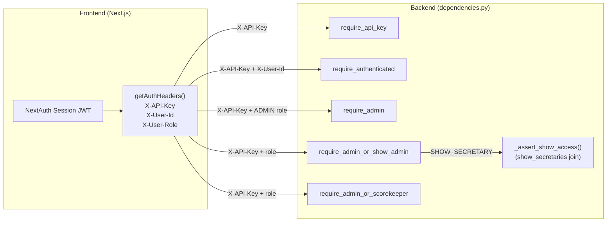
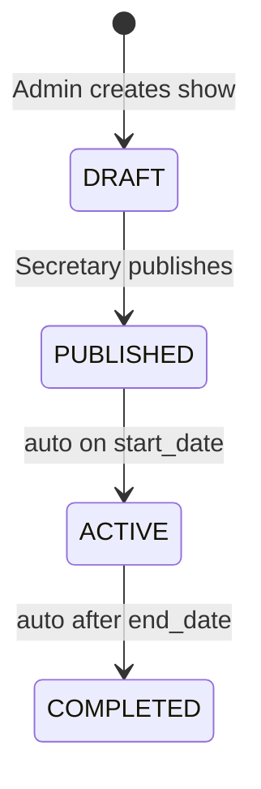

# Claude.md - Horse Show Results App

## Project Overview

**Horse Show Results App** is a browser-based application designed for managing ranch and western pleasure horse shows. It provides a streamlined workflow for show entry management, number assignment, result scoring, and live publishing.

**Key Differentiator:** This is a manual placement entry system—it does NOT include judging, maneuver scoring, penalties, or rule enforcement. Placings are entered by show office staff and published as-is.

## Project Scope

### What This App Does
- Exhibitors sign up for classes
- Show office assigns back numbers to exhibitors
- Official scorekeepers manually enter placings
- Results are published live to participants

### What This App Does NOT Do
- No automated judging
- No maneuver or performance scoring
- No penalty calculations
- No rule enforcement or validation logic

## Supported Associations
- AQHA (American Quarter Horse Association)
- APHA (American Paint Horse Association)
- WSCA (Western States Cutting Association)
- NSBA (National Snaffle Bit Association)
- ARHA (American Ranch Horse Association)
- ApHC (Appaloosa Horse Club)
- FQHR (Foundation Quarter Horse Registry)
- OPEN (Open / Unaffiliated) — no Secretary certification required

## User Roles
- **Admin (`ADMIN`):** Full system access — show setup, user management, venue management, all configuration
- **Show Secretary (`SHOW_SECRETARY`):** Scoped access — manages their assigned shows and scorekeepers; formerly called "Show Admin"
- **Scorekeeper (`SCOREKEEPER`):** Entry of placings and results for assigned shows
- **Exhibitor (`EXHIBITOR`):** Viewing personal entries and results; created via self-registration at `/register`

Show Secretaries self-register at `/register/show-secretary` (linked from the login page). During registration they select which show type(s) they are certified for and optionally enter their Secretary ID per association. Certifications are stored in `show_secretary_certifications`. The `OPEN` show type is excluded from the certification list since it requires no association affiliation; this is controlled by `UNCERTIFIED_SHOW_TYPE_CODES` in `ShowSecretaryRegisterForm.tsx`.

All authenticated users can access `/profile` to view and edit their name/email and change their password. Exhibitors additionally see a list of horses linked to their exhibitor profile. The admin Exhibitors page has been removed — exhibitor management is handled through the Users admin page.

When an Exhibitor self-registers at `/register`, the backend creates both a `User` record and a linked `Exhibitor` record atomically in `POST /auth/register`. These must always be created together — never create an EXHIBITOR user without a corresponding exhibitor record or the horse owner dropdown and exhibitor-horse associations will be broken.

## Technology Stack

| Layer | Technology | Details |
|-------|-----------|---------|
| **Frontend** | Next.js (PWA) | Progressive Web App for cross-platform access |
| **Backend** | FastAPI | Modern Python async API framework |
| **Database** | PostgreSQL | Relational database for persistent storage |
| **Deployment** | Docker + GitHub Codespaces | Containerized application with cloud-based dev environment |
| **Version Control** | Git | GitHub-hosted repository |

## Project Structure

```
horse-show-results-app/
├── backend/              # FastAPI application
├── frontend/             # Next.js PWA application
├── database/             # PostgreSQL schema and migrations
├── docker-compose.yml    # Local development orchestration
└── README.md             # Project overview
```

### Backend (`/backend`)
- **Framework:** FastAPI
- **Language:** Python
- **Purpose:** REST API serving the frontend application
- **Key Responsibilities:**
  - User authentication and authorization
  - Show, class, and entry management
  - Placing entry and result calculation
  - Real-time result publishing
  - Data validation and business logic

### Frontend (`/frontend`)
- **Framework:** Next.js
- **Type:** Progressive Web App (PWA)
- **Language:** JavaScript/TypeScript
- **Purpose:** User interface for all roles (admin, scorekeeper, exhibitor)
- **Key Features:**
  - Offline capability (PWA)
  - Cross-device responsiveness
  - Real-time result updates
  - Role-based access control

### Database (`/database`)
- **System:** PostgreSQL
- **Purpose:** Persistent storage for shows, exhibitors, entries, and results
- **Entities:**
  - Shows (events)
  - Exhibitors/Riders
  - Classes (competition categories)
  - Entries (exhibitor + class registrations)
  - Placings (results with order)
  - Users (with roles)
  - Associations via `show_types` table (AQHA, APHA, WSCA, NSBA, ARHA, ApHC, FQHR, OPEN)
  - Horses — with foaling date, sex, breed, color, association registrations, and owner (exhibitor FK)
  - Breeds — managed lookup table, seeded with 17 common western breeds, sorted alphabetically
  - Horse Colors — managed lookup table, seeded with 27 coat colors/patterns, sorted alphabetically

## Development Environment

### Local Development Setup
```bash
# Prerequisites: Docker, Docker Compose

# Start all services
docker-compose up

# Services will be available at:
# - Frontend: http://localhost:3000 (or configured port)
# - Backend API: http://localhost:8000 (or configured port)
# - PostgreSQL: localhost:5432 (or configured port)
```

### Key Configuration Files
- `docker-compose.yml` — Defines services for local development (backend, frontend, database)

## Current Status
🔨 **Active Development** — Core infrastructure is in place. User management, show/class/entry management, results entry, and back number assignment are all functional. Exhibitors have a self-service account/profile page at `/profile`.

## Development Guidelines for Claude

### When Working on This Project

1. **API Design**: Follow RESTful conventions. Backend provides JSON API; frontend consumes it.

2. **Database Queries**: Write migrations in `/database` folder. Keep schema organized and well-documented.

3. **Frontend Components**: Use Next.js best practices. Consider PWA capabilities for offline access.

4. **Authentication**: Role-based access control is implemented. Roles: `ADMIN`, `SHOW_SECRETARY`, `SCOREKEEPER`, `EXHIBITOR`. The internal API key (`INTERNAL_API_KEY`) is passed via `X-API-Key` header for server-to-server calls; user identity is passed via `X-User-Id` and `X-User-Role` headers.



5. **Data Validation**: Implement validation at both API and database layers.

6. **Testing**: Include unit tests and integration tests as features are added.

7. **Environment Variables**: Keep sensitive config in environment, not hardcoded.

### Code Style & Best Practices
- **Python (Backend):** Follow PEP 8. Use type hints.
- **JavaScript/TypeScript (Frontend):** Use modern ES6+ syntax. Configure linting if not present.
- **Git Commits:** Write clear, descriptive commit messages.

## Key Concepts

### Placings vs. Results
- **Placings:** The order in which exhibitors finished (1st, 2nd, 3rd, etc.)
- **Results:** The published, finalized placings shown to exhibitors

### Show Workflow
1. Admin creates a new show event
2. Exhibitors register and enter classes
3. Admin/office staff assigns back numbers
4. Scorekeepers enter placings after each class
5. Results are immediately published (no review/approval process)



### Core Data Model

```mermaid
erDiagram
    ShowType { uuid id; text code }
    Show { uuid id; text status; uuid show_type_id FK; text apha_show_number }
    Class { uuid id; uuid show_id FK; uuid ring_id FK; uuid division_id FK; text apha_class_code }
    Entry { uuid id; uuid class_id FK; uuid exhibitor_id FK; uuid horse_id FK; text apha_division; bool is_disqualified }
    Result { uuid id; uuid class_id FK; uuid entry_id FK; int place; bool is_tie }
    ShowEntry { uuid id; uuid show_id FK; uuid exhibitor_id FK; int back_number }
    ShowSecretary { uuid show_id FK; uuid user_id FK }
    ShowScorekeeper { uuid show_id FK; uuid user_id FK }
    User { uuid id; text role }
    Exhibitor { uuid id; uuid user_id FK; text full_name }

    ShowType ||--o{ Show : "typed by"
    Show ||--o{ Class : contains
    Class ||--o{ Entry : "entered in"
    Class ||--o{ Result : "results for"
    Entry ||--o| Result : placing
    Entry }o--|| Exhibitor : by
    Show ||--o{ ShowEntry : "back numbers"
    ShowEntry }o--|| Exhibitor : "assigned to"
    Show ||--o{ ShowSecretary : "managed by"
    Show ||--o{ ShowScorekeeper : "scored by"
    ShowSecretary }o--|| User : ""
    ShowScorekeeper }o--|| User : ""
    User ||--o| Exhibitor : "1:1 optional"
```

### Association Classes
Different horse show associations (AQHA, APHA, WSCA, NSBA, ARHA, ApHC, FQHR) may have different class structures and naming conventions. The app should support flexible class definitions per association. Show types live in the `show_types` table and are seeded via migrations — add new associations there, not in code.

### Horse Data Model
Horses have the following attributes:
- `name` (required)
- `owner_exhibitor_id` — FK to `exhibitors`. Owners are always linked to an exhibitor record, not a raw user. If the exhibitor is later linked to a user account, ownership carries through automatically. `HorseOut.owner_name` is derived from `owner_exhibitor.full_name`. The `GET /exhibitors/{id}/horses` endpoint includes horses via ownership, direct link (`exhibitor_horses`), and entries — all three sources are unioned.
- `sex` — constrained to `'Mare'`, `'Gelding'`, `'Stallion'` (nullable)
- `foaling_date` — actual birth date (DATE, nullable). **Age is calculated, never stored:** `max(0, current_year - foaling_year)`. Every horse turns one year older on January 1 regardless of actual foaling date. Computed in `HorseOut.age` via `model_validator`.
- `breed_id` — FK to `breeds` lookup table (admin-managed, alphabetically sorted)
- `color_id` — FK to `horse_colors` lookup table (admin-managed, alphabetically sorted)
- `horse_registrations` — child table linking a horse to a `show_type` + `registration_number`. One registration per association per horse. `OPEN` is excluded from the association registration UI (same `UNCERTIFIED_SHOW_TYPE_CODES` pattern as Show Secretary certifications — constant defined at top of `EditHorseForm.tsx`).

`HorseOut` uses a `model_validator(mode='before')` to derive `breed_name`, `color_name`, `owner_name`, `is_solid_paint_bred`, and `age` from loaded relationships. Horse routes always use `selectinload` for `breed`, `color`, and `owner_exhibitor` — never rely on lazy loading.

```mermaid
erDiagram
    Horse { uuid id; text name; uuid owner_exhibitor_id FK; date foaling_date; text sex; uuid breed_id FK; uuid color_id FK; bool is_solid_paint_bred }
    Breed { uuid id; text name }
    HorseColor { uuid id; text name }
    Exhibitor { uuid id; text full_name }
    ExhibitorHorse { uuid exhibitor_id FK; uuid horse_id FK }
    HorseRegistration { uuid id; uuid horse_id FK; uuid show_type_id FK; text registration_number }
    ShowType { uuid id; text code }
    HorseDocument { uuid id; uuid horse_id FK; text document_type; date expiry_date }

    Horse }o--|| Breed : breed
    Horse }o--|| HorseColor : color
    Horse }o--o| Exhibitor : owner
    Exhibitor ||--o{ ExhibitorHorse : ""
    Horse ||--o{ ExhibitorHorse : ""
    Horse ||--o{ HorseRegistration : registered
    HorseRegistration }o--|| ShowType : "per association"
    Horse ||--o{ HorseDocument : documents
```

Admin manages breeds at `/admin/horses/breeds` and colors at `/admin/horses/colors`.

`is_solid_paint_bred` — BOOLEAN, defaults false. SPB horses cannot enter Regular Registry Open classes (APHA SC-325.A.1). The entry creation endpoint enforces this with an HTTP 400 when `apha_division == 'OPEN'` and `horse.is_solid_paint_bred == true`. Shown as "(SPB)" suffix in horse dropdowns on the entry form.

### Horse Documents
Four document types per horse: `COGGINS` (EIA test), `VACCINATION`, `HEALTH_CERTIFICATE` (CVI), `REGISTRATION` (breed papers/membership). Each document stores: type, original filename, file bytes (BYTEA in Neon for now), mime type, file size, issue date, expiry date (both manually entered — no auto-calculation), and uploader user ID.

**S3 migration path:** Add a `storage_key TEXT` column, backfill from file_data, then drop file_data. No schema changes needed beyond that.

**Auth:** ADMIN has full access. EXHIBITORs can only upload/view/delete documents for horses they own (`owner_exhibitor_id` matches their exhibitor record).

**Backend:** `backend/routers/horse_documents.py` — GET list, POST upload (multipart), GET download, DELETE. Max 10 MB, accepts PDF and images. The `HorseDocumentOut` schema never includes `file_data` — only the download endpoint returns bytes.

**Frontend:** Shared `HorseDocuments` client component at `frontend/components/HorseDocuments.tsx` — used by both admin edit horse page and exhibitor horse detail page. Displays docs grouped by type with expiry badges (green/yellow/red). Exhibitors access documents via `/profile/horses/[id]`, linked from the "Documents" button on each horse in MyHorsesPanel.

## APHA Sanctioned Shows

APHA shows require specific data capture and results submission to APHA within 10 days via ShowEntry.xls format.

### Key APHA Fields

**Shows:** `apha_show_number` — the number assigned by APHA, required for results export.

**Horses:** `is_solid_paint_bred` — SPB horses can only enter Solid Paint-Bred classes, not Regular Registry Open classes.

**Exhibitors:** `apha_member_number`, `apha_member_expiry`, `amateur_card_number`, `amateur_card_expiry`, `amateur_novice_codes`, `date_of_birth`. All optional/nullable.

**Entries:** `apha_division` — one of `OPEN`, `SOLID_PAINT_BRED`, `AMATEUR`, `NOVICE_AMATEUR`, `YOUTH`, `NOVICE_YOUTH` (CHECK constraint). `relationship_to_owner` — required for Amateur/Youth divisions. `is_disqualified` — DQ'd entries still appear in APHA export but receive no placing.

**Classes:** `apha_class_code` — APHA standard code (e.g. `WP01`, `AMH4`); free-text, secretary responsible for accuracy.

### APHA Results Export

`GET /shows/{show_id}/apha-export` — returns a CSV in APHA ShowEntry format. Requires `show.apha_show_number` to be set and `show_type_code == 'APHA'`. Accessible via the "Export APHA Results (CSV)" button on the admin show detail page. Frontend proxy at `frontend/app/api/shows/[showId]/apha-export/route.ts`.

CSV columns: `SHOW NBR | SHOW YR | BACK# | REG NUMBER | HORSE'S NAME | CLASS CODE | CLASS DESCRIPTION | EXHIBITOR ID | EXHIBITOR'S NAME`

All APHA-specific form fields are conditionally rendered based on `show_type_code === 'APHA'`.

## Future Considerations

- Real-time notifications to exhibitors
- Export results to various formats (PDF, Excel)
- Integration with association websites
- Mobile-optimized scorekeeping interface
- Undo/correction workflows for entered placings
- Multi-arena/multi-ring support for larger shows

## Common Tasks & Commands

### Running the Application
```bash
docker-compose up
```

### Accessing Logs
```bash
docker-compose logs -f [service-name]
# service-name: backend, frontend, or db
```

### Database Migrations

Migrations live in `database/migrations/` and are tracked in the `_migrations` table. The migrate script uses Docker + psql and has a Windows path bug with volume mounts, so apply migrations directly via `psql -c`:

```bash
# Apply a migration directly (replace SQL as needed)
PSQL_URL="${DATABASE_URL/postgresql+asyncpg/postgresql}"
docker run --rm postgres:16-alpine psql "$PSQL_URL" -c "<SQL statement>"
docker run --rm postgres:16-alpine psql "$PSQL_URL" -c \
  "INSERT INTO _migrations (name) VALUES ('<filename>.sql') ON CONFLICT DO NOTHING;"
```

Applied migrations:
- `001_show_types.sql` — show_types table; seeds AQHA, APHA, OPEN
- `002_show_admin_role.sql` — show_secretaries join table (originally show_admins)
- `003_venue_admins.sql` — venue_admins join table
- `004_user_last_login.sql` — last_login_at column on users
- `005_rename_show_admins_table.sql` — renamed show_admins → show_secretaries
- `006_secretary_certifications.sql` — show_secretary_certifications table (user ↔ show_type + secretary_id_number)
- `007_horse_attributes.sql` — breeds table (17 seeded), horse_colors table (27 seeded), adds foaling_date/sex/breed_id/color_id to horses, horse_registrations table (horse ↔ show_type + registration_number)
- `008_horse_owner_exhibitor.sql` — adds owner_exhibitor_id FK (horses → exhibitors)
- `009_horse_documents.sql` — horse_documents table (BYTEA file storage in Neon; migrate to S3 later by adding a storage_key column and dropping file_data)
- `010_apha_fields.sql` — APHA sanctioned show fields: `shows.apha_show_number`, `horses.is_solid_paint_bred`, `classes.apha_class_code`, `entries.apha_division/relationship_to_owner/is_disqualified`, exhibitor APHA membership fields (apha_member_number/expiry, amateur_card_number/expiry, amateur_novice_codes, date_of_birth)
- `011_entries_horse_fk_set_null.sql` — Alters `entries.horse_id` FK to `ON DELETE SET NULL` so horses can be deleted even when they have class entries; historical entry records are preserved with `horse_id = NULL`

Data seeded directly (not via migration file):
- show_types: NSBA, WSCA, ARHA, ApHC, FQHR added via INSERT

### Testing
```bash
# Testing configuration to be established
```

## Contact & Questions
Refer to the main GitHub repository for issues, discussions, and collaboration:
https://github.com/dhuber24/horse-show-results-app

---

**Last Updated:** April 2026 (migration 010, APHA sanctioned show fields)
**Project Status:** 🔨 Active Development

