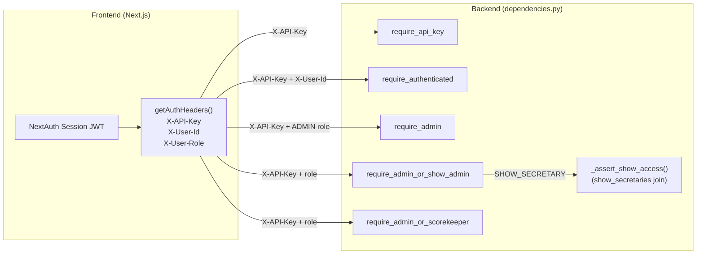
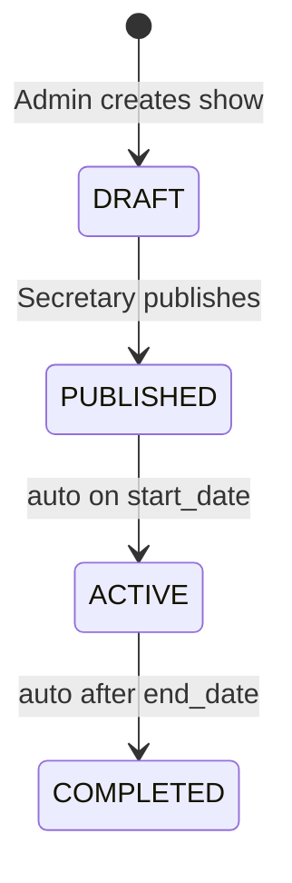

# Claude.md - Horse Show Results App

## Project Overview

**Horse Show Results App** is a browser-based application designed for managing ranch and western pleasure horse shows. It provides a streamlined workflow for show entry management, number assignment, result scoring, and live publishing.

**Key Differentiator:** This is a manual placement entry system—it does NOT include judging, maneuver scoring, penalties, or rule enforcement. Placings are entered by show office staff and published as-is.

## Project Scope

### What This App Does
- Exhibitors sign up for classes
- Show office assigns back numbers to exhibitors
- Official scorekeepers manually enter placings
- Results are published live to participants

### What This App Does NOT Do
- No automated judging
- No maneuver or performance scoring
- No penalty calculations
- No rule enforcement or validation logic

## Supported Associations
- AQHA (American Quarter Horse Association)
- APHA (American Paint Horse Association)
- WSCA (Western States Cutting Association)
- NSBA (National Snaffle Bit Association)
- ARHA (American Ranch Horse Association)
- ApHC (Appaloosa Horse Club)
- FQHR (Foundation Quarter Horse Registry)
- OPEN (Open / Unaffiliated) — no Secretary certification required

## User Roles
- **Admin (`ADMIN`):** Full system access — show setup, user management, venue management, all configuration
- **Show Secretary (`SHOW_SECRETARY`):** Scoped access — manages their assigned shows and scorekeepers; formerly called "Show Admin"
- **Scorekeeper (`SCOREKEEPER`):** Entry of placings and results for assigned shows
- **Exhibitor (`EXHIBITOR`):** Viewing personal entries and results; created via self-registration at `/register`. Exhibitors have a personalized **My Show Entries** dashboard at `/dashboard` and a profile/horse management page at `/profile`.

Show Secretaries self-register at `/register/show-secretary` (linked from the login page). During registration they select which show type(s) they are certified for and optionally enter their Secretary ID per association. Certifications are stored in `show_secretary_certifications`. The `OPEN` show type is excluded from the certification list since it requires no association affiliation; this is controlled by `UNCERTIFIED_SHOW_TYPE_CODES` in `ShowSecretaryRegisterForm.tsx`.

**Approval Workflow:** Self-registered Show Secretaries start with `is_approved = false` and cannot log in until an admin approves them via the admin Users page. Upon registration, they see: _"Registration submitted! An admin will review and approve your account before you can log in."_ Login attempts by pending accounts show: _"Your account is pending admin approval. Please check back soon."_ Admins approve accounts via the green **Approve** button next to each pending Show Secretary's **Pending** badge in the Users table.

All authenticated users can access `/profile` to view and edit their name/email and change their password. Exhibitors additionally see a list of horses linked to their exhibitor profile. The admin Exhibitors page has been removed — exhibitor management is handled through the Users admin page.

When an Exhibitor self-registers at `/register`, the backend creates both a `User` record and a linked `Exhibitor` record atomically in `POST /auth/register`. These must always be created together — never create an EXHIBITOR user without a corresponding exhibitor record or the horse owner dropdown and exhibitor-horse associations will be broken.

## Technology Stack

| Layer | Technology | Details |
|-------|-----------|---------|
| **Frontend** | Next.js (PWA) | Progressive Web App for cross-platform access |
| **Backend** | FastAPI | Modern Python async API framework |
| **Database** | PostgreSQL (Neon cloud) | Cloud-hosted Postgres — no local db service |
| **Deployment** | Docker + GitHub Codespaces | Containerized application with cloud-based dev environment |
| **Version Control** | Git | GitHub-hosted repository |

## Project Structure

```
horse-show-results-app/
├── backend/              # FastAPI application
├── frontend/             # Next.js PWA application
├── database/             # PostgreSQL schema and migrations
├── docker-compose.yml    # Local development orchestration
└── README.md             # Project overview
```

### Backend (`/backend`)
- **Framework:** FastAPI
- **Language:** Python
- **Purpose:** REST API serving the frontend application
- **Key Responsibilities:**
  - User authentication and authorization
  - Show, class, and entry management
  - Placing entry and result calculation
  - Real-time result publishing
  - Data validation and business logic

### Frontend (`/frontend`)
- **Framework:** Next.js
- **Type:** Progressive Web App (PWA)
- **Language:** JavaScript/TypeScript
- **Purpose:** User interface for all roles (admin, scorekeeper, exhibitor)
- **Key Features:**
  - Offline capability (PWA)
  - Cross-device responsiveness
  - Real-time result updates
  - Role-based access control

### Database (`/database`)
- **System:** PostgreSQL
- **Purpose:** Persistent storage for shows, exhibitors, entries, and results
- **Entities:**
  - Shows (events)
  - Exhibitors/Riders
  - Classes (competition categories)
  - Entries (exhibitor + class registrations)
  - Placings (results with order)
  - Users (with roles)
  - Associations via `show_types` table (AQHA, APHA, WSCA, NSBA, ARHA, ApHC, FQHR, OPEN)
  - Classes — competition categories within a show
  - Class Associations — `class_associations` join table: per-association class codes for dual-sanctioned classes (e.g. both an AQHA and NSBA code on the same class)
  - Horses — with foaling date, sex, breed, color, association registrations, and owner (exhibitor FK)
  - Breeds — managed lookup table, seeded with 17 common western breeds, sorted alphabetically
  - Horse Colors — managed lookup table, seeded with 27 coat colors/patterns, sorted alphabetically

## Development Environment

### Local Development Setup
```bash
# Prerequisites: Docker, Docker Compose, a .env file with:
#   DATABASE_URL       — Neon connection string (postgresql+asyncpg://...)
#   INTERNAL_API_KEY   — shared secret between Next.js and FastAPI
#   NEXTAUTH_SECRET    — NextAuth signing secret

# Start backend + frontend (no local db — Neon is the database)
docker-compose up

# Services will be available at:
# - Frontend: http://localhost:3000 (or configured port)
# - Backend API: http://localhost:8000 (or configured port)
```

### Key Configuration Files
- `docker-compose.yml` — Defines services for local development (backend + frontend only; database is Neon cloud)

## Current Status
🔨 **Active Development** — Core infrastructure is in place. User management, show/class/entry management, results entry, and back number assignment are all functional. Exhibitors have a self-service account/profile page at `/profile`.

## Development Guidelines for Claude

### When Working on This Project

1. **API Design**: Follow RESTful conventions. Backend provides JSON API; frontend consumes it. List endpoints that are admin-only (`GET /users/`, `GET /horses/`, `GET /exhibitors/`) accept optional `?limit=N&offset=N` query params (limit capped at 1000, default is no limit). `GET /shows/` is not paginated — it applies role-based filtering instead.

2. **Database Queries**: Write migrations in `/database` folder. Keep schema organized and well-documented.

3. **Frontend Components**: Use Next.js best practices. Consider PWA capabilities for offline access.

4. **Authentication**: Role-based access control is implemented. Roles: `ADMIN`, `SHOW_SECRETARY`, `SCOREKEEPER`, `EXHIBITOR`. The internal API key (`INTERNAL_API_KEY`) is passed via `X-API-Key` header for server-to-server calls; user identity is passed via `X-User-Id` and `X-User-Role` headers.



5. **Data Validation**: Implement validation at both API and database layers.

6. **Testing**: Include unit tests and integration tests as features are added.

7. **Environment Variables**: Keep sensitive config in environment, not hardcoded.

### Code Style & Best Practices
- **Python (Backend):** Follow PEP 8. Use type hints.
- **JavaScript/TypeScript (Frontend):** Use modern ES6+ syntax. Configure linting if not present.
- **Git Commits:** Write clear, descriptive commit messages.

## Key Concepts

### Placings vs. Results
- **Placings:** The order in which exhibitors finished (1st, 2nd, 3rd, etc.)
- **Results:** The published, finalized placings shown to exhibitors

### Show Workflow
1. Admin creates a new show event
2. Exhibitors register and enter classes
3. Admin/office staff assigns back numbers
4. Scorekeepers enter placings after each class
5. Results are immediately published (no review/approval process)



### Core Data Model

```mermaid
erDiagram
    ShowType { uuid id; text code }
    Show { uuid id; text status; uuid show_type_id FK; text apha_show_number }
    Class { uuid id; uuid show_id FK; uuid ring_id FK; uuid division_id FK }
    ClassAssociation { uuid id; uuid class_id FK; uuid show_type_id FK; text association_class_code }
    Entry { uuid id; uuid class_id FK; uuid exhibitor_id FK; uuid horse_id FK; text apha_division; bool is_disqualified }
    Result { uuid id; uuid class_id FK; uuid entry_id FK; int place; bool is_tie }
    ShowEntry { uuid id; uuid show_id FK; uuid exhibitor_id FK; int back_number }
    ShowSecretary { uuid show_id FK; uuid user_id FK }
    ShowScorekeeper { uuid show_id FK; uuid user_id FK }
    User { uuid id; text role; bool is_approved }
    Exhibitor { uuid id; uuid user_id FK; text full_name }

    ShowType ||--o{ Show : "typed by"
    Show ||--o{ Class : contains
    Class ||--o{ ClassAssociation : "codes per assoc"
    ClassAssociation }o--|| ShowType : ""
    Class ||--o{ Entry : "entered in"
    Class ||--o{ Result : "results for"
    Entry ||--o| Result : placing
    Entry }o--|| Exhibitor : by
    Show ||--o{ ShowEntry : "back numbers"
    ShowEntry }o--|| Exhibitor : "assigned to"
    Show ||--o{ ShowSecretary : "managed by"
    Show ||--o{ ShowScorekeeper : "scored by"
    ShowSecretary }o--|| User : ""
    ShowScorekeeper }o--|| User : ""
    User ||--o| Exhibitor : "1:1 optional"
```

### Association Classes
Different horse show associations (AQHA, APHA, WSCA, NSBA, ARHA, ApHC, FQHR) have different class structures and naming conventions. A class at a dual-sanctioned show (e.g. Lucky Seven Classic — AQHA + NSBA) carries one code per association in the `class_associations` table: `(class_id, show_type_id, association_class_code)` with a UNIQUE constraint on the pair. The admin Classes page (`/admin/shows/{id}/classes`) lets secretaries add/remove codes per class via an inline panel. `OPEN` show type is excluded. Show types live in the `show_types` table and are seeded via migrations — add new associations there, not in code.

### Horse Data Model
Horses have the following attributes:
- `name` (required)
- `owner_exhibitor_id` — FK to `exhibitors`. Owners are always linked to an exhibitor record, not a raw user. If the exhibitor is later linked to a user account, ownership carries through automatically. `HorseOut.owner_name` is derived from `owner_exhibitor.full_name`. The `GET /exhibitors/{id}/horses` endpoint includes horses via ownership, direct link (`exhibitor_horses`), and entries — all three sources are unioned.
- `sex` — constrained to `'Mare'`, `'Gelding'`, `'Stallion'` (nullable)
- `foaling_date` — actual birth date (DATE, nullable). **Age is calculated, never stored:** `max(0, current_year - foaling_year)`. Every horse turns one year older on January 1 regardless of actual foaling date. Computed in `HorseOut.age` via `model_validator`.
- `breed_id` — FK to `breeds` lookup table (admin-managed, alphabetically sorted)
- `color_id` — FK to `horse_colors` lookup table (admin-managed, alphabetically sorted)
- `horse_registrations` — child table linking a horse to a `show_type` + `registration_number`. One registration per association per horse. `OPEN` is excluded from the association registration UI (same `UNCERTIFIED_SHOW_TYPE_CODES` pattern as Show Secretary certifications — constant defined at top of `EditHorseForm.tsx`).

`HorseOut` uses a `model_validator(mode='before')` to derive `breed_name`, `color_name`, `owner_name`, `is_solid_paint_bred`, and `age` from loaded relationships. Horse routes always use `selectinload` for `breed`, `color`, and `owner_exhibitor` — never rely on lazy loading.

```mermaid
erDiagram
    Horse { uuid id; text name; uuid owner_exhibitor_id FK; date foaling_date; text sex; uuid breed_id FK; uuid color_id FK; bool is_solid_paint_bred }
    Breed { uuid id; text name }
    HorseColor { uuid id; text name }
    Exhibitor { uuid id; text full_name }
    ExhibitorHorse { uuid exhibitor_id FK; uuid horse_id FK }
    HorseRegistration { uuid id; uuid horse_id FK; uuid show_type_id FK; text registration_number }
    ShowType { uuid id; text code }
    HorseDocument { uuid id; uuid horse_id FK; text document_type; date expiry_date }

    Horse }o--|| Breed : breed
    Horse }o--|| HorseColor : color
    Horse }o--o| Exhibitor : owner
    Exhibitor ||--o{ ExhibitorHorse : ""
    Horse ||--o{ ExhibitorHorse : ""
    Horse ||--o{ HorseRegistration : registered
    HorseRegistration }o--|| ShowType : "per association"
    Horse ||--o{ HorseDocument : documents
```

Admin manages breeds at `/admin/horses/breeds` and colors at `/admin/horses/colors`.

`is_solid_paint_bred` — BOOLEAN, defaults false. SPB horses cannot enter Regular Registry Open classes (APHA SC-325.A.1). The entry creation endpoint enforces this with an HTTP 400 when `apha_division == 'OPEN'` and `horse.is_solid_paint_bred == true`. Shown as "(SPB)" suffix in horse dropdowns on the entry form. Exhibitors see an amber **SPB** badge next to the horse name in their horse list (`MyHorsesPanel`) so they understand why an entry may be rejected.

### Horse Documents
Four document types per horse: `COGGINS` (EIA test), `VACCINATION`, `HEALTH_CERTIFICATE` (CVI), `REGISTRATION` (breed papers/membership). Each document stores: type, original filename, file bytes (BYTEA in Neon for now), mime type, file size, issue date, expiry date (both manually entered — no auto-calculation), and uploader user ID.

**S3 migration path:** Add a `storage_key TEXT` column, backfill from file_data, then drop file_data. No schema changes needed beyond that.

**Auth:** ADMIN has full access. EXHIBITORs can only upload/view/delete documents for horses they own (`owner_exhibitor_id` matches their exhibitor record).

**Backend:** `backend/routers/horse_documents.py` — GET list, POST upload (multipart), GET download, DELETE. Max 10 MB, accepts PDF and images. The `HorseDocumentOut` schema never includes `file_data` — only the download endpoint returns bytes.

**Frontend:** Shared `HorseDocuments` client component at `frontend/components/HorseDocuments.tsx` — used by both admin edit horse page and exhibitor horse detail page. Displays docs grouped by type with expiry badges (green/yellow/red). Exhibitors access documents via `/profile/horses/[id]`, linked from the "Documents" button on each horse in MyHorsesPanel.

## APHA Sanctioned Shows

APHA shows require specific data capture and results submission to APHA within 10 days via ShowEntry.xls format.

### Key APHA Fields

**Shows:** `apha_show_number` — the number assigned by APHA, required for results export.

**Horses:** `is_solid_paint_bred` — SPB horses can only enter Solid Paint-Bred classes, not Regular Registry Open classes.

**Exhibitors:** `apha_member_number`, `apha_member_expiry`, `amateur_card_number`, `amateur_card_expiry`, `amateur_novice_codes`, `date_of_birth`. All optional/nullable.

**Entries:** `apha_division` — one of `OPEN`, `SOLID_PAINT_BRED`, `AMATEUR`, `NOVICE_AMATEUR`, `YOUTH`, `NOVICE_YOUTH` (CHECK constraint). `relationship_to_owner` — required for Amateur/Youth divisions. `is_disqualified` — DQ'd entries still appear in APHA export but receive no placing.

**Classes:** `class_associations` child table — one row per `(class, show_type)` pair storing an `association_class_code` (e.g. `WP01`, `684`). A dual-sanctioned class (e.g. AQHA + NSBA) has two rows. `OPEN` show type is excluded. Managed via `GET/POST /shows/{id}/classes/{classId}/associations` and `DELETE …/{assocId}`. The APHA CSV export reads codes from this table first, falling back to the legacy `classes.apha_class_code` column until migration 021 drops it. The `EditClassCard` UI on the admin classes page displays and edits association codes inline.

### APHA Results Export

`GET /shows/{show_id}/apha-export` — returns a CSV in APHA ShowEntry format. Requires `show.apha_show_number` to be set and `show_type_code == 'APHA'`. Accessible via the "Export APHA Results (CSV)" button on the admin show detail page. Frontend proxy at `frontend/app/api/shows/[showId]/apha-export/route.ts`.

CSV columns: `SHOW NBR | SHOW YR | BACK# | REG NUMBER | HORSE'S NAME | CLASS CODE | CLASS DESCRIPTION | EXHIBITOR ID | EXHIBITOR'S NAME`

All APHA-specific form fields are conditionally rendered based on `show_type_code === 'APHA'`.

## Scorekeeper UX

### Scorekeeper Navigation Flow
1. Scorekeeper logs in → clicks **Shows** in the navbar → lands on `/scorekeeper` (their dedicated page)
2. `/scorekeeper` page — lists only shows they are assigned to (filtered via `show_scorekeepers` join); reuses the `ShowList` client component from the public home page
3. `/shows/{id}` — show detail page with class list; shows **"Pending"** (amber) or **"X placed"** (green) scoring progress badges per class, visible only to SCOREKEEPER/ADMIN
4. `/shows/{id}/classes/{classId}/scorekeeper` — the scoring form

### Scorekeeper-Filtered Show List
`GET /shows/` in `backend/routers/shows.py` has role-based filtering:
- **SHOW_SECRETARY**: joins `ShowSecretary` → returns only their assigned shows
- **SCOREKEEPER**: joins `ShowScorekeeper` → returns only their assigned shows
- **Everyone else**: returns all non-draft shows

Both filters use the same pattern (conditional `elif` on the query before execution). The `ShowScorekeeper` model is the `show_scorekeepers` join table; scorekeepers are assigned to shows via the admin show staff management UI.

### Class Scoring Progress (`placed_count`)
`GET /shows/{show_id}/classes/` in `backend/routers/classes.py` returns each class with a `placed_count` field — the number of entries that have a result recorded — computed via a correlated subquery (no N+1). The frontend uses this to render progress badges on the show detail page.

### Scoring Form (`ScorekeeperForm`)
`frontend/app/shows/[id]/classes/[classId]/scorekeeper/ScorekeeperForm.tsx`:
- Entries sorted by back number; DQ'd entries (`is_disqualified=true`) rendered at the bottom with a red **DQ** badge and no place input — excluded from the save payload
- Progress counter ("X of Y placed") and **Clear all** button
- Auto-focuses the first empty place input on mount
- Tie detection: any place number shared by 2+ entries automatically shows a **TIE** badge
- After a successful save: inline **View Results** and **Next Class →** links appear in the success banner
- Class navigation bar (← prev class | N of M | next class →) for moving between classes without returning to the show page

### Show Detail Page (`/shows/{id}`)
Each class card links directly to the scoring form when the viewer is a scorer on an active show (`canScore && show.status === 'ACTIVE'`); otherwise it links to the class results view. CLOSED classes are hidden entirely in scoring mode — only OPEN classes are shown to scorers on an active show.

### Admin Show Page (`/admin/shows/{id}`)
When a show is ACTIVE, a dark **"Score Classes"** tile appears in the action grid linking to `/shows/{id}`, providing a direct path to per-class scoring without leaving the admin context.

A compact scorekeeper summary line appears below the status badge, showing assigned scorekeeper names (e.g. "Scorekeepers: Jane Smith · Bob Jones") or "No scorekeepers assigned yet" — visible to ADMIN and SHOW_SECRETARY.

**Status transitions** (handled by `ShowStatusControl.tsx`): Each forward transition (DRAFT → PUBLISHED, PUBLISHED → ACTIVE) requires confirmation via an inline panel that describes what the change does and states that it cannot be undone. The button is labelled "Yes, confirm". Transitions are blocked if the end date is in the past or if trying to publish with zero classes.

**Breadcrumbs**: All admin pages display a `Breadcrumbs` trail (`frontend/components/Breadcrumbs.tsx`). The component renders a `← Back to [parent]` link above the trail so users always have a one-click escape, in addition to clicking any segment of the trail.

**Delete confirmations**: All destructive delete actions use an **inline confirm toggle** — clicking "Delete" replaces the button with "Delete [name]? · Yes, delete · Cancel" in-place. No modal overlays. Errors appear inline next to the buttons. The `ConfirmDialog` component (`frontend/components/ConfirmDialog.tsx`) exists but is no longer used — do not add new usages of it.

**Disabled button tooltips**: Disabled buttons carry a `title` attribute explaining why they are inactive — e.g. "No changes to save", "Fix duplicate back numbers before saving", "Password must be at least 8 characters".

## Exhibitor UX

### My Show Entries Dashboard (`/dashboard`)
The exhibitor's primary view. Linked from the **My Entries** button in the navbar (visible to EXHIBITOR role only).

**Data source:** `GET /dashboard/exhibitor/{user_id}` — returns the exhibitor record and all their entries with class, show, horse, and result details. The response includes `show_status`, `show_start_date`, `show_end_date`, `show_venue`, `is_disqualified`, and `entry_created_at` so the frontend can group and contextualize entries without additional requests.

**Layout:**
- Entries are **grouped by show** — each show renders as a card with the show name (linked to `/shows/{id}`), date range, venue, and a status badge:
  - Amber "In Progress" (ACTIVE), blue "Open for Registration" (PUBLISHED), gray "Completed" (COMPLETED)
- Shows are ordered: Active → Published → Completed
- Two labeled sections: **Active & Upcoming** and **Past Shows**
- Within a show card, entries are sorted by class number

**Entry states:**
- Result recorded → ordinal place (1st, 2nd, 3rd…) with "T" suffix for ties
- `is_disqualified = true` → red **DQ** badge
- No result yet → gray **Pending** badge
- No result, not DQ'd, `entry_created_at` within last 7 days → blue **New** badge (entry confirmation signal); a banner at the top of the page summarises how many new classes were recently added

**Empty state:** Shows a prompt to contact the show secretary with a link to the public show list.

### Profile & Horses (`/profile`)
Account info (name, email), horse list, and change-password form. The horse section is rendered by `MyHorsesPanel` (`frontend/app/profile/MyHorsesPanel.tsx`).

**MyHorsesPanel horse list** — each horse row shows:
- Horse name, sex badge, and an amber **SPB** badge when `is_solid_paint_bred = true`
- Breed, color, age metadata
- **Edit** link → `/profile/horses/{id}` (edit details + registrations)
- **Documents** link → `/profile/horses/{id}#documents` (scrolls directly to the documents section)
- **Remove** button (soft-removes the ownership link)

### Exhibitor Horse Detail (`/profile/horses/[id]`)
Edit horse details (name, sex, foaling date, breed, color, SPB flag) and manage association registration numbers. Below the edit form is the `HorseDocuments` component anchored at `id="documents"` for deep-linking from the profile horse list.

### User Management (`/admin/users`)
Admin-only. Rendered by `UserTable` (`frontend/app/admin/users/UserTable.tsx`) — a client component with search, role filter, CSV export, and inline delete for all roles.

- **List page** shows a role breakdown summary (e.g. "2 Admins · 3 Secretaries · 5 Exhibitors") and a total/filtered count below the table.
- **Inline delete** — available for every role (not just EXHIBITOR). Clicking Delete expands an inline "Delete [name]? · Yes, delete · Cancel" confirmation in the table row.
- **User detail page** (`/admin/users/[id]`) shows joined date and last login below the user's email.
- **Role change warning** — `ChangeRoleForm` shows an amber warning banner when changing an EXHIBITOR to another role, noting that their exhibitor data is preserved but dashboard access is removed.
- **Delete on detail page** — `DeleteUserButton` uses the inline confirm pattern (not a modal); the confirmation text appears inline in the Danger Zone section.

### Entries Page (`/admin/shows/{id}/entries`)
- An **"Assign Back Numbers →"** link in the page header provides direct navigation to the back numbers page without returning to the show detail.
- The entries-by-class listing uses the `EntryListSection` client component (`entries/EntryListSection.tsx`) which renders each entry with **Edit** and **Remove** inline actions.
  - **Edit**: expands an inline form for `back_number`, `apha_division` (APHA shows only), `relationship_to_owner` (APHA, shown only for Amateur/Youth divisions), and `is_disqualified`. Saves via `PATCH /api/entries/[entryId]`.
  - **Remove**: shows an inline "Remove this entry? / Yes, remove / Cancel" confirmation before deleting via `DELETE /api/entries/[entryId]`.
- Entry PATCH and DELETE are proxied through `frontend/app/api/entries/[entryId]/route.ts` → `backend PATCH/DELETE /shows/{show_id}/classes/{class_id}/entries/{entry_id}`. The PATCH body includes `showId` and `classId`; the DELETE passes them as query params.

## Shared Frontend Components

Reusable components live in `frontend/components/`.

### `Breadcrumbs` (`frontend/components/Breadcrumbs.tsx`)
Renders a `← Back to [parent]` link above a horizontal breadcrumb trail. Accepts a `crumbs` array of `{ label: string; href?: string }` objects — the last crumb (current page) is plain text; all others are links. The back link is automatically derived as the last crumb that has an `href`.

Use on **every admin page** — including top-level list pages that are just one level below `/admin`. Convention:

| Page | Crumbs |
|------|--------|
| `/admin/shows` | Admin › Shows |
| `/admin/shows/new` | Admin › Shows › New Show |
| `/admin/shows/[id]` | Admin › Shows › [show name] |
| `/admin/shows/[id]/classes` | Admin › Shows › [show name] › Classes |
| `/admin/shows/[id]/entries` | Admin › Shows › [show name] › Entries |
| `/admin/shows/[id]/back-numbers` | Admin › Shows › [show name] › Back Numbers |
| `/admin/shows/[id]/edit` | Admin › Shows › [show name] › Edit Details |
| `/admin/shows/types` | Admin › Shows › Show Types |
| `/admin/shows/types/new` | Admin › Shows › Show Types › New Show Type |
| `/admin/shows/types/[id]` | Admin › Shows › Show Types › [type name] |
| `/admin/users` | Admin › Users |
| `/admin/users/new` | Admin › Users › New User |
| `/admin/users/[id]` | Admin › Users › [user name] |
| `/admin/venues` | Admin › Venues |
| `/admin/venues/new` | Admin › Venues › New Venue |
| `/admin/venues/[id]` | Admin › Venues › [venue name] |
| `/admin/horses` | Admin › Horses |
| `/admin/horses/new` | Admin › Horses › New Horse |
| `/admin/horses/[id]` | Admin › Horses › [horse name] |
| `/admin/horses/breeds` | Admin › Horses › Breeds |
| `/admin/horses/breeds/[id]` | Admin › Horses › Breeds › [breed name] |
| `/admin/horses/colors` | Admin › Horses › Colors |
| `/admin/horses/colors/[id]` | Admin › Horses › Colors › [color name] |

### Inline Delete Pattern
All destructive delete actions use an inline confirm toggle — **not** a modal. The standard pattern:

```tsx
// State
const [confirmDeleteId, setConfirmDeleteId] = useState<string | null>(null);
const [deleting, setDeleting] = useState(false);
const [deleteError, setDeleteError] = useState<{ id: string; message: string } | null>(null);

// In each row's action cell:
{confirmDeleteId === item.id ? (
  <>
    <span className="text-xs" style={{ color: '#5c3d1e' }}>Delete {item.name}?</span>
    <button onClick={() => handleDelete(item)} disabled={deleting}
      className="text-xs text-red-600 hover:underline disabled:opacity-50">
      {deleting ? 'Deleting…' : 'Yes, delete'}
    </button>
    <button onClick={() => { setConfirmDeleteId(null); setDeleteError(null); }}
      disabled={deleting} className="text-xs hover:underline" style={{ color: '#8b7355' }}>
      Cancel
    </button>
    {deleteError?.id === item.id && (
      <span className="text-xs text-red-600">{deleteError.message}</span>
    )}
  </>
) : (
  <button onClick={() => { setConfirmDeleteId(item.id); setDeleteError(null); }}
    className="text-xs text-red-600 hover:text-red-800">
    Delete
  </button>
)}
```

For single-item delete on a detail/edit page (e.g. delete show, delete venue), use a simple boolean `confirmDelete` state — same inline text pattern without the per-id tracking.

`ConfirmDialog` (`frontend/components/ConfirmDialog.tsx`) exists but is **no longer used**. Do not add new usages.

### `VenueList` (`frontend/app/admin/venues/VenueList.tsx`)
Client component used by the admin venues list page. Renders each venue with an Edit link and inline delete (same pattern as `HorseList`). Only shown to ADMIN role — Show Secretaries see a read-only link list.

### Disabled Button Tooltips
All `<button disabled={...}>` elements should carry a `title` attribute explaining why they are blocked:

```tsx
<button
  disabled={saving || !isDirty}
  title={!isDirty ? 'No changes to save' : saving ? 'Saving, please wait…' : undefined}
>
```

Common tooltip values: `"No changes to save"`, `"Saving, please wait…"`, `"Fix duplicate back numbers before saving"`, `"Password must be at least 8 characters"`.

## Future Considerations

- Real-time push notifications to exhibitors when added to a class (currently surfaced via "New" badge on dashboard)
- Export results to various formats (PDF, Excel)
- Integration with association websites
- Undo/correction workflows for entered placings
- Multi-arena/multi-ring support for larger shows

## Common Tasks & Commands

### Running the Application
```bash
docker-compose up
```

### Accessing Logs
```bash
docker-compose logs -f [service-name]
# service-name: backend, frontend, or db
```

### Database Migrations

Migrations live in `database/migrations/` and are tracked in the `_migrations` table. Apply via a Docker volume mount (use `MSYS_NO_PATHCONV=1` on Windows/Git Bash to prevent path mangling):

```bash
# Apply a migration file
PSQL_URL="${DATABASE_URL/postgresql+asyncpg/postgresql}"
MSYS_NO_PATHCONV=1 docker run --rm \
  -v "/c/Users/Home/projects/horse-show-results-app/database/migrations:/migrations" \
  postgres:16-alpine \
  psql "$PSQL_URL" -v ON_ERROR_STOP=1 -f /migrations/<filename>.sql

# Apply a one-off SQL statement (no file needed)
MSYS_NO_PATHCONV=1 docker run --rm postgres:16-alpine \
  psql "$PSQL_URL" -c "<SQL statement>"
```

Applied migrations:
- `001_show_types.sql` — show_types table; seeds AQHA, APHA, OPEN
- `002_show_admin_role.sql` — show_secretaries join table (originally show_admins)
- `003_venue_admins.sql` — venue_admins join table (applied manually, not tracked in _migrations)
- `004_user_last_login.sql` — last_login_at column on users
- `005_rename_show_admins_table.sql` — renamed show_admins → show_secretaries
- `006_secretary_certifications.sql` — show_secretary_certifications table (user ↔ show_type + secretary_id_number)
- `007_horse_attributes.sql` — breeds table (17 seeded), horse_colors table (27 seeded), adds foaling_date/sex/breed_id/color_id to horses, horse_registrations table (horse ↔ show_type + registration_number)
- `008_horse_owner_exhibitor.sql` — adds owner_exhibitor_id FK (horses → exhibitors)
- `009_horse_documents.sql` — horse_documents table (BYTEA file storage in Neon; migrate to S3 later by adding a storage_key column and dropping file_data)
- `010_apha_fields.sql` — APHA sanctioned show fields: `shows.apha_show_number`, `horses.is_solid_paint_bred`, `classes.apha_class_code`, `entries.apha_division/relationship_to_owner/is_disqualified`, exhibitor APHA membership fields (apha_member_number/expiry, amateur_card_number/expiry, amateur_novice_codes, date_of_birth)
- `011_entries_horse_fk_set_null.sql` — Alters `entries.horse_id` FK to `ON DELETE SET NULL` so horses can be deleted even when they have class entries; historical entry records are preserved with `horse_id = NULL`
- `012_user_approval.sql` — Adds `is_approved BOOLEAN NOT NULL DEFAULT TRUE` column to users table for Show Secretary approval workflow; new accounts default to approved, self-registered Show Secretaries set to false
- `013_user_approval.sql` — Duplicate/renumbered version of 012; registered in _migrations to keep tracking consistent
- `014_user_role_check_constraint.sql` — CHECK constraint on `users.role` restricting to valid role values
- `015_add_fk_indexes.sql` — 32 indexes on FK columns across all major tables (shows, classes, entries, results, horses, exhibitors, join tables)
- `016_add_enum_check_constraints.sql` — CHECK constraints on status/enum columns: `shows.status`, `classes.status`, `entries.status`, `entries.apha_division`, `horses.sex`, `result_audit` null check; sets `shows.created_at NOT NULL`
- `017_drop_legacy_venue_column.sql` — Drops `shows.venue TEXT` column (replaced by `venue_id` FK + `venue_rel` relationship)
- `018_drop_legacy_owner_name_column.sql` — Drops `horses.owner_name TEXT` column (replaced by `owner_exhibitor_id` FK; `HorseOut.owner_name` derived from `owner_exhibitor.full_name`)
- `019_result_audit_changed_at_index.sql` — Index on `result_audit(changed_at DESC)` for audit query performance
- `020_class_associations.sql` — New `class_associations` join table (`class_id`, `show_type_id`, `association_class_code`, UNIQUE on pair); backfills APHA rows from `classes.apha_class_code`; legacy column preserved until 021
- `021_drop_apha_class_code.sql` — (**not yet applied**) Drops `classes.apha_class_code`; must be applied with matching backend/schema code changes (see migration header comments)

Data seeded directly (not via migration file):
- show_types: NSBA, WSCA, ARHA, ApHC, FQHR added via INSERT

### Testing
```bash
# Run frontend type check, lint, and build from frontend/ directory
npm run type-check
npm run lint
npm run build

# Verify code-level changes (run from project root in bash)
bash RUN_TESTS.sh
```

## Contact & Questions
Refer to the main GitHub repository for issues, discussions, and collaboration:
https://github.com/dhuber24/horse-show-results-app

---

**Last Updated:** May 2026 (Migration 020: `class_associations` table for multi-association class codes (AQHA+NSBA dual-sanctioning); replaces single `classes.apha_class_code` column. New `GET/POST/DELETE /shows/{id}/classes/{classId}/associations` endpoints. APHA CSV export reads from `class_associations` with legacy fallback. `EditClassCard` UI updated with inline association code management. Migration 021 drafted (not yet applied) to drop legacy column.)
**Project Status:** 🔨 Active Development

