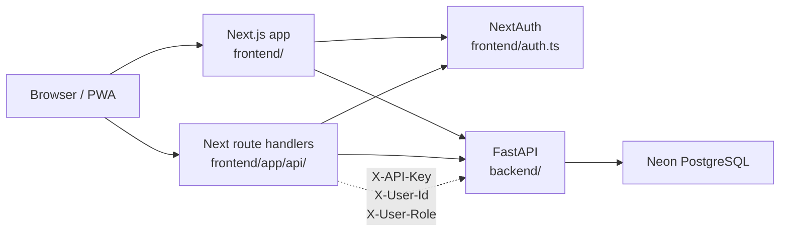
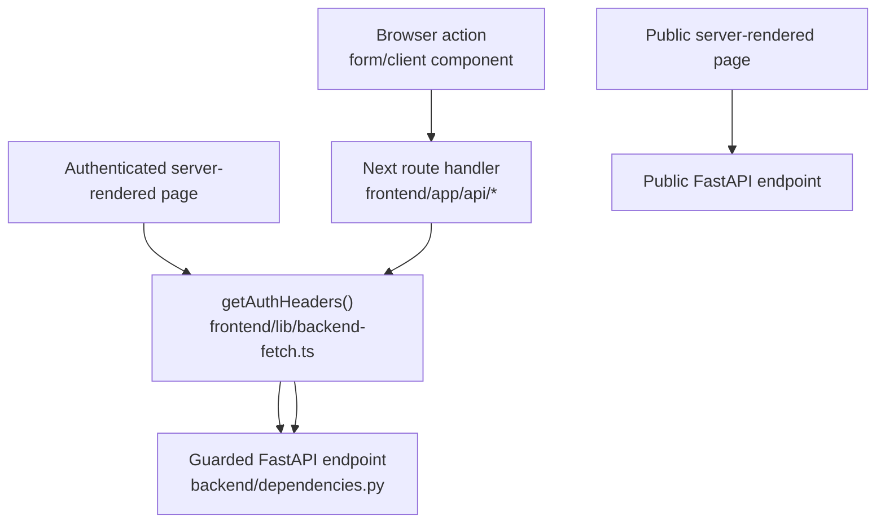

# Architecture

Horse Show Results is a browser-based system for managing horse show entries, back numbers, manual placings, and published results. It is intentionally not a judging engine: it does not score maneuvers, calculate penalties, or enforce association judging rules.

## Stack

| Layer | Technology | Notes |
| --- | --- | --- |
| Frontend | Next.js 15, React 19, TypeScript | App Router PWA in `frontend/` |
| Backend | FastAPI, async SQLAlchemy | API in `backend/` |
| Database | PostgreSQL on Neon | Schema, migrations, and seeds in `database/` |
| Local runtime | Docker Compose | Runs frontend and backend; no local database service |

## System Context

The trust boundary is between browser code and server-side code. Browser components should not create backend auth headers. Next server code and route handlers are the places that attach the internal API key and session-derived user context before calling FastAPI.

## Request Flow

The frontend uses two styles of backend access:

- Public server-rendered pages can fetch public backend endpoints directly.
- Authenticated mutations usually go through Next route handlers in `frontend/app/api/`.

Authenticated route handlers call `getAuthHeaders()` from `frontend/lib/backend-fetch.ts`, then forward requests to FastAPI with:

- `X-API-Key`: shared internal secret
- `X-User-Id`: current user ID from NextAuth
- `X-User-Role`: current user role from NextAuth

The backend validates those headers in `backend/dependencies.py`.

Use this as the default routing heuristic when adding features:

- Public data can be fetched directly from server-rendered pages when the backend endpoint is public.
- Authenticated server-rendered pages can call FastAPI directly with `getAuthHeaders()`.
- Browser-triggered authenticated writes should go through a Next route handler, which attaches trusted headers server-side.

## Key Entry Points

| Area | Path | Purpose |
| --- | --- | --- |
| FastAPI app | `backend/main.py` | Registers routers, CORS, rate limits, lifecycle task |
| DB session | `backend/database.py` | Async SQLAlchemy engine/session |
| ORM models | `backend/models.py` | Database entities and relationships |
| API schemas | `backend/schemas.py` | Pydantic request/response models |
| Backend routers | `backend/routers/` | Domain API endpoints |
| Next auth | `frontend/auth.ts` | Credentials login through backend `/auth/verify` |
| Backend fetch helper | `frontend/lib/backend-fetch.ts` | Auth headers and backend error handling |
| Next pages | `frontend/app/` | App Router pages and layouts |
| Next route handlers | `frontend/app/api/` | Server-side proxy layer to FastAPI |
| Database migrations | `database/migrations/` | Ordered SQL changes |

## Common Feature Path

Most data-backed features touch these layers:

1. Add a SQL migration in `database/migrations/`.
2. Update `backend/models.py`.
3. Update `backend/schemas.py`.
4. Add or update a FastAPI router in `backend/routers/`.
5. Add or update a Next route handler in `frontend/app/api/`.
6. Add or update the relevant page/form/component in `frontend/app/` or `frontend/components/`.
7. Run focused validation, usually frontend type check and backend compile.

## Runtime Behavior

`backend/main.py` starts a background task that checks show status every 60 seconds:

- `PUBLISHED` becomes `ACTIVE` on or after `start_date`.
- `ACTIVE` becomes `COMPLETED` after `end_date`.

The backend also calls `Base.metadata.create_all()` on startup. Migrations remain the source of truth for intentional schema evolution.

