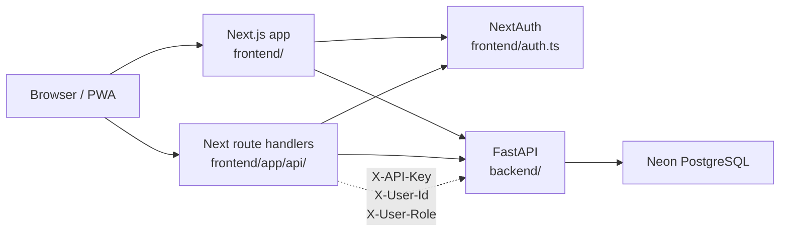
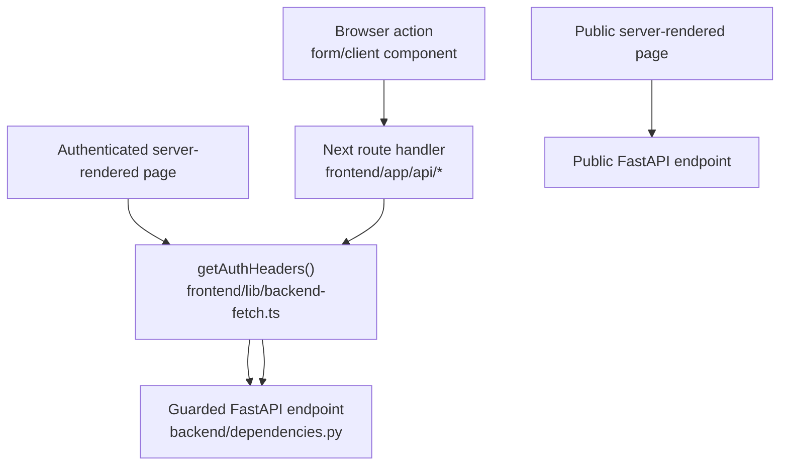

# Architecture

Horse Show Results is a browser-based system for managing horse show entries, back numbers, manual placings, and published results. It is intentionally not a judging engine: it does not score maneuvers or calculate penalties. It does include limited association compliance validation where the app models the required data, such as AQHA class-code, registration, membership-number, and age checks.

## Stack

| Layer | Technology | Notes |
| --- | --- | --- |
| Frontend | Next.js 15, React 19, TypeScript | App Router PWA in `frontend/` |
| Backend | FastAPI, async SQLAlchemy | API in `backend/` |
| Database | PostgreSQL on Neon | Schema, migrations, and seeds in `database/` |
| Local runtime | Docker Compose | Runs frontend and backend; no local database service |

## System Context

The trust boundary is between browser code and server-side code. Browser components should not create backend auth headers. Next server code and route handlers are the places that attach the internal API key and session-derived user context before calling FastAPI.

## Request Flow

The frontend uses two styles of backend access:

- Public server-rendered pages can fetch public backend endpoints directly.
- Authenticated mutations usually go through Next route handlers in `frontend/app/api/`.

Authenticated route handlers call `getAuthHeaders()` from `frontend/lib/backend-fetch.ts`, then forward requests to FastAPI with:

- `X-API-Key`: shared internal secret
- `X-User-Id`: current user ID from NextAuth
- `X-User-Role`: current user role from NextAuth

The backend validates those headers in `backend/dependencies.py`.

Use this as the default routing heuristic when adding features:

- Public data can be fetched directly from server-rendered pages when the backend endpoint is public.
- Authenticated server-rendered pages can call FastAPI directly with `getAuthHeaders()`.
- Browser-triggered authenticated writes should go through a Next route handler, which attaches trusted headers server-side.

## Key Entry Points

| Area | Path | Purpose |
| --- | --- | --- |
| FastAPI app | `backend/main.py` | Registers routers, CORS, rate limits, lifecycle task |
| DB session | `backend/database.py` | Async SQLAlchemy engine/session |
| ORM models | `backend/models.py` | Database entities and relationships |
| API schemas | `backend/schemas.py` | Pydantic request/response models |
| Backend routers | `backend/routers/` | Domain API endpoints |
| Association rules | `backend/rules/` | Per-association validation hooks, with AQHA currently overriding entry and show-schedule validation |
| Next auth | `frontend/auth.ts` | Credentials login through backend `/auth/verify` |
| Backend fetch helper | `frontend/lib/backend-fetch.ts` | Auth headers and backend error handling |
| Next pages | `frontend/app/` | App Router pages and layouts |
| Next route handlers | `frontend/app/api/` | Server-side proxy layer to FastAPI |
| Database migrations | `database/migrations/` | Ordered SQL changes |

## Common Feature Path

Most data-backed features touch these layers:

1. Add a SQL migration in `database/migrations/`.
2. Update `backend/models.py`.
3. Update `backend/schemas.py`.
4. Add or update a FastAPI router in `backend/routers/`.
5. Add or update a Next route handler in `frontend/app/api/`.
6. Add or update the relevant page/form/component in `frontend/app/` or `frontend/components/`.
7. Run focused validation, usually frontend type check and backend compile.

## Runtime Behavior

Show status transitions are handled through guarded write paths in `backend/routers/shows.py`:

- Publishing requires venue + at least one class.
- Setting `ACTIVE` requires today's date to fall within the show date range.
- Status transitions are explicit updates, not a background scheduler.

The backend also calls `Base.metadata.create_all()` on startup. Migrations remain the source of truth for intentional schema evolution. Note that this makes the database a hard startup dependency: with it unreachable, `create_all` fails and the process does not come up at all.

## Logging And Health

`backend/main.py` calls `logging.basicConfig` at import. Without it uvicorn configures only its own named loggers and leaves the root logger at WARNING with no handlers, so **every `logger.info()` in the codebase was silently discarded** — including `mailer.py`'s "Email not sent (no SMTP configured)", which is the one line someone debugging email needs. `LOG_LEVEL` (default `INFO`) sets the level. Never pass `force=True`: plain `basicConfig` is a no-op when handlers already exist, which is what keeps it from displacing uvicorn's.

An `@app.middleware("http")` logs method, path, status and duration for every request, escalating to WARNING at 5xx. It deliberately does **not** wrap `call_next` in try/except — Starlette already logs unhandled exceptions with a traceback, and wrapping would double-log every 500. Health endpoints are excluded, because docker-compose polls `/` every 10 seconds and 8,640 lines a day of nothing is how a log stops being read.

**Two health endpoints, on purpose:**

| Endpoint | Answers | Touches the DB |
| --- | --- | --- |
| `GET /` | Is the process alive? | No |
| `GET /health/ready` | Can it reach the database? | Yes — `SELECT 1` |

They are kept separate because `docker-compose.yml` polls `/` and the frontend declares `depends_on.backend.condition: service_healthy`. If `/` failed on a database blip, Compose would stop the frontend from starting — a worse outage than the one being detected. Do not merge them.

The readiness check is bounded by `READINESS_TIMEOUT_SECONDS` (5s) via `asyncio.wait_for`. An unreachable host does not refuse a connection, it goes unanswered, and `pool_pre_ping` retries — so without the timeout the probe hangs until the caller gives up, which is no more useful than one that always says yes. On timeout it returns `503 {"status": "degraded", "database": "timeout"}`.

Money movements are logged in `backend/routers/show_financials.py`: one INFO line per payment recorded and per payment deleted, plus a WARNING when two staff open the same roster row concurrently. `show_payments` is the app's only record that money moved and `recorded_by_name` is denormalized because staff accounts do not outlive the show, so a few dozen lines a day is worth it. `billing.py` itself logs nothing — it is pure, it is covered by tests, and a line per exhibitor per screen render would drown the lines above.

## Association Rules

Association-specific behavior is dispatched through `backend/rules/__init__.py`.

- `DefaultRules` is the safe fallback for unaffiliated or unsupported associations.
- `AQHARules` currently validates official class-code presence, AQHA horse registration, AQHA exhibitor membership number presence, supported DOB/age constraints, youth/stallion restrictions, ranch/VRH minimum age, 2-year-old performance timing, and Level 1 schedule pairing warnings.
- Entry create/update calls the rule layer before saving and blocks `error` severity issues.
- `GET /shows/{show_id}/aqha-validation` returns show-level and existing-entry issues for AQHA dashboards.

