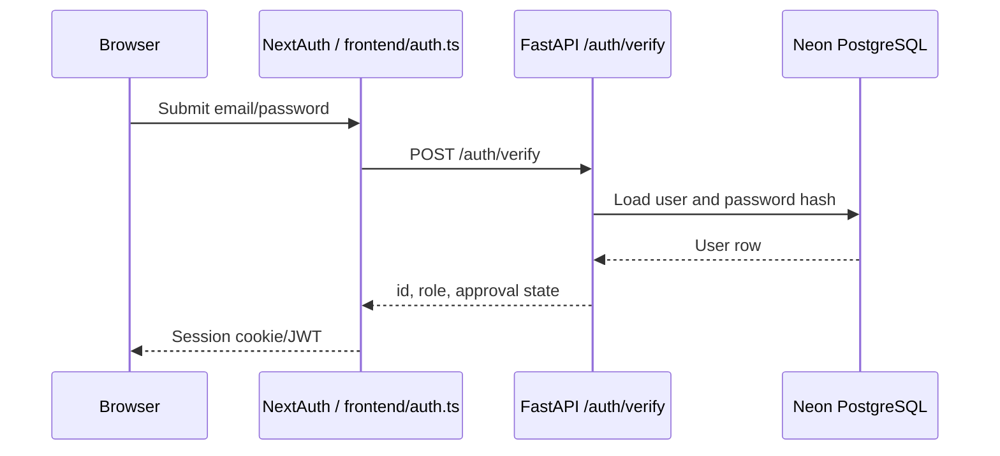
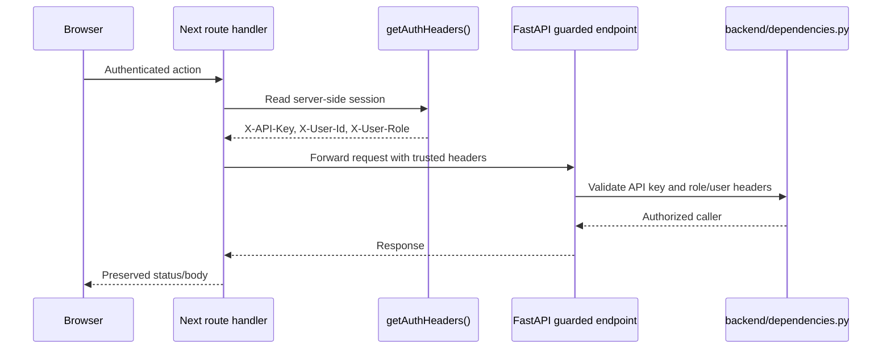

# Auth And Roles

Authentication uses NextAuth credentials on the frontend and bcrypt password verification on the FastAPI backend.

## Login Flow

1. User submits credentials on `/login`.
2. `frontend/auth.ts` posts to backend `POST /auth/verify`.
3. Backend verifies email/password and checks `users.is_approved`.
4. NextAuth stores `id` and `role` in the JWT/session.
5. Authenticated Next route handlers forward `X-User-Id` and `X-User-Role` to FastAPI.

Codex note: browser code should call local `/api/*` routes for authenticated writes. Do not copy `X-User-Id`, `X-User-Role`, or `X-API-Key` handling into client components.

## Roles

| Role | Purpose |
| --- | --- |
| `ADMIN` | Full system access, user management, venues, configuration, all shows |
| `SHOW_MANAGER` | Requests and manages hosted shows; can assign show secretaries and scorekeepers |
| `SHOW_SECRETARY` | Manages assigned shows, classes, entries, back numbers, and results administration |
| `SCOREKEEPER` | Enters placings for assigned shows |
| `EXHIBITOR` | Views own entries/results and manages profile/horses |
| `TRAINER` | Manages a linked trainer registry profile used on horse records |

## Registration

- Exhibitor registration at `/register` creates both a `users` row and a linked `exhibitors` row. Keep those atomic.
- Trainer registration at `/register/trainer` creates a `TRAINER` user and links it to the trainer registry row used on horse profiles. If a registry trainer already exists with the same email and no linked user, registration reuses that row.
- Trainer accounts use one canonical name shared between `users.full_name` and `trainers.name`. Private email is the login email (`users.email`), private phone is `trainers.private_phone`, and optional public contact fields are `trainers.email` and `trainers.phone`.
- Trainer profiles show horses whose `horses.trainer_id` is linked to the trainer's registry row. A trainer can unlink a wrongly-attributed horse from their own profile via `DELETE /trainers/me/horses/{horse_id}` (clears `horses.trainer_id` and `horses.trainer_name`); only works when the horse is currently linked to the requesting trainer.
- Trainer profile (migration 049) carries ad-ready business fields (`business_name`, location, `website`, `bio`, socials), compliance fields (`safesport_completed_at`, `background_check_expires_at`), a self-attested `has_liability_insurance` flag, and an `is_public` toggle gating any future public/ad-listing surface. Compliance dates parallel `users.aqha_management_workshop_completed_at` and are visible to the trainer and admin/secretary only — public views show boolean badges (current / expired), never the raw dates.
- Trainer professional affiliations live in `trainer_registrations` (one row per association) with a `status` field capturing the AQHA Professional Horseman / NRHA Pro / Non Pro distinction.
- Trainer headshots upload as `trainer_documents` rows (`document_type = 'HEADSHOT'`, one per trainer). `GET /trainers/{id}/headshot` serves the image unauthenticated only when `is_public` is true; `GET /trainers/me/headshot` is authenticated and used for self-preview before going public.
- Admin user creation (`POST /users/` and `POST /users/with-password`) and role promotion (`PATCH /users/{id}/role` to `EXHIBITOR` or `TRAINER`) also create the linked profile row in the same transaction. The DB enforces exhibitor 1:1 links via a partial unique index on `exhibitors.user_id`, and trainer 1:1 links via `idx_trainers_user_id_unique`.
- Show Secretary registration at `/register/show-secretary` captures association certifications. APHA certification is required when APHA is selected.
- Show Manager registration at `/register/show-manager` is available immediately. APHA certification lookup is informational.
- Admin user profiles can record `aqha_management_workshop_completed_at`, which AQHA validation uses to confirm at least one assigned show manager or show secretary is workshop-current within 3 years.
- New self-registered Show Secretaries, Show Managers, Trainers, and Exhibitors are currently auto-approved. The `is_approved` column remains as an account lock gate.
- Show Manager approval happens at the show request level, not at account creation.

## Backend Guards

Common guards live in `backend/dependencies.py`:

| Guard | Requires |
| --- | --- |
| `require_api_key` | Valid `X-API-Key` |
| `require_authenticated` | Valid `X-API-Key` and `X-User-Id` |
| `require_admin` | Valid API key and `ADMIN` role |
| `require_admin_or_show_admin` | `ADMIN`, `SHOW_SECRETARY`, or `SHOW_MANAGER` |
| `require_admin_or_show_manager` | `ADMIN` or `SHOW_MANAGER` |
| `require_admin_or_scorekeeper` | `ADMIN` or `SCOREKEEPER` |

Show-scoped write access is usually checked with join tables:

- `show_secretaries`
- `show_managers`
- `show_scorekeepers`

## Sharp Edges

- Do not trust client-provided role or user IDs from browser code. Only server-side Next route handlers should attach backend auth headers.
- Any endpoint returning PII or horse ownership data should require auth.
- When changing an `EXHIBITOR` user to another role, the linked exhibitor data is preserved but the exhibitor dashboard no longer applies.
- When changing a `TRAINER` user to another role, the linked trainer registry row is preserved but the trainer profile panel no longer applies.
- `PATCH /users/me` requires `current_password` when changing `email` because email is the login identifier.
- Admin user deletion is safer after migration `039_user_delete_set_null_fks.sql`, but deleting users can still affect ownership/audit attribution semantics (`SET NULL` references).
