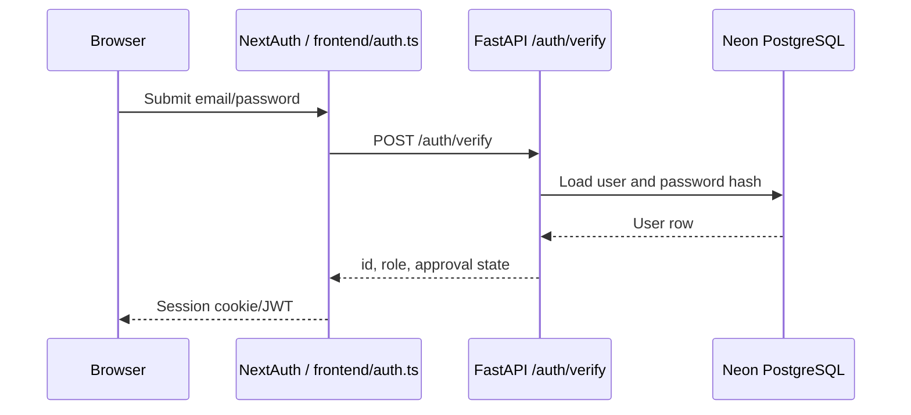
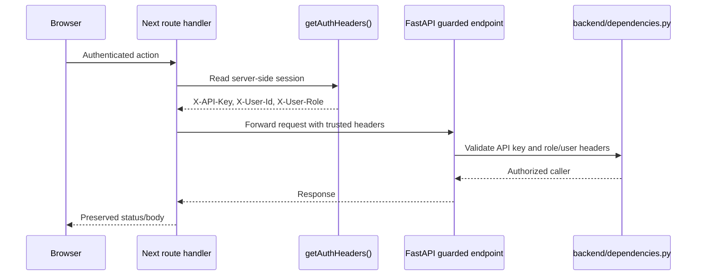

# Auth And Roles

Authentication uses NextAuth credentials on the frontend and bcrypt password verification on the FastAPI backend.

## Login Flow

1. User submits credentials on `/login`.
2. `frontend/auth.ts` posts to backend `POST /auth/verify`.
3. Backend verifies email/password and checks `users.is_approved`.
4. NextAuth stores `id` and `role` in the JWT/session.
5. Authenticated Next route handlers forward `X-User-Id` and `X-User-Role` to FastAPI.

Codex note: browser code should call local `/api/*` routes for authenticated writes. Do not copy `X-User-Id`, `X-User-Role`, or `X-API-Key` handling into client components.

## Roles

| Role | Purpose |
| --- | --- |
| `ADMIN` | Full system access, user management, venues, configuration, all shows |
| `SHOW_MANAGER` | Requests and manages hosted shows; can assign show secretaries and scribes |
| `SHOW_SECRETARY` | Manages assigned shows, classes, entries, back numbers, and results administration |
| `SCRIBE` | Enters placings for assigned shows |
| `GATE_STEWARD` | Runs the warm-up side of the in-gate for assigned shows: per-class order-of-go, exhibitor check-in at the gate, and class gate progression (pending → ready → in progress → done). Admins, Show Managers, and Show Secretaries can also perform gate functions |
| `EXHIBITOR` | Views own entries/results and manages profile/horses |
| `TRAINER` | Manages a linked trainer registry profile used on horse records |

## Registration

- Exhibitor registration at `/register` creates both a `users` row and a linked `exhibitors` row. Keep those atomic.
- Registration endpoints collect `first_name` and `last_name` for users and trainers. `users.full_name` and `trainers.name` are derived display fields retained for existing response shapes.
- Trainer registration at `/register/trainer` creates a `TRAINER` user and links it to the trainer registry row used on horse profiles. Existing unclaimed registry rows are reused by email, including rows that exhibitors created from the horse form when they selected "Other" for a trainer that wasn't yet on file.
- Trainer accounts use one canonical first/last name shared between `users` and `trainers`. Private email is the login email (`users.email`), private phone is `trainers.private_phone`, and optional public contact fields are `trainers.email` and `trainers.phone`.
- Trainer profiles show horses whose `horses.trainer_id` is linked to the trainer's registry row. A trainer can unlink a wrongly-attributed horse from their own profile via `DELETE /trainers/me/horses/{horse_id}` (clears `horses.trainer_id` and `horses.trainer_name`); only works when the horse is currently linked to the requesting trainer.
- Admin deletion keeps linked trainer users and trainer registry rows together: deleting a linked `TRAINER` user removes the `trainers` row, and deleting a linked trainer from the trainer admin removes the user account. Unclaimed trainer registry rows with no `user_id` can still be deleted independently.
- When an exhibitor picks "Other" on the trainer dropdown of a horse form, trainer first name, last name, and email are required. The backend checks for an existing `trainers` row using first name + last name + email case-insensitively, links the horse to that row when found, and otherwise creates an unclaimed registry row the trainer can claim later by registering with the same email.
- Trainer profile (migration 049) carries ad-ready business fields (`business_name`, location, `website`, `bio`, socials), compliance fields (`safesport_completed_at`, `background_check_expires_at`), a self-attested `has_liability_insurance` flag, and an `is_public` toggle gating any future public/ad-listing surface. Compliance dates parallel `users.aqha_management_workshop_completed_at` and are visible to the trainer and admin/secretary only — public views show boolean badges (current / expired), never the raw dates.
- Trainer professional affiliations live in `trainer_registrations` (one row per association) with a `status` field capturing the AQHA Professional Horseman / NRHA Pro / Non Pro distinction.
- Trainer headshots upload as `trainer_documents` rows (`document_type = 'HEADSHOT'`, one per trainer). `GET /trainers/{id}/headshot` serves the image unauthenticated only when `is_public` is true; `GET /trainers/me/headshot` is authenticated and used for self-preview before going public.
- Admin user creation (`POST /users/` and `POST /users/with-password`) and role promotion (`PATCH /users/{id}/role` to `EXHIBITOR` or `TRAINER`) also create the linked profile row in the same transaction. The DB enforces exhibitor 1:1 links via a partial unique index on `exhibitors.user_id`, and trainer 1:1 links via `idx_trainers_user_id_unique`.
- Show Secretary registration at `/register/show-secretary` captures association certifications. APHA certification is required when APHA is selected.
- Show Manager registration at `/register/show-manager` is available immediately. APHA certification lookup is informational.
- Admin user profiles can record `aqha_management_workshop_completed_at`, which AQHA validation uses to confirm at least one assigned show manager or show secretary is workshop-current within 3 years.
- New self-registered Show Secretaries, Show Managers, Trainers, and Exhibitors are currently auto-approved. The `is_approved` column remains as an account lock gate.
- Show Managers create shows directly via `/admin/shows/new`; `POST /shows/` auto-links them via `show_managers`. There is no per-show approval gate.

## Password Reset

Three routes back into an account, in the order a user should meet them.

**1. Security question (self-serve, the normal path).** `/forgot-password` asks for an email, `POST /auth/password-reset/question` returns the question that account set, and `POST /auth/password-reset/answer` takes the answer plus the new password in one request. Both are public and rate-limited — the caller cannot sign in, which is the point.

There is no emailed token because this app cannot depend on email: `mailer.py` returns `None` whenever `SMTP_HOST` is unset and never raises. A mailed-token reset would accept the request, say "check your email", and silently drop it. Every other flow here that mails a link also hands the link back for copy/paste; a reset token is the one thing that must *not* be shown to whoever asked for it, so there is no equivalent fallback.

There is no intermediate token between the two steps either. A token pays for itself when the steps happen in different places — a mailed link, a second device. Here both halves are typed on the same screen a second apart, so a token table would add something to expire, clean up, and secure, and buy nothing.

**2. Current password (fallback).** `POST /auth/reset-password` still takes email + current password + new password. It is a sound check and a useless one for someone who has genuinely forgotten — it stays for accounts with no question set, which is every account created before migration 102.

**3. Admin reset (backstop).** `PATCH /users/{id}/password` on `/admin/users/[id]`, unchanged, for the user who forgot their answer too.

### Setting the question

`GET|PUT|DELETE /users/me/security-question`, surfaced on the profile Account tab. The `PUT` requires `current_password` for the same reason changing the email does: the question is a second way into the account, so an unlocked laptop must not be enough to install one whose answer the attacker knows.

Two refusals worth knowing about: the prompt must end in `?` (a question people can answer, not a label), and the answer may not be the account password — that would put the password into a field which is stored separately, shown unmasked while typing, and guessable with a five-try budget.

Answers are compared **normalized** — trimmed, lowercased, inner whitespace collapsed — then bcrypt-hashed. `Dusty Rose` and `  dusty   rose ` match, because the difference is one the user cannot see and could never debug. Nothing else is stripped.

### Throttling

The question is a single self-written prompt, which at a horse show is often guessable ("first horse's name" is printed on the entry form). Unlimited guesses against a guessable question is not authentication, so `users.security_answer_failed_attempts` counts consecutive misses and `security_answer_locked_until` closes the route for 15 minutes after 5. Per-IP rate limiting sits in front of both, but cannot carry this on its own — it resets when the attacker changes address, and the counter is a property of the account, not of where the guess came from.

While locked, the **question is withheld too**, not just the answer check: the prompt is the half that hints at the answer.

The lock covers the reset route only. Signing in with the password still works and **clears the counter** — someone who remembers their password must never be locked out by a stranger guessing at their question. An admin password reset clears it for the same reason.

### Admin view

`GET /users/{id}/security-question` reports `has_question`, `set_at`, `failed_attempts`, and `locked_until` — deliberately **not** the question text. Admins can already reset the password outright, so showing a self-written question (which usually hints at its own answer) would add exposure and no capability. `DELETE` clears it for a user who forgot their answer; the user then sets their own. An admin cannot *set* a replacement, because that would mean knowing the answer to someone else's account.

## Backend Guards

Common guards live in `backend/dependencies.py`:

| Guard | Requires |
| --- | --- |
| `require_api_key` | Valid `X-API-Key` |
| `require_authenticated` | Valid `X-API-Key` and `X-User-Id` |
| `require_admin` | Valid API key and `ADMIN` role |
| `require_admin_or_show_admin` | `ADMIN`, `SHOW_SECRETARY`, or `SHOW_MANAGER` |
| `require_admin_or_show_manager` | `ADMIN` or `SHOW_MANAGER` |
| `require_admin_or_scribe` | `ADMIN` or `SCRIBE` |

Show-scoped write access is usually checked with join tables:

- `show_secretaries`
- `show_managers`
- `show_gate_stewards`
- `show_scribes`

### Horse Documents: Read And Write Split

`backend/routers/horse_documents.py` separates the two, because they answer different questions:

| | Allowed roles | Endpoints |
| --- | --- | --- |
| `_assert_can_view` | `ADMIN`, `SHOW_SECRETARY`, `SHOW_MANAGER`, or the horse's registered owner | list, download |
| `_assert_can_manage` | `ADMIN` or the horse's registered owner | upload, delete |

Show staff read health paperwork to **verify** it — the secretary at the entry desk and the in-gate both need to see a Coggins. The record itself stays the owner's to maintain, so staff cannot add or remove documents on someone else's horse.

Viewing is **not** scoped to horses entered in a show the user staffs. That rule was considered and rejected: the secretary most needs the Coggins while *creating* the entry, before any row linking horse to show exists, so scoping would hide the document at exactly the moment it is needed. The trade is that any show secretary or manager can read any horse's health documents — acceptable for roles that already see exhibitor contact details, entries, and back numbers.

### Who May See The Money

Financials (`backend/routers/show_financials.py`) is the **show-office tier**: `require_admin_or_show_admin` on the router plus `_assert_show_access` per endpoint, so it is ADMIN, or the `SHOW_SECRETARY` / `SHOW_MANAGER` assigned to *that* show. Covers the overview, the payment endpoints, and the report registry — the report *list* is not sensitive, but nothing under a show should answer to a caller with no rights to that show.

`SCRIBE` and `GATE_STEWARD` are show staff and are deliberately **excluded**. Both work the ring; neither has any reason to read revenue or an exhibitor's balance. "Show staff" is ambiguous in this app — it names roles as well as a general tier — so check which one is meant before widening a money endpoint.

Two things the payment endpoint refuses to take from the client, for the same reason `POST /shows/{id}/verifications` refuses to take a verified value:

- **Who recorded it.** `recorded_by` / `recorded_by_name` come from the caller's headers, so a client cannot attribute a payment to another staff member.
- **Who it is for.** The exhibitor must already be on that show's roster (`_assert_exhibitor_on_roster`, shared with the desk endpoints in `show_office.py`), so staff cannot post a payment against a stranger's account at a show they have nothing to do with.

### Who May Change A Horse

`_check_horse_access` in [backend/routers/people.py](../backend/routers/people.py) is the gate on the horse itself: **`ADMIN`, or the exhibitor in `horses.owner_exhibitor_id`.** Riding a horse, or having added its record, is not the same as owning it. It covers `PATCH /horses/{id}`, the registration endpoints, and both rider endpoints, so two things are the owner's alone:

- **Who rides it.** `POST` / `DELETE /horses/{id}/riders` write `exhibitor_horses`, the table that decides whose show-registration picker the horse appears in.
- **Who trains it.** `trainer_id` and the free-text fallback move only through `PATCH /horses/{id}`. This matters beyond the horse's own record: naming a trainer who isn't on file **creates** a `trainers` registry row (see the "Other" trainer flow above), so an open trainer field is a way to mint people.

Creation follows the same rule rather than sidestepping it — `POST /exhibitors/{id}/created-horses` drops the trainer fields unless the caller is claiming the horse, and routes profile attachment through `horse_access_requests` when the owner named has an account. See the Horse Access section in [show-workflow.md](show-workflow.md).

Two deliberate exceptions:

- **Show staff at the desk.** `POST /shows/{id}/exhibitors/{exhibitor_id}/horses` creates a horse *owned by the exhibitor standing in front of them*, scoped to that show's roster, with `created_by_user_id` recording the staff member — the owner's instruction typed by staff, not staff acting on their own, and they cannot `PATCH` it afterwards. `StaffHorseCreate` still inherits the trainer fields from the shared base, so the endpoint would accept one; `StaffAddHorseForm` has no trainer input, so nothing sends one today.
- **A trainer disowning a false claim.** `DELETE /trainers/me/horses/{horse_id}` clears `trainer_id` when the horse currently names the calling trainer. It only ever removes an assertion someone else made about them.

## Sharp Edges

- Do not trust client-provided role or user IDs from browser code. Only server-side Next route handlers should attach backend auth headers.
- Any endpoint returning PII or horse ownership data should require auth.
- When changing an `EXHIBITOR` user to another role, the linked exhibitor data is preserved but the exhibitor dashboard no longer applies.
- When changing a `TRAINER` user to another role, the linked trainer registry row is preserved but the trainer profile panel no longer applies.
- `PATCH /users/me` requires `current_password` when changing `email` because email is the login identifier.
- `PUT /users/me/security-question` requires `current_password` for the same reason: it installs a second way into the account.
- A security-answer lockout closes the **reset route**, never the login. Signing in clears the counter, so a stranger guessing at someone's question cannot lock the owner out of their own account.
- The security question is never returned to an admin — only whether one is set. Admins can reset the password outright, so reading a self-written question would add exposure without adding capability.
- Admin user deletion is safer after migration `039_user_delete_set_null_fks.sql`, but deleting users can still affect ownership/audit attribution semantics (`SET NULL` references).
