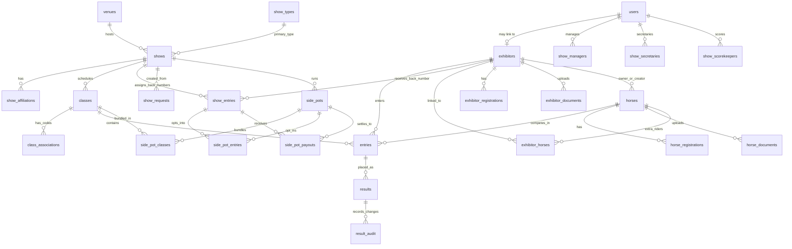

# Database

The database is PostgreSQL hosted on Neon. There is no local `db` service in `docker-compose.yml`.

## Migration Policy

Migrations live in `database/migrations/` and are tracked by the `_migrations` table. Treat migrations as append-only once applied to Neon.

Current migration files:

| File | Summary |
| --- | --- |
| `001_show_types.sql` | Initial show types |
| `002_show_admin_role.sql` | Original show admin join table |
| `003_venue_admins.sql` | Venue admin join table |
| `004_user_last_login.sql` | User last login timestamp |
| `005_rename_show_admins_table.sql` | Rename show admins to show secretaries |
| `006_secretary_certifications.sql` | Show secretary certifications |
| `007_horse_attributes.sql` | Breeds, colors, horse attributes, registrations |
| `008_horse_owner_exhibitor.sql` | Horse owner exhibitor FK |
| `009_horse_documents.sql` | Horse document storage |
| `010_apha_fields.sql` | APHA show, horse, entry, exhibitor fields |
| `011_entries_horse_fk_set_null.sql` | Preserve entries when horses are deleted |
| `012_result_audit_entry_fk.sql` | Result audit entry FK support |
| `013_user_approval.sql` | User approval flag |
| `014_user_role_check_constraint.sql` | Role check constraint |
| `015_add_fk_indexes.sql` | Foreign key indexes |
| `016_add_enum_check_constraints.sql` | Status and enum check constraints |
| `017_drop_legacy_venue_column.sql` | Drop legacy show venue text |
| `018_drop_legacy_owner_name_column.sql` | Drop legacy horse owner text |
| `019_result_audit_changed_at_index.sql` | Result audit timestamp index |
| `020_class_associations.sql` | Per-association class codes |
| `021_drop_apha_class_code.sql` | Drop legacy APHA class code |
| `022_show_manager_role.sql` | Show Manager role and join table |
| `023_show_requests.sql` | Show request workflow |
| `024_apha_standard_classes.sql` | APHA reference class list |
| `024_cert_org_users.sql` | Certification lookup table |
| `024_unique_class_number.sql` | Historical class number uniqueness |
| `025_class_sort_order.sql` | Class sort order |
| `026_show_affiliations.sql` | Secondary show affiliations |
| `027_new_show_types.sql` | Added NRHA, NCHA, NRCHA |
| `028_drop_class_number_unique.sql` | Drop class number unique constraint |
| `029_remove_show_types.sql` | Remove ARHA, NRHA, NCHA, NRCHA |
| `030_horse_owner_trainer.sql` | Horse owner and trainer free-text fields |
| `031_exhibitor_registrations.sql` | Exhibitor association registrations |
| `032_exhibitor_documents.sql` | Exhibitor document storage (BYTEA) |
| `033_horse_created_by.sql` | Track horse creator exhibitor linkage |
| `034_horse_registration_unique.sql` | Unique registration number per association |
| `035_rings_divisions_setup.sql` | Ring/division `sort_order` columns; `standard_rings` + `standard_divisions` lookup tables |
| `036_class_score_type.sql` | `classes.score_type` enum (`placement` / `pattern` / `time`) and `results.raw_score` numeric column |
| `037_side_pots.sql` | Side pot tables: `side_pots`, `side_pot_classes`, `side_pot_entries`, `side_pot_payouts` |
| `038_exhibitor_document_show_type.sql` | Optional `exhibitor_documents.show_type_id` so membership/amateur/youth cards can be tagged to a specific association |
| `039_user_delete_set_null_fks.sql` | Switch `exhibitors.user_id` and `result_audit.changed_by` to `ON DELETE SET NULL` so deleting a user no longer fails on these FKs |
| `040_exhibitor_user_id_unique.sql` | Dedupe linked exhibitors and add partial unique index `exhibitors_user_id_uniq` on `exhibitors(user_id) WHERE user_id IS NOT NULL`, enforcing 1:1 between users and their exhibitor profile |
| `041_exhibitor_contact_youth.sql` | Add `phone`, `address`, `city`, `state`, `zip`, `emergency_contact_name`, `emergency_contact_phone`, `parent_guardian_name`, `parent_guardian_phone` to `exhibitors` |
| `042_trainer_registry.sql` | Add `trainers` table and `horses.trainer_id` foreign key with free-text fallback `horses.trainer_name` |

There are duplicate `024_*` migration numbers. Preserve the existing filenames and ordering behavior; do not rename already-applied migrations casually.

## Running Migrations

Preferred local command on Windows:

```powershell
powershell -ExecutionPolicy Bypass -File database/migrate.ps1
```

Fallback for direct SQL through Docker:

```bash
PSQL_URL="${DATABASE_URL/postgresql+asyncpg/postgresql}"
docker run --rm postgres:16-alpine psql "$PSQL_URL" -v ON_ERROR_STOP=1 -c "<SQL statement>"
```

If a manual migration file is applied outside the runner, also insert its filename into `_migrations`.

## Recent Schema Updates

### New table: `trainers`

- `id` UUID primary key
- `name` TEXT NOT NULL
- `phone` TEXT nullable
- `email` TEXT nullable
- `created_at` TIMESTAMP WITH TIME ZONE

### Updated table: `horses`

- `trainer_id` UUID nullable FK -> `trainers.id` (`ON DELETE SET NULL`)
- `trainer_name` TEXT free-text fallback when no trainer registry entry is linked

### Updated table: `exhibitors` (migration 041)

- `phone` TEXT nullable
- `address` TEXT nullable
- `city` TEXT nullable
- `state` TEXT nullable
- `zip` TEXT nullable
- `emergency_contact_name` TEXT nullable
- `emergency_contact_phone` TEXT nullable
- `parent_guardian_name` TEXT nullable
- `parent_guardian_phone` TEXT nullable

## Core Entities



This diagram is intentionally a domain map, not a full schema dump. Use it to choose the right feature path, then verify exact columns and constraints in `backend/models.py` and `database/migrations/`.

| Entity | Notes |
| --- | --- |
| `show_types` | Association catalog, currently AQHA, APHA, WSCA, NSBA, ApHC, FQHR, OPEN |
| `venues` | Show locations |
| `shows` | Event shell with primary show type, venue, dates, status |
| `show_affiliations` | Secondary associations available for selected classes |
| `show_requests` | Show Manager request/approval workflow |
| `rings` and `divisions` | Per-show arenas and class groupings, each with `sort_order` |
| `standard_rings` and `standard_divisions` | Curated lookup lists used by the show setup picker; `standard_divisions.show_type_id NULL` is the generic fallback set |
| `classes` | Competition classes; ordered by `sort_order`; `score_type` is `placement` (judges rank), `pattern` (judges score numerically), or `time` (clocked event) |
| `class_associations` | Per-class association codes |
| `entries` | Exhibitor + horse in a class |
| `show_entries` | Show-level back number assignment |
| `results` | Manual placings; `raw_score` carries the numeric input for `pattern` (judge score) and `time` (seconds) classes — `place` is derived from `raw_score` for those types |
| `result_audit` | Immutable placing change history |
| `side_pots` | Optional money pool spanning multiple classes; carries `entry_fee_cents`, `payback_percent`, `scoring_method` (`sum_placings` / `sum_scores`), `eligibility_rule`, `payout_schedule` (JSONB keyed by entry-count band), and `status` (`open` / `closed` / `settled`) |
| `side_pot_classes` | Many-to-many: which classes feed each pot |
| `side_pot_entries` | Back-number opt-ins (`paid` flag); pool size = `entry_fee_cents × paid count` |
| `side_pot_payouts` | Frozen ranking + cents-per-place written on settle; tied entries split their combined share |
| `users` | Login accounts and roles |
| `exhibitors` | Exhibitor profile/person records |
| `exhibitor_horses` | Horses an exhibitor may ride beyond ownership |
| `exhibitor_registrations` | Exhibitor membership numbers per association |
| `exhibitor_documents` | Exhibitor-uploaded documents (membership cards, amateur cards, youth cards, medical, ID, other). Card-type rows may carry a nullable `show_type_id` so the right card can be matched to the right association. |
| `horses` | Horse profile, owner link, optional trainer registry link with free-text fallback, breed/color/registration/document links |
| `trainers` | Trainer registry used by horse profiles (`trainer_id`) |
| `horse_registrations` | Horse registration numbers per association |
| `horse_documents` | Uploaded documents stored as BYTEA for now |
| `cert_org_users` | Association certification lookup data |

## Integrity Rules

- Shows cascade to rings, divisions, classes, show staff links, show entries, and side pots.
- Classes cascade to entries, results, and side pot bundle rows.
- Horse deletion sets `entries.horse_id` to `NULL` to preserve history.
- Results changes should write audit rows for `placement` classes; pattern/time classes recompute `place` from `raw_score` on every save and skip the audit (the score is the editorial decision, not the derived placing).
- For `pattern` and `time` classes, `raw_score` is required on insert and update; the backend recomputes every result's `place` and `is_tie` flags after each change so equal scores share a place.
- A side pot with `scoring_method = 'sum_scores'` requires every bundled class to have `score_type IN ('pattern','time')`; the backend rejects the create/update otherwise.
- Settling a side pot is one-way: status moves to `settled`, payouts are written, and further edits are blocked.
- Horse age is derived from foaling year and current year; it is not stored.
- Horse registration numbers are unique per association across all horses.
