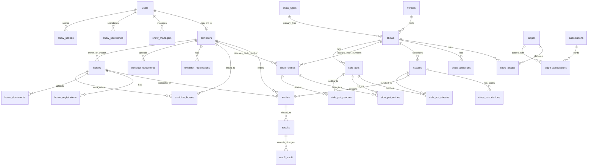

# Database

The database is PostgreSQL hosted on Neon. There is no local `db` service in `docker-compose.yml`.

## Migration Policy

Migrations live in `database/migrations/` and are tracked by the `_migrations` table. Treat migrations as append-only once applied to Neon.

Current migration files:

| File | Summary |
| --- | --- |
| `001_show_types.sql` | Initial show types |
| `002_show_admin_role.sql` | Original show admin join table |
| `003_venue_admins.sql` | Venue admin join table |
| `004_user_last_login.sql` | User last login timestamp |
| `005_rename_show_admins_table.sql` | Rename show admins to show secretaries |
| `006_secretary_certifications.sql` | Show secretary certifications |
| `007_horse_attributes.sql` | Breeds, colors, horse attributes, registrations |
| `008_horse_owner_exhibitor.sql` | Horse owner exhibitor FK |
| `009_horse_documents.sql` | Horse document storage |
| `010_apha_fields.sql` | APHA show, horse, entry, exhibitor fields |
| `011_entries_horse_fk_set_null.sql` | Preserve entries when horses are deleted |
| `012_result_audit_entry_fk.sql` | Result audit entry FK support |
| `013_user_approval.sql` | User approval flag |
| `014_user_role_check_constraint.sql` | Role check constraint |
| `015_add_fk_indexes.sql` | Foreign key indexes |
| `016_add_enum_check_constraints.sql` | Status and enum check constraints |
| `017_drop_legacy_venue_column.sql` | Drop legacy show venue text |
| `018_drop_legacy_owner_name_column.sql` | Drop legacy horse owner text |
| `019_result_audit_changed_at_index.sql` | Result audit timestamp index |
| `020_class_associations.sql` | Per-association class codes |
| `021_drop_apha_class_code.sql` | Drop legacy APHA class code |
| `022_show_manager_role.sql` | Show Manager role and join table |
| `023_show_requests.sql` | Show request workflow (dropped in 052) |
| `024_apha_standard_classes.sql` | APHA reference class list |
| `024_cert_org_users.sql` | Certification lookup table |
| `024_unique_class_number.sql` | Historical class number uniqueness |
| `025_class_sort_order.sql` | Class sort order |
| `026_show_affiliations.sql` | Secondary show affiliations |
| `027_new_show_types.sql` | Added NRHA, NCHA, NRCHA |
| `028_drop_class_number_unique.sql` | Drop class number unique constraint |
| `029_remove_show_types.sql` | Remove ARHA, NRHA, NCHA, NRCHA |
| `030_horse_owner_trainer.sql` | Horse owner and trainer free-text fields |
| `031_exhibitor_registrations.sql` | Exhibitor association registrations |
| `032_exhibitor_documents.sql` | Exhibitor document storage (BYTEA) |
| `033_horse_created_by.sql` | Track horse creator exhibitor linkage |
| `034_horse_registration_unique.sql` | Unique registration number per association |
| `035_rings_divisions_setup.sql` | Ring/division `sort_order` columns; `standard_rings` + `standard_divisions` lookup tables |
| `036_class_score_type.sql` | `classes.score_type` enum (`placement` / `pattern` / `time`) and `results.raw_score` numeric column |
| `037_side_pots.sql` | Side pot tables: `side_pots`, `side_pot_classes`, `side_pot_entries`, `side_pot_payouts` |
| `038_exhibitor_document_show_type.sql` | Optional `exhibitor_documents.show_type_id` so membership/amateur/youth cards can be tagged to a specific association |
| `039_user_delete_set_null_fks.sql` | Switch `exhibitors.user_id` and `result_audit.changed_by` to `ON DELETE SET NULL` so deleting a user no longer fails on these FKs |
| `040_exhibitor_user_id_unique.sql` | Dedupe linked exhibitors and add partial unique index `exhibitors_user_id_uniq` on `exhibitors(user_id) WHERE user_id IS NOT NULL`, enforcing 1:1 between users and their exhibitor profile |
| `041_exhibitor_contact_youth.sql` | Add `phone`, `address`, `city`, `state`, `zip`, `emergency_contact_name`, `emergency_contact_phone`, `parent_guardian_name`, `parent_guardian_phone` to `exhibitors` |
| `042_trainer_registry.sql` | Add `trainers` table and `horses.trainer_id` foreign key with free-text fallback `horses.trainer_name` |
| `043_aqha_support.sql` | Add AQHA approval metadata to `shows` and create empty `aqha_standard_classes` lookup table for the official AQHA Class Code List |
| `044_aqha_workshop_tracking.sql` | Add `users.aqha_management_workshop_completed_at` for AQHA show-management workshop validation |
| `045_trainer_accounts.sql` | Add `TRAINER` role and link trainer registry rows to user accounts |
| `046_trainer_private_phone.sql` | Add private phone storage for trainer accounts |
| `047_class_templates.sql` | Original Schedule Builder seed library (templates + OPEN-style age-bracket "divisions"); superseded by 048 |
| `048_consolidate_divisions.sql` | Consolidate Divisions/Sections/Classes: add `divisions.default_score_type`, new `sections` and `standard_sections` tables, `classes.section_id`; migrate 047 brackets into sections; merge `class_templates` into `standard_divisions`; drop `class_templates` |
| `049_trainer_credentials_and_profile.sql` | Add ad-ready public profile fields (business_name, city/state/country, website, bio, socials, is_public), compliance fields (safesport_completed_at, background_check_expires_at), self-attested has_liability_insurance, plus new `trainer_registrations` table (mirrors `exhibitor_registrations` with `status` and `expires_at`) and `trainer_documents` table for headshot uploads |
| `050_first_last_name.sql` | Add required `first_name` and `last_name` columns to `users` and `trainers`, backfilled from `users.full_name` and `trainers.name`; application model events derive legacy display columns from first/last while older response fields remain available |
| `051_trainer_user_delete_cascade.sql` | Change `trainers.user_id` to `ON DELETE CASCADE` so deleting a linked trainer user removes the trainer registry row instead of orphaning it |
| `052_drop_show_requests.sql` | Drop the legacy `show_requests` table and approval flow (Show Managers now create shows directly) |
| `053_venue_creator.sql` | Add `venues.created_by_user_id` so Show Managers can delete venues they created |
| `054_class_entry_fee.sql` | Add `classes.entry_fee_cents` (default 0) to support the exhibitor self-registration fee summary; no payment is collected by the app |
| `055_show_office_charge_and_nsba.sql` | Add `shows.office_charge_cents` (one-time per horse, default 0) and seed the `NSBA` show type so per-class NSBA sanction fees (`max($3, 6% × entry_fee)`) can be auto-computed at registration time from existing `class_associations` rows |
| `056_user_email_case_insensitive.sql` | Make `users.email` case-insensitive at the unique-index level |
| `057_entries_no_duplicates.sql` | Block duplicate (class_id, horse_id) entries via a unique constraint |
| `058_relax_exhibitor_per_class.sql` | Allow the same exhibitor to enter a class on multiple horses where show policy permits |
| `059_optional_association_class_code.sql` | Make `class_associations.association_class_code` optional |
| `060_show_fees.sql` | Add `show_fees` table for non-entry fees (stall, drug, late, etc.) |
| `061_division_sections.sql` | Nest Sections under Divisions via new `division_sections` join table; tighten `classes.{division_id, section_id}` to NOT NULL with a composite FK enforcing `(division_id, section_id)` membership; mirror `standard_division_sections`. Pre-existing classes with a NULL division or section are deleted; existing valid pairs are backfilled into the join. |
| `062_horse_breeds.sql` | Multi-breed support for horses |
| `063_fix_standard_division_score_types.sql` | Backfill `default_score_type` on legacy standard_divisions rows |
| `064_seed_standard_sections.sql` | Seed generic + APHA + AQHA `standard_sections` brackets |
| `065_remove_bracket_divisions.sql` / `065_seed_standard_division_sections.sql` | Drop legacy bracket-named divisions; seed standard_division_sections pairs |
| `068_standard_classes.sql` | New `standard_classes` table — canonical per-show-type class catalog used by the Matrix setup picker. Each row pairs a class to a `(standard_division, standard_section)` cell via a composite FK to `standard_division_sections`. |
| `069_wipe_per_show_setup.sql` | **Destructive** — wipes per-show `rings`, `divisions`, `sections`, `division_sections`, `classes` and cascades (entries, results, side pots, class associations). Dev-only reset to make the Matrix setup picker's apply flow idempotent. |
| `070_seed_aqha_standard_library.sql` | Generated by `scripts/generate_aqha_standard_library_seed.py` — reseeds AQHA's `standard_divisions`, `standard_sections`, `standard_division_sections`, and `standard_classes` (~1589 classes from the 2026 AQHA Class Master Listing) via the discipline and section classifiers. Re-run the generator after `database/seeds/aqha_standard_classes.csv` changes. |
| `071_classes_division_section_cascade.sql` | Switch the composite FK `classes(division_id, section_id) → division_sections` from `ON DELETE RESTRICT` to `ON DELETE CASCADE`. The original RESTRICT broke show deletion because Postgres' non-deterministic cascade order could delete a `division_sections` row before its dependent `classes`. User-action protection (refusing to drop a membership a class still uses) still lives in `routers/sections.py` as an explicit 409. |
| `072_sanctioned_associations.sql` | Add `sanctioned_associations`, `sanctioned_association_requests`, and `show_sanctioning` tables for the show-setup wizard's Step 3. Sanctioning bodies (NSBA, WSCA, ...) are distinct from breed `show_types`; `show_sanctioning` carries a `per_class_fee_cents`. Add `shows.office_charge_basis` (`per_back_number` / `per_horse`) and `shows.shavings_ban_outside` policy bool. Seed NSBA + WSCA. |
| `073_scorekeeper_invites.sql` | Add `user_invites` table backing the Show Staff page's scorekeeper invite flow. Manager / secretary enters first/last/email; backend stores a token + 14-day expiry; invitee accepts at `/invite/{token}` and gets an auto-created SCOREKEEPER account assigned to the issuing show. Email delivery itself is a follow-up — the invite URL is returned to the issuer for manual share. |
| `074_rename_division_to_discipline.sql` | **Vocabulary rename.** `divisions` → `disciplines`, `sections` → `divisions`, `division_sections` → `discipline_divisions`, and the standard-library analogues (`standard_divisions` → `standard_disciplines`, `standard_sections` → `standard_divisions`, `standard_division_sections` → `standard_discipline_divisions`). Column renames on `classes` and `standard_classes`, plus named constraint / index renames so the schema reads consistently end-to-end. The new vocabulary: **Discipline** = riding style (Western Pleasure, Hunter Under Saddle), **Division** = age/skill bracket (Youth 14-18, Novice Amateur), **Class** = the single event (#102 Youth 14-18 Western Pleasure). |
| `075_gate_steward_role.sql` | Add `GATE_STEWARD` to the user-role check, `show_gate_stewards` assignment table (mirrors `show_scorekeepers`), and gate state on `entries`: `gate_order` (1-based order-of-go, NULL = unordered) and `gate_status` (`waiting`/`on_deck`/`in_ring`/`done`). Backs the `/gate` steward screen and the Show Staff page's gate steward assignment + invite flow. |
| `076_gate_class_progression.sql` | Gate progression moves to the class level: `classes.gate_status` (`pending`/`done`; the current and on-deck classes are derived from show order) and `entries.gate_checked_in` bool replace `entries.gate_status` from 075 (dropped, never used in production). |
| `077_gate_ready_in_progress.sql` | Widen `classes.gate_status` to `pending`/`ready`/`in_progress`/`done`. `ready` is set automatically by the check-in endpoint when every exhibitor has checked in (and reverts to `pending` on undo); `in_progress` is set explicitly by the steward when the first exhibitor enters the ring. |
| `078_default_ring_backfill.sql` | Every class gets a ring: creates a "Ring 1" for shows that have ring-less classes and no rings, then assigns every ring-less class its show's first ring. Class-creation endpoints now apply the same default; the gate enforces one in-progress class per ring. `classes.ring_id` stays nullable at the schema level. |
| `079_horse_pedigree.sql` | Add nullable free-text `horses.sire_name` and `horses.dam_name` so the class schedule and admin entry list can carry the owner/sire/dam columns a printed show program prints. |
| `080_associations_registry.sql` | **Concept split: affiliation vs show configuration.** New `associations` registry (`code`, `name`, `association_type` = `breed` or `club`, `is_active`). `show_types` had been doing two unrelated jobs — "what kind of show is this?" and "which body is this horse/person registered with?" — which forced club bodies (NSBA, WSCA) to masquerade as show types, and duplicated them again in `sanctioned_associations`. Every table storing a membership/registration number repoints from `show_types` to `associations`: `horse_registrations`, `exhibitor_registrations`, `trainer_registrations`, `exhibitor_documents`, `show_secretary_certifications` (all `show_type_id` -> `association_id`, unique constraints renamed to match). `sanctioned_associations` is folded in and dropped: `show_sanctioning.sanctioned_association_id` -> `association_id` referencing `associations`, same for `sanctioned_association_requests.approved_association_id`. NSBA/WSCA are deleted from `show_types` — they are clubs, not show types, so an NSBA-approved show is now an OPEN (or breed) show carrying NSBA club sanctioning. There is deliberately no `associations` row for OPEN: "Open" is the absence of a breed association, not a body anyone holds a membership with. |

| `081_horse_barn_name.sql` | Add nullable `horses.barn_name` (stable/call name) and split it from `horses.name`, which is documented via `COMMENT` as the **registered (association) name** and stays required — it is what the horse is entered and published under. Deliberately *not* a rename of `horses.name` to `registered_name`: that column is referenced across entries, results, the public schedule, search and exports, and the rename would buy nothing beyond the label the UI already shows. |

| `082_coggins_override_audit.sql` | **Historical — nothing writes this table any more.** Health paperwork no longer blocks an entry (see [show-workflow.md](show-workflow.md#health-records--a-flag-not-a-gate)), so there is no gate left to bypass; the table and `GET /shows/{id}/coggins-overrides` are kept read-only because shows that ran under the old rule keep their audit trail. New `coggins_override_audit` table recording each show-staff bypass of the Coggins entry gate (`skip_coggins_check`). Only *effective* overrides were written — passing the flag for a horse that already holds a valid Coggins overrides nothing and records nothing, so the table counts real bypasses rather than flag usage. FK behaviour is mixed on purpose: `show_id` CASCADEs (the audit answers a question about a show, so it goes when the show does, keeping the table bounded), while `entry_id` / `class_id` / `horse_id` / `overridden_by` SET NULL with `horse_name` and `overridden_by_name` denormalized alongside — an audit that goes anonymous when a user is deleted is not much of an audit. |

| `083_document_extractions.sql` | New `document_extractions` table recording each AI read of an uploaded horse document. A row is written *before* the document is saved and linked to it on save, in the same transaction — so a stored `expiry_date` can always be traced to whether a human typed it, accepted the model's reading, or corrected it. `document_id` is nullable because an uploader can abandon a read; those rows are kept rather than cleaned up. `extracted` is JSONB holding the model's output whole, so the extraction schema can widen without a migration and old rows stay readable against the schema of their day. |

| `084_document_extractions_horse_optional.sql` | Drop NOT NULL from `document_extractions.horse_id`. The add-a-horse wizard stages health documents in the browser and saves them only after the horse is created, so a read taken while the user is still filling in the wizard has no horse to point at — and that is exactly where an exhibitor first files a Coggins. A NULL `horse_id` means the read predated its horse; it is filled in when the queued document is saved. |

| `093_scribe_role.sql` | Rename the `SCOREKEEPER` role to `SCRIBE` — the term the horse show world actually uses for the person who records the scores a judge calls. Moves the `users.role` value (and the role check constraint), the role on any pending `user_invites`, and renames `show_scorekeepers` → `show_scribes`. The table step is guarded both ways because startup `create_all` may have already created an empty `show_scribes` from the renamed ORM model. Note that a *ring steward* is a different job — arena floor, closer to `GATE_STEWARD` — which is why this is `SCRIBE`. Earlier rows in this table describe `SCOREKEEPER`/`show_scorekeepers` as they were at the time; those descriptions are left as historical record. |

| `094_class_results_publish_gate.sql` | Add `classes.results_published_at` (NULL = staff-only draft, timestamp = posted to the public screens), backing autosave on the scribe screens. **Backfilled**: every class that already had results is set to `now()`, because those results are already public — without that step the migration would silently un-publish every result in every show that has ever run. Partial index on the published case, since the public read paths filter on it. Related rule enforced in `backend/routers/results.py`, not in SQL: `result_audit` rows are only written once a class is published. |

| `095_results_per_judge.sql` | Add `results.judge_id` (FK → `show_judges`, `ON DELETE RESTRICT`, nullable), giving placings the per-judge dimension they lacked — before this, a class could hold exactly one set of placings, so on a panel show the second judge's card overwrote the first. **Drops `UNIQUE (class_id, place, entry_id)`**, which is not merely superseded: two judges awarding the same horse the same place produce the identical triple, so leaving it would reject the second card. Replaced by two *partial* unique indexes — `(class_id, judge_id, entry_id)` where judge_id is not null, and `(class_id, entry_id)` where it is — because NULLs compare as distinct in a plain unique index, which would let an unattributed row be inserted twice. The constraint is located by column set rather than by name so it drops on databases built from `schema.sql` as well as migrated ones. **Backfilled** only where a show has exactly one judge assigned: there the single card on file is unambiguously that judge's. Shows with two or more judges are left NULL rather than guessed at. NULL `judge_id` means unattributed and renders as one "Placing" column. |

| `096_show_payments.sql` | Add `show_payments` — what the office recorded **collecting** against an exhibitor's account at one show, which is the half the app never had. `billing.build_bill` could say what was owed and nothing said what came in, so an outstanding balance would have read as the full bill for every exhibitor forever. Scoped to `show_entries` (CASCADE) rather than to an individual charge: a show office takes one check for the whole bill, and per-line allocation would be an accounts-receivable ledger nobody at the desk keeps. `amount_cents` is deliberately **signed** — a refund is a negative row rather than an edit to the original payment, so the day's takings still reconcile against what actually moved — with a CHECK excluding only zero. `recorded_by_name` is denormalized beside the FK so the row stays readable after a seasonal staff account is removed. **Recording, not processing**: no card is handled and no processor is called. |
| `097_show_health_requirements.sql` | Add per-show health policy to `shows`: `requires_coggins` (default true), `requires_health_certificate` + `health_certificate_valid_days` (30), `requires_vaccination` + `vaccination_valid_days` (365) + `vaccination_notes`. The app had accepted COGGINS, VACCINATION and HEALTH_CERTIFICATE uploads since `horse_documents` existed but only ever looked at Coggins again, so the office's sweep saw a third of what staff physically check. The other two need a policy first because Coggins is universal and they are not — a CVI follows from crossing a state line, vaccination rules come from the venue — and a flat "no CVI on file" flag would light up every in-state horse at every show until staff stopped reading the panel. Validity is expressed in days from `issue_date` because that is how the papers are written ("issued within 30 days", not "expires on"); a printed expiry on the document still wins. Coggins has no window on purpose: how long a test stays good is a state rule the app cannot know. |
| `098_verify_health_documents_and_trainers.sql` | Widen `show_verifications` with two kinds and the columns they need (`document_type`, `trainer_id`), restating both CHECKs in full so every branch pins the new columns. `horse_health_document` is the office attesting it inspected a Coggins, CVI, or vaccination record; it is keyed on `(horse_id, document_type)` rather than on a `horse_documents` row because the paper is frequently **not** in the app — an exhibitor hands one across the counter and there is nothing to point at, which is the exact case the sign-off exists for. `trainer_membership` covers a trainer's card per association; `trainer_registrations` had held those numbers since the registry landed with nothing checking them. `verified_value` snapshots the derived standing (`valid:2027-05-03`, or `missing:none`), so uploading, replacing, or letting a document lapse moves the snapshot and the check reads back stale. Migration 090 had argued health needed no sign-off on the grounds that a document is either current or not; that collapses "is the date good" (the file answers) with "does this paper describe this horse" (only a person does). |
| `108_consolidate_camping_fee.sql` | Fold the `hookup` fee code back into `camping`, so the Lodging & Boarding setup step offers **one** camping line priced either `per_night` or `per_show` instead of two slots. Migration 106 added the `per_show` unit and the setup screen grew a second slot beside Camping to go with it, which cut the problem in the wrong place: a venue sells one camping spot and the only real question is how it charges for it. Two slots asked the manager which *product* they were selling, and a manager who answered both put two camping charges on the same bill with nothing to say so. Rows are renamed, never merged — no show currently holds both codes, and where one somehow does the `hookup` row is left alone with its own price and possibly its own reservations, because a visible duplicate for staff to resolve beats silently discarding either. Labels are untouched: `code` is the app's key, `label` is what the exhibitor and the printed show bill read. The unit is now guarded rather than free: `PATCH /shows/{id}/fees/{fee_id}` returns **409** when the unit changes on a fee somebody has already reserved, because `build_bill` multiplies rate × quantity and never reads the unit, so flipping camping from per night to per show turns "3 nights" into "3 spots" and reprices every booking with nothing in the data to record it. `ShowFeeOut.reserved_count` (staff list endpoint only — the public price list has no business reporting how many people entered) is what lets both fee editors lock the control instead of offering it and then refusing. |
| `109_futurity_entry_form.sql` | The half of a futurity migration 107 did not model: the entry form. 107 covered what a futurity *charges* — tiered per-class rates, a deadline with a late fee, a membership-dependent office fee, Hi-Point divisions — which is the half the app does arithmetic on and the right half first. What it left with nowhere to live is what a futurity is actually published as. The North Star form states its deadline to the minute, names the awards, tells entrants that breed-association crossover rules do not apply to futurity classes, explains the three categories before asking them to pick one, sells an optional club membership beside the office fee, states a refund policy, and ends in a release. A show setting a futurity up in this app therefore produced a programme that priced correctly and said nothing. Adds to `futurities`: `entry_deadline_time` + `entry_deadline_timezone` (**display precision only** — lateness is still decided by `entered_at` against the deadline *date*, and a CHECK stops a cutoff hour existing without a day to qualify it), `entry_instructions`, `award_notice`, `rules_notice`, `refund_policy`, and `requires_horse_pedigree`. Adds `award_name` / `reserve_award_name` to `futurity_divisions` — the ranking is the computation, the saddle is the reason anybody entered. New table `futurity_membership_options`: the club membership sold at entry, priced by the futurity and billed on its line. **Not a `show_fees` row** — that would be reservable by anyone at the show, would bill through `show_entry_reservations`, and would leave "did this entrant join?" answerable in two places that could disagree with `futurity_entries.is_member`, which is a different question (the card they already hold, not the one they are buying). `futurity_entries` gains `membership_option_id` (RESTRICT, same reasoning as `fee_tier_id`) and `shown_by_name` — "exhibitor if different than owner", free text and named `shown_by_name` because every payload carrying it also carries the account holder's name off `show_entries`. Finally `show_waivers.futurity_id`: the release is a waiver in every sense migration 099 already models one, so it is **scoped rather than duplicated** — NULL keeps the original meaning (everyone at the show), set means only that futurity's entrants are asked, counted, and chased. |
| `110_futurity_membership_amount_check.sql` | Add `ck_futurity_membership_options_amount` (`amount_cents >= 0`), which migration 109 declared inline and the database did not get. `create_all` runs at backend startup and creates whole tables from `models.py`; where it won the race, 109's `CREATE TABLE IF NOT EXISTS` correctly did nothing and the CHECK — which the ORM model did not declare — was silently absent. The general rule for a new table in this repo: anything a migration puts *inside* a `CREATE TABLE` has to be re-assertable on its own, because whichever of the two runs first decides what the table looks like and the migration cannot tell. The constraint is now on the model as well, so a fresh database gets it either way. |
| `107_futurities.sql` | New tables `futurities`, `futurity_fee_tiers`, `futurity_classes`, `futurity_divisions`, `futurity_division_classes`, `futurity_entries`. A futurity had been a single `show_fees` row with code `futurity` — one flat per-entry amount sitting next to the jackpot fee in setup Step 5 — which cannot describe one. A real futurity prices the same class three ways depending on how the horse got there ($75 / $100 / $150 on the North Star form), closes entries on a stated date after which every class carries a late fee, charges an office fee per horse that depends on club membership, and hands out Hi-Point awards over a named subset of its classes. None of that fits in an `amount_cents`. Shaped after `side_pots` — a named programme spanning several classes that exhibitors opt into, with standings — with two deliberate differences. **An entry is an enrollment of a horse, not a bet on classes:** the lettered futurity classes are ordinary `classes` entered through ordinary `entries`, and `futurity_entries` records that a horse is in the programme at a given tier, with the money derived in `billing.futurity_charge_cents` (tier × classes entered + office fee + late fee × classes). **The futurity supplies the class price,** so a futurity class carries `entry_fee_cents = 0` — anything that prices one double-charges, which the UI warns about rather than silently correcting. `futurity_entries.entered_at` is a stored date and never `now()`, the same rule as `show_entry_reservations.reserved_at`: comparing against today would drop a late fee on every existing enrollment the moment the deadline passed. `futurity_division_classes.scoring` is `counts` or `best_of_group`; classes sharing a `group_name` contribute exactly one result between them, which is how "all three pleasure classes may be entered, but only the best counts" is expressed. Scoring reuses the side pot vocabulary (`sum_placings` / `sum_scores`) because the app has no points table — do not invent a third scale without first deciding what a point is. |
| `106_per_show_fee_unit.sql` | Add `per_show` to the `show_fees.unit` CHECK and to `RESERVABLE_FEE_UNITS`. The reservable units were per stall / per bag / per night, which between them cannot price the commonest camping arrangement at a weekend show: an electrical hook-up sold as one flat charge per spot for the whole event. MNSPHC sells exactly that ("$60 for the weekend"), and the closest reservable unit was `per_night`, which bills a two-day show twice. `flat` is wrong for a different reason — a flat fee is charged once however many you have, so it cannot express "two hook-ups"; `per_show` is charged once **per thing reserved**, however long the show runs. Also repairs drift the rewrite exposed: `per_judge` had been in the application's `FeeUnit` enum since 060 but never in the database CHECK, so a fee priced per judge — how every rate on an APHA show bill is quoted — passed Pydantic and then failed on INSERT. |
| `105_mnsphc_association.sql` | Seed the Minnesota North Star Paint Horse Club into `associations` as a `club` row. MNSPHC hosts the Splash of Color / Paint-O-Rama shows, and its own "All Breed" classes sit on an APHA show bill beside the WSCA ones on their own price scale ($8 per judge against WSCA's $5) — so a show has to be able to say it is MNSPHC-sanctioned through `show_sanctioning`, and an exhibitor needs somewhere to hold the membership the club's futurity office fee is priced against ($10 member, $20 non-member). A **club, not a breed** and emphatically not a new `show_type`: nobody registers a horse with MNSPHC, and an MNSPHC-sanctioned show is an APHA (or OPEN) show carrying the club overlay, exactly as with NSBA and WSCA. Idempotent on the unique `code`, so it survives the create_all race. |
| `104_preferred_back_number.sql` | Add `show_entries.preferred_back_number` — the back number the exhibitor asked for, as against `back_number`, which is what the show issued. "Can I have 42 again?" is one of the commonest questions a show office fields before a show; it was answered by email and keyed in by hand, which is the workflow this app exists to remove. Kept as a second column rather than folded into `back_number` because the two answer different questions and diverge the moment the office renumbers — and that divergence ("asked for 42, has 87") is exactly what the desk wants to see. Deliberately **not** unique: several people may want the same number, and only one can have it, which is what the existing `UNIQUE (show_id, back_number)` already decides. `PUT /shows/{id}/register/back-number` grants the request outright when nothing else at that show holds the number — a number nobody else wants is not a decision anyone needs to make, and a "preference" that still leaves the exhibitor waiting on a secretary is the old workflow with an extra table. |
| `103_contact_message_sender_identity.sql` | Add `show_contact_messages.sender_user_id` / `sender_exhibitor_id` (both nullable, `ON DELETE SET NULL`). The table was built for visitors with no account, so every sender field is self-reported text joined to nothing — right for a stranger asking about stall availability, wrong for the exhibitor entered in nine classes asking whether their Coggins arrived. The secretary reading a name in a free-text field cannot tell that person from someone who has never been to the show, and answering usually depends on knowing. Asking the sender to type their back number would be a self-reported answer to an identity question, so the stamp is written by the backend from the session and never from the body; NULL still means exactly what it meant before. SET NULL rather than CASCADE on both, because a message is a record of a conversation the office had and closing an account should not delete the question or its answer. |
| `102_user_security_question.sql` | Add `users.security_question` / `security_answer_hash` (a pair, enforced by CHECK) plus `security_answer_failed_attempts` / `security_answer_locked_until`, backing self-serve password reset at `/forgot-password`. See the Forgot Password section in [auth.md](auth.md) for why a self-written question rather than a mailed token, and why the lockout closes the *reset route* and never the login. |
| `101_attested_health_expiry.sql` | Add `show_verifications.attested_expiry` — the expiry printed on the paper the office was handed. Migration 098 let the desk sign off that it had inspected a Coggins the app had never been shown, but the sign-off recorded only that somebody looked: the horse kept reading "No Coggins on file" and stayed on the office's own chase list, so a secretary who had just held a valid negative test was still being told to go and find it. Clearing the flag on the click alone was the tempting fix and the wrong one — "I looked at this" and "this is valid" are different claims, and collapsing them would let one click clear a flag on a test that expired years ago. Optional, so an illegible or genuinely lapsed document is still recordable as inspected with the horse left flagged. A staff-entered value, like `show_waiver_signatures.signed_name` and unlike everything else in this table, because the app cannot derive a date off a document it has never seen. CHECK-constrained to `horse_health_document`. |
| `100_drop_trainer_membership_verification.sql` | Reverse the `trainer_membership` kind added by 098 and drop the `trainer_id` column, index, and CHECK branch it needed. The reasoning for adding it was sound as a rule — a professional's card is what makes an amateur class an amateur class — but wrong about who does the checking: the trainer is not standing at the counter, has no entry and no back number, and their card is the association's business rather than this show's. The check was permanently unverified and quietly inflated every outstanding count. Reversed rather than left dormant, because a kind nothing writes and a column nothing populates is the `entries.back_number` trap. `horse_health_document` and `document_type` stay. |
| `099_show_waivers.sql` | Add `show_waivers` and `show_waiver_signatures` — the signed entry blank and liability release, which pointed at nothing at all before this. Free text on the way in because the wording comes from the venue's insurer or the fair board. Signatures land in one table from two routes: the exhibitor types their name at sign-up, or staff record a paper blank with `on_paper` set, so a show running entirely on clipboards still gets a working outstanding count. `signed_by_guardian` + `guardian_relationship` because a release signed by a minor is not a release and youth classes are a third of a schedule. Emergency contacts deliberately get no table — `exhibitors` has carried them since migration 041 and a per-show copy would be a second, staler answer to "who do we call". |

There are duplicate `024_*` migration numbers. Preserve the existing filenames and ordering behavior; do not rename already-applied migrations casually.

## Running Migrations

Preferred local command on Windows:

```powershell
powershell -ExecutionPolicy Bypass -File database/migrate.ps1
```

Fallback for direct SQL through Docker:

```bash
PSQL_URL="${DATABASE_URL/postgresql+asyncpg/postgresql}"
docker run --rm postgres:16-alpine psql "$PSQL_URL" -v ON_ERROR_STOP=1 -c "<SQL statement>"
```

If a manual migration file is applied outside the runner, also insert its filename into `_migrations`.

## Recent Schema Updates

### New table: `show_payments` (migration 096)

The other half of the money. `billing.build_bill` has always itemized what an
exhibitor *owes*; nothing recorded the check handed over at the desk. Without
this table an "outstanding balance" is arithmetically the full bill for every
exhibitor, forever, which is why the Financials screen could not exist before it.

Columns: `id`, `show_entry_id` (CASCADE), `amount_cents`, `method`
(`cash` / `check` / `card` / `transfer` / `other`), `reference`, `received_on`,
`note`, `recorded_by` (SET NULL), `recorded_by_name` snapshot, `created_at`.
Indexed on `show_entry_id` (every read is "all payments for this show") and on
`received_on` (reconciling a day).

**This records a payment; it does not process one.** No card is handled, no
processor is called, nothing is charged. The office takes cash or a check and
writes down that it happened — the same shape as `show_verifications`, which
records a document a human physically inspected.

**Scoped to the account, not the charge.** `show_entry_id` is the exhibitor's
account at that show. A show office takes one check for the whole bill;
allocating tenders against specific line items would be a full
accounts-receivable ledger and nobody at the desk works that way. Balance is
therefore `bill total − payments`, per exhibitor per show.

**`amount_cents` is signed.** A refund is a negative row, never an edit to or
deletion of the original payment — the original is a fact about money that
moved, and erasing it balances the account while losing the audit trail. The
CHECK excludes only zero. `DELETE` is for a row typed in error.

`recorded_by_name` is denormalized beside the FK for the same reason
`show_verifications.verified_by_name` is: "who took this $600" is exactly the
question asked when the drawer does not balance, and seasonal staff accounts get
removed.

### Placings are per judge (migration 095)

A ranch or breed show routinely runs a **panel**: four APHA judges and two WSCA
judges on the same day, each placing the same class independently off their own
card. `results` had no way to say whose card a placing came from, so a class
could hold exactly one set of placings and the second judge's entry overwrote
the first.

`results` gains `judge_id`, a nullable FK to **`show_judges`** — the assignment,
not the registry `judges` row. Who placed a class is a fact about this show; the
same judge working two shows files two independent sets of cards.

`NULL` means **unattributed**, and is a real state rather than missing data:

- results entered before any judge was assigned to the show, and
- pre-migration results on a show that has more than one judge, which the
  backfill deliberately refuses to attribute.

The backfill only fills in shows with **exactly one** judge assigned, where the
single card on file can only have been that judge's. Guessing on a panel show
would put a name against placings that judge may never have given.

Uniqueness moved and the old constraint had to go outright:

| Before | After |
| --- | --- |
| `UNIQUE (class_id, place, entry_id)` | `UNIQUE (class_id, judge_id, entry_id) WHERE judge_id IS NOT NULL` |
| — | `UNIQUE (class_id, entry_id) WHERE judge_id IS NULL` |

The old triple is not just superseded — every judge on a panel awards a 1st, so
two judges placing the same horse first produce the identical
`(class_id, place, entry_id)` and the constraint would reject the second card.
Two *partial* indexes rather than one plain one because NULLs compare as
distinct in a unique index, which would let an unattributed row be stored twice.

`ON DELETE RESTRICT` on the FK: unassigning a judge who has already handed in
placings must not delete them. `DELETE /shows/{id}/judges/{assignment_id}`
checks first and returns 409 naming the count, so the office clears the card
deliberately instead of by side effect.

Consequences elsewhere in the schema and code:

- `Entry.results` is a **list** (it was `uselist=False`); an entry now holds one
  row per judge who placed its class.
- Place derivation for `pattern`/`time` classes ranks **within each judge's
  card**. Pooling them would make a 71.5 from one judge tie a 71.5 from another,
  and would make each judge's placings depend on how many other judges had
  filed.
- The results bulk save replaces **one judge's card**, not the whole class —
  see [frontend.md](frontend.md#per-judge-placings) for why that matters with
  autosave.
- Anything counting result rows must count distinct entries instead
  (`classes.list_classes` did not, and reported 24 placed in an eight-horse
  class with three judges).

### Early-bird rate on a show fee (migration 092)

Show bills price stalls, shavings and camping two ways — one number if you
reserve by a date, a higher one after — because the office has to know how much
of the barn to hold before it can plan the grounds. `show_fees` could store only
one number.

`show_fees` gains a **pair**:

- `early_amount_cents INTEGER NULL` — the discounted per-unit price
- `early_deadline DATE NULL` — last day it is available, inclusive

A discount is live only when *both* are set. One without the other is a
half-finished edit in the fee editor, not a price, so it is ignored by
[backend/billing.py](../backend/billing.py) and rejected outright by
`POST`/`PATCH /shows/{id}/fees` — a secretary who filled in an amount and no
deadline believes the discount is live, and the exhibitor screen would say
otherwise. `amount_cents` remains the standard (post-deadline) rate, so every
existing fee bills exactly as it did before.

The columns sit on `show_fees` generally, but only **reservations** consume
them, so the router also rejects an early rate on a unit outside
`RESERVABLE_FEE_UNITS`. Class entry fees live on `classes.entry_fee_cents` and
are never reserved — an early rate on a `per_entry` row would have nothing to
apply to.

`show_entry_reservations` gains `reserved_at DATE NOT NULL DEFAULT
CURRENT_DATE` (backfilled from `created_at`, so existing rows are dated when
they were actually booked). **That date, never "today", decides the rate.**
Pricing off the current date would silently reprice a booking the moment a
deadline passed, which is the one thing an early rate promises not to do.

`reserved_at` is set once when a line is first created and **preserved** when
the exhibitor amends their sign-up — which is why `PUT /shows/{id}/register/signup`
updates existing reservation lines in place instead of replacing them wholesale.
Recreating the rows would re-date them, so an exhibitor who reserved stalls in
April would lose the early rate the moment they came back in July to change
their arrival date. The deliberate consequence: raising the quantity on a line
booked before the deadline keeps the early rate on the whole line, which is how
a show office behaves anyway. Removing a line and re-adding it later does not —
that is a new booking, dated today.

Both the date the reservation is stamped with and the deadline it is compared
against are plain dates in the server's timezone (UTC in the containers), like
every other date gate in this app. Secretaries should set deadlines with a day
of slack rather than expecting a to-the-hour cutoff.

### New table: `show_contact_messages` (migration 091)

An inbox for the public contact form, so a visitor with no account can reach a
show. Deliberately **stored, not forwarded**: `mailer.py` is best-effort and
returns None with no SMTP configured, so an email-only contact form would
accept a message, tell the sender it was sent, and lose it.

Columns: `id`, `show_id` (CASCADE), `sender_name`, `sender_email`,
`sender_phone`, `subject`, `message`, `status` (`new` / `read` / `archived`),
`handled_by_user_id` (SET NULL), `handled_at`, `created_at`. Indexed on
`(show_id, created_at DESC)` for the inbox and a partial index on
`show_id WHERE status = 'new'` for the unread badge.

**Everything about the sender is self-reported and unverified** — the feature
exists for people without accounts, so no column here is joined back to
`users`. Never treat `sender_email` as an identity.

Numbered 091 because the repo already had a `090_show_paperwork_verification.sql`;
"migration 090" elsewhere in the docs means `show_verifications`.

### New table: `show_verifications` + `horses.created_by_user_id` (migration 090)

The show office's record of paperwork it has **physically inspected**. Three
kinds share one table because the actor, the question, and the staleness rule
are identical for all of them:

| `kind` | Subject columns | What staff read | Value snapshotted |
| --- | --- | --- | --- |
| `horse_age` | `horse_id` | The foaling date on the registration papers | `horses.foaling_date` (ISO) |
| `horse_registration` | `horse_id` + `association_id` | The registration number on the papers | `horse_registrations.registration_number` |
| `exhibitor_membership` | `exhibitor_id` + `association_id` | The rider's membership card | `exhibitor_registrations.member_number` |

`ck_show_verifications_subject` enforces which subject columns each kind
populates, so a row cannot describe a shape nobody handles.

Columns: `id`, `show_id` (CASCADE), `kind`, `horse_id` / `exhibitor_id` /
`association_id` (all CASCADE, all nullable per kind), `verified_value`, `note`,
`verified_by` (SET NULL), `verified_by_name` snapshot, `created_at`.

**Scope is per show.** A verification is a show attesting that *its own* office
saw the document, not a permanent property of the horse or the person — the next
show runs its own gate, and one bad sign-off cannot propagate forward. Same
reasoning as `coggins_override_audit`.

**`verified_value` is what makes the record honest.** Staff verify a *value*, not
a row, so the on-file value is snapshotted at sign-off. Edit the number
afterwards and the check reads back as `stale` instead of staying green. The
backend derives this column itself and never accepts it from the request —
a caller able to name the value it "verified" could attest to anything.

Uniqueness is **three partial indexes**, not one composite UNIQUE: the subject
columns are deliberately nullable per kind and Postgres treats NULLs as
distinct, so a plain UNIQUE would not stop the same horse's age being signed off
twice.

- `uq_show_verifications_horse_age` on `(show_id, horse_id) WHERE kind = 'horse_age'`
- `uq_show_verifications_horse_registration` on `(show_id, horse_id, association_id) WHERE kind = 'horse_registration'`
- `uq_show_verifications_exhibitor_membership` on `(show_id, exhibitor_id, association_id) WHERE kind = 'exhibitor_membership'`

`horses.created_by_user_id` (SET NULL) is added in the same migration because
090 also lets show staff create a horse for an exhibitor at the desk.
`created_by_exhibitor_id` cannot attribute that — staff have no exhibitor record
— and it stays NULL for staff-created horses, which is also how the profile's
horse list distinguishes them (that list reads `created_by_exhibitor_id` **or**
an `exhibitor_horses` link, so the staff path writes the link).

This table was created by `create_all` before the migration ran on the
development database, and the constraints and partial indexes survived only
because they are declared in `backend/models.py` as well — see the next section.

### CHECK constraints lost to the create_all race (migration 089)

Backend startup runs `Base.metadata.create_all`, which races the migration
runner. On a database where the app booted first, migrations 087 and 088 found
their tables already present and their `CREATE TABLE IF NOT EXISTS` was skipped
**in full** — including the CHECK constraints, which existed only in the SQL.
Indexes and comments still applied, because those are separate statements, so
the shortfall was precisely the checks and nothing else. This is the failure
mode idempotent DDL does *not* protect against: the table exists, so it looks
applied, but it is not the table the migration describes.

**Writing a new migration: declare constraints in `backend/models.py` too**,
with the same explicit name the SQL uses. A constraint that lives only in the
migration is silently absent on every create_all-first database. Migration 089
is the catch-up for databases already past that point:
`ck_horse_access_requests_kind`, `ck_horse_access_requests_status`,
`ck_show_entry_reservations_quantity`.

### New table: `horse_access_requests` (migration 087)

Consent, pending, for a horse changing hands. Two flows share one table because
they are the same shape — a request that only takes effect when a specific
person says yes:

| `kind` | Requester | Approver | On approval |
| --- | --- | --- | --- |
| `link` | An exhibitor who wants the horse on their profile | The horse's current owner | Writes the `exhibitor_horses` row |
| `transfer` | The current owner | The person receiving the horse | Moves `horses.owner_exhibitor_id`, then writes `exhibitor_horses` for them |

`approver_exhibitor_id` is always "whoever must press the button", which is why
approve/decline is one code path (`_apply_decision` in
[backend/routers/horse_access.py](../backend/routers/horse_access.py)).

Columns: `id`, `token` (UNIQUE), `kind`, `horse_id` (CASCADE), `horse_name`
snapshot, `requester_exhibitor_id` / `approver_exhibitor_id` (both SET NULL),
`requested_by_name` / `approver_name` / `approver_email`, `status`
(`pending` / `approved` / `declined` / `cancelled` / `expired`), `message`,
`email_sent` (NULL = never attempted, FALSE = attempted and failed),
`expires_at`, `responded_at`, `created_at`.

A partial UNIQUE index on `(horse_id, requester_exhibitor_id, kind) WHERE
status = 'pending'` allows one outstanding ask at a time without blocking a
fresh request after a decline. Horses CASCADE; the exhibitors SET NULL so a
closed account doesn't erase a horse's history.

The token is the authorization for the decision page, matching `user_invites` —
single-use, 30-day TTL. It is emailed *and* shown to the requester for copy and
paste, because SMTP is optional here and an undelivered email must not be the
reason a sale can't be recorded.

### Show sign-up: `show_entries` columns + `show_entry_reservations` (migration 088)

`show_entries` gains `registered_at TIMESTAMPTZ`, `arrival_date DATE`,
`departure_date DATE`, and `registration_notes TEXT`. `registered_at` is the
sign-up gate: set means the exhibitor completed sign-up, NULL means the row is
a shell a secretary created while adding a late entry by hand. The migration
backfills `registered_at` from `created_at` on every existing row, so anybody
already registered stays registered.

`show_entry_reservations` records how many of each show fee an exhibitor booked:

- `id`, `show_entry_id` (CASCADE), `show_fee_id` (CASCADE), `quantity` (>= 0),
  `created_at`
- UNIQUE `(show_entry_id, show_fee_id)`

It points at `show_fees` rather than restating stalls/shavings/camping as
columns. The secretary already configures those rows with prices and units, and
which ones an exhibitor may reserve is derived from the **unit** —
`per_stall`, `per_bag`, `per_night`, `per_show` (`RESERVABLE_FEE_UNITS` in
[backend/billing.py](../backend/billing.py)) — so a show that adds its own
per-stall fee is offered without a schema change.

`quantity` has no meaning apart from the unit it was booked under, and nothing
downstream re-reads that unit: `build_bill` multiplies rate × quantity and
prints the unit as a label. So a fee's **price** may change freely — the
`reserved_at` early-rate rule already decides who pays which — but its **unit**
may not once anybody holds a reservation. `PATCH /shows/{id}/fees/{fee_id}`
returns 409 in that case (migration 108); changing how a line is charged means
removing it and adding it again, which drops the reservations openly instead of
re-pricing them in silence.

### Preferred back number: `show_entries.preferred_back_number` (migration 104)

One nullable `INTEGER`, and no constraint of its own. It is what the exhibitor
asked for during class registration; `back_number` stays what the show issued.

`PUT /shows/{id}/register/back-number` grants the request when nothing else at
the show holds that number, so in the ordinary case the two columns agree and
the exhibitor walks away with the number they wanted. They diverge when the
office renumbers, and the desk renders "asked for 42" under the field so staff
see it before the exhibitor asks at the counter.

Three deliberate limits:

- **Only while the show is `PUBLISHED`.** `_load_published_show_or_403` closes
  the endpoint when the show goes `ACTIVE` — by then numbers are printed,
  hanging on backs, and written on judges' cards.
- **Clearing drops the wish, not the number.** Handing a number back is not
  something anyone asks for at a horse show, and an empty text box releasing an
  assignment the office may have made independently would be a surprise.
- **Auto-assign honours it.** `POST /shows/{id}/back-numbers/auto-assign` claims
  requested numbers first and fills the rest from the lowest free number, rather
  than numbering straight through 1..N and undoing every request in one click.
  It also nulls the target set before refilling it, because Postgres checks
  `UNIQUE (show_id, back_number)` per statement and reassigning in place can
  swap two numbers through an invalid halfway state.

### New tables: `judges`, `judge_associations` (migration 085)

A judge used to exist only as a row on `show_judges`, so their name, contact
details, and affiliations were retyped into every show that hired them. The
judge is now the record; the show assignment only points at it.

`judges`:

- `id` UUID primary key
- `first_name`, `last_name` TEXT NOT NULL
- `email`, `phone` TEXT nullable
- `is_active` BOOLEAN NOT NULL default TRUE
- UNIQUE index on `(lower(first_name), lower(last_name), lower(coalesce(email,'')))` — name + email is the identity rule, the same one the old "known judges" dropdown applied in Python

`judge_associations`: `(judge_id, association_id)` — what the judge is carded
with, referencing `associations`, **not** `show_types`. The migration carried
the old `show_judge_affiliations` rows across by matching codes and dropped
that table; OPEN affiliations were discarded because OPEN has no `associations`
row (migration 080) and never meant an affiliation.

`show_judges` changed shape in the same migration: `judge_id` UUID NOT NULL FK
-> `judges.id` (`ON DELETE RESTRICT`), UNIQUE `(show_id, judge_id)`, and the
`first_name` / `last_name` / `email` / `phone` columns were dropped. Existing
rows were deduplicated into the registry by that identity rule before the drop.

### New table: `trainers`

- `id` UUID primary key
- `user_id` UUID nullable FK -> `users.id` (`ON DELETE CASCADE`), unique when present
- `name` TEXT NOT NULL
- `first_name` TEXT NOT NULL (migration 050; editable source of truth)
- `last_name` TEXT NOT NULL (migration 050; editable source of truth)
- `name` TEXT NOT NULL derived display field retained for existing trainer list/profile responses
- `private_phone` TEXT nullable, required by trainer self-service once a trainer account is linked
- `phone` TEXT nullable public phone
- `email` TEXT nullable public email
- Public profile (migration 049): `business_name`, `city`, `state`, `country` (NOT NULL default `'US'`), `website`, `bio`, `social_facebook`, `social_instagram`, `social_tiktok`
- `is_public` BOOLEAN NOT NULL default FALSE — gate for ad-facing exposure
- Compliance (migration 049): `safesport_completed_at` DATE (valid 1 year), `background_check_expires_at` DATE
- `has_liability_insurance` BOOLEAN NOT NULL default FALSE — self-attested
- `created_at` TIMESTAMP WITH TIME ZONE

### New table: `trainer_registrations` (migration 049)

Mirrors `exhibitor_registrations` with extra credential fields:

- `id` UUID primary key
- `trainer_id` UUID NOT NULL FK -> `trainers.id` (`ON DELETE CASCADE`)
- `association_id` UUID NOT NULL FK -> `associations.id` (`ON DELETE CASCADE`) — was `show_type_id` -> `show_types.id` before migration 080
- `member_number` TEXT NOT NULL
- `status` TEXT NOT NULL default `'general'`, CHECK `('professional','non_pro','general')` — captures AQHA Professional Horseman / NRHA Pro / Non Pro distinction
- `expires_at` DATE nullable
- UNIQUE `(trainer_id, association_id)`

### New table: `trainer_documents` (migration 049)

BYTEA storage parallel to `exhibitor_documents`, currently restricted to one `HEADSHOT` per trainer (partial unique index). The CHECK can be extended in a follow-up migration to accept COI, W-9 indicator, etc.

- `id` UUID primary key
- `trainer_id` UUID NOT NULL FK -> `trainers.id` (`ON DELETE CASCADE`)
- `document_type` TEXT NOT NULL CHECK `('HEADSHOT')`
- `original_filename`, `file_data` BYTEA, `mime_type`, `file_size`
- `uploaded_by_user_id` UUID nullable FK -> `users.id` (`ON DELETE SET NULL`)
- `created_at` TIMESTAMPTZ
- Partial unique index `idx_trainer_documents_one_headshot` on `(trainer_id)` where `document_type = 'HEADSHOT'`

### Updated table: `horses`

- `trainer_id` UUID nullable FK -> `trainers.id` (`ON DELETE SET NULL`)
- `trainer_name` TEXT free-text fallback when no trainer registry entry is linked

### Updated table: `shows` (migration 043)

- `aqha_show_number` TEXT nullable
- `aqha_approval_status` TEXT default `NOT_SUBMITTED`
- `aqha_approval_submitted_at` DATE nullable
- `aqha_approval_notes` TEXT nullable

### New table: `aqha_standard_classes`

- `code` TEXT primary key
- `name` TEXT NOT NULL
- `division` TEXT NOT NULL
- `sort_order` INTEGER NOT NULL default `0`
- `source_year` INTEGER nullable
- `notes` TEXT nullable

Load this table from the official AQHA Class Code List using:

```powershell
python scripts/import_aqha_standard_classes.py database/seeds/aqha_standard_classes.csv --replace --source-year 2026
```

The 2026 AQHA Class Master Listing is stored as `database/seeds/aqha_standard_classes.csv` after extraction from the official PDF. Re-run the import command after applying migration `043_aqha_support.sql` to populate or refresh the lookup table.

### Updated table: `users` (migration 044)

- `aqha_management_workshop_completed_at` DATE nullable
- `first_name` TEXT NOT NULL (migration 050; editable source of truth)
- `last_name` TEXT NOT NULL (migration 050; editable source of truth)
- `full_name` TEXT NOT NULL derived display field retained for existing user/session responses

AQHA validation checks assigned show managers and show secretaries for a workshop date within 3 years of the show start date.

### Updated table: `exhibitors` (migration 041)

- `phone` TEXT nullable
- `address` TEXT nullable
- `city` TEXT nullable
- `state` TEXT nullable
- `zip` TEXT nullable
- `emergency_contact_name` TEXT nullable
- `emergency_contact_phone` TEXT nullable
- `parent_guardian_name` TEXT nullable
- `parent_guardian_phone` TEXT nullable

## Core Entities



This diagram is intentionally a domain map, not a full schema dump. Use it to choose the right feature path, then verify exact columns and constraints in `backend/models.py` and `database/migrations/`.

| Entity | Notes |
| --- | --- |
| `associations` | **Affiliation registry** (migration 080) — bodies a horse or person is registered/enrolled with, typed `breed` (AQHA, APHA, ApHC, FQHR) or `club` (NSBA, WSCA, MNSPHC). Everything storing a membership/registration number points here, and it is also the source for per-show club sanctioning. No OPEN row: Open means no breed association. |
| `show_types` | **Show configuration** — what kind of show is being put on, which drives eligibility and the standard class catalogs. Currently AQHA, APHA, ApHC, FQHR, OPEN. Distinct from `associations`: an AQHA *show* and an AQHA *registration* are different facts, so the same code legitimately appears in both lists. Clubs are not show types. |
| `venues` | Show locations. `created_by_user_id` (added in migration 053) tracks the creator so Show Managers can delete venues they created. |
| `shows` | Event shell with primary show type, venue, dates, status |
| `show_affiliations` | Secondary associations available for selected classes |
| `rings` | Per-show arenas, each with `sort_order` |
| `judges` | **Judge registry** (migration 085) — the judge as a person: name, email, phone, `is_active`. Identity is name + email, enforced by a unique index, so the same judge is one row no matter how many shows hire them |
| `judge_associations` | Which associations a judge is carded with. Points at `associations` (affiliation registry), not `show_types` |
| `show_judges` | Assignment of a registry judge to a show, with `sort_order`. Carries no judge details of its own — `judge_id` is RESTRICT, so a judge who has officiated cannot be deleted out from under the history. Unique on `(show_id, judge_id)` |
| `divisions` | Per-show **disciplines** (Halter, Western Pleasure, Trail, Barrels). Each carries `default_score_type` (`placement` / `pattern` / `time`) that newly-created classes inherit when score_type is omitted. Legacy rows from before migration 048 are not auto-classified; secretaries may need to clean up names that are really sections. |
| `sections` | Per-show **age/skill brackets** (10 & Under, 11-13, Walk-Trot, Amateur). Each section is linked to one or more divisions via `division_sections` (M2M, migration 061). A section with no division memberships can't be used on classes. |
| `division_sections` | Join table on `(division_id, section_id)`. A composite FK on `classes(division_id, section_id)` references this table — pairing a class with an unregistered (div, sec) returns 422. Removing a section from a division that still has classes pairing them returns 409. |
| `standard_rings`, `standard_divisions`, `standard_sections`, `standard_division_sections` | Curated lookup lists used by the setup picker. `show_type_id NULL` is the generic fallback set. `standard_divisions` carries `default_score_type` for each discipline; `standard_division_sections` mirrors the per-show membership join. |
| `standard_classes` | Canonical per-show-type class catalog used by the Matrix setup picker (migration 068). Each row carries `class_code`, `class_name`, `default_score_type`, `default_entry_fee_cents`, and `sort_order`, anchored to a `(standard_division, standard_section)` cell via composite FK to `standard_division_sections`. AQHA seed comes from `scripts/generate_aqha_standard_library_seed.py` reading the 2026 Class Master Listing CSV. |
| `classes` | Competition classes; ordered by `sort_order`. `division_id` (discipline) and `section_id` (bracket) are **both required** (migration 061). The `(division_id, section_id)` pair must be a registered membership in `division_sections` — enforced by a composite FK. `score_type` is `placement` (judges rank), `pattern` (judges score numerically), or `time` (clocked event); set from `division.default_score_type` at create time when omitted. Bulk imports and section-less schedule-builder picks use the per-show "Unassigned" placeholder pair. |
| `class_associations` | Per-class association codes |
| `aqha_standard_classes` | AQHA class-code lookup used by the AQHA class picker and validation rules; seeded from the official 2026 AQHA Class Master Listing CSV |
| `entries` | Exhibitor + horse in a class |
| `show_entries` | Show-level back number assignment, plus show sign-up (`registered_at`) and the number the exhibitor requested (`preferred_back_number`, migration 104) |
| `results` | Manual placings; `raw_score` carries the numeric input for `pattern` (judge score) and `time` (seconds) classes — `place` is derived from `raw_score` for those types |
| `result_audit` | Immutable placing change history |
| `coggins_override_audit` | One row per effective show-staff bypass of the Coggins entry gate: horse, which failure was bypassed (`missing` / `undated` / `expired`), who did it, and when |
| `document_extractions` | One row per AI read of an uploaded horse document: what the model suggested (`extracted`), what the human saved (`accepted`), which suggestions they changed (`overridden_fields`), and what the read cost. `document_id` is NULL for abandoned uploads |
| `side_pots` | Optional money pool spanning multiple classes; carries `entry_fee_cents`, `payback_percent`, `scoring_method` (`sum_placings` / `sum_scores`), `eligibility_rule`, `payout_schedule` (JSONB keyed by entry-count band), and `status` (`open` / `closed` / `settled`) |
| `side_pot_classes` | Many-to-many: which classes feed each pot |
| `side_pot_entries` | Side pot entries, one per exhibitor (`show_entry_id`); pool size = `entry_fee_cents × paid count`, and `paid` defaults to true since buy-ins settle with the show bill rather than being collected per entry |
| `side_pot_payouts` | Frozen ranking + cents-per-place written on settle; tied entries split their combined share |
| `futurities` | A futurity programme within a show (migration 107) — `entry_deadline`, `late_fee_cents`, and `office_fee_member_cents` / `office_fee_nonmember_cents`. Not a `show_fees` row: a futurity prices one class several ways, by entrant category. Since 109 it also carries the words on its entry form — `entry_deadline_time` / `entry_deadline_timezone` (display only), `entry_instructions`, `award_notice`, `rules_notice`, `refund_policy` — and `requires_horse_pedigree` |
| `futurity_fee_tiers` | What one class costs per entrant category ("Category #1/#2/#3"). `futurity_entries.fee_tier_id` is `ON DELETE RESTRICT` — a tier with enrollments against it is a price somebody was quoted |
| `futurity_membership_options` | Optional club memberships the futurity sells at entry (migration 109). Charged once per enrollment on the futurity line. Distinct from `futurity_entries.is_member`, which decides the office fee: that is a card the entrant already holds, this is one they are buying |
| `futurity_classes` | Many-to-many: which classes belong to the futurity. Each carries `entry_fee_cents = 0`, because the tier supplies the price |
| `futurity_divisions` | Hi-Point award brackets (Yearling, 2 Year Old), each with a `scoring_method` reusing the side pot vocabulary, plus `award_name` / `reserve_award_name` — what the champion and reserve actually receive |
| `futurity_division_classes` | Which classes count toward a division, and how — `counts`, or `best_of_group` where classes sharing a `group_name` contribute one result between them |
| `futurity_entries` | One horse enrolled in one futurity, at one tier, with `is_member`, an optional `membership_option_id`, a free-text `shown_by_name` for when the owner is not showing, and a stored `entered_at` that decides the late fee |
| `users` | Login accounts and roles |
| `exhibitors` | Exhibitor profile/person records |
| `exhibitor_horses` | Horses an exhibitor may ride beyond ownership |
| `exhibitor_registrations` | Exhibitor membership numbers per association |
| `exhibitor_documents` | Exhibitor-uploaded documents (membership cards, amateur cards, youth cards, medical, ID, other). Card-type rows may carry a nullable `show_type_id` so the right card can be matched to the right association. |
| `horses` | Horse profile, owner link, optional trainer registry link with free-text fallback, breed/color/registration/document links |
| `trainers` | Trainer registry used by horse profiles (`trainer_id`) |
| `horse_registrations` | Horse registration numbers per association |
| `horse_documents` | Uploaded documents stored as BYTEA for now. Served inline (`?inline=true`) for the desk's side-by-side viewer as well as as a download. |
| `show_waivers` | What a show asks exhibitors to sign: entry blank terms, liability release, venue rules. `futurity_id` (migration 109) narrows *who is asked* — set, only that futurity's entrants are counted and chased; NULL, everyone at the show, which is what every pre-109 row is |
| `show_waiver_signatures` | One exhibitor's signature on one waiver — typed at sign-up, or recorded from paper at the desk |
| `cert_org_users` | Association certification lookup data |

## Integrity Rules

- Shows cascade to rings, divisions, sections, classes, show staff links, show entries, and side pots.
- Classes cascade to entries, results, and side pot bundle rows. Deleting a section returns 409 from `routers/sections.py` if any class still references it (the per-section FK is RESTRICT). The composite FK `classes(division_id, section_id) → division_sections` is `ON DELETE CASCADE` (migration 071) so that show deletion can cascade cleanly; user-driven membership removal is still 409-guarded at the API layer.
- Horse deletion sets `entries.horse_id` to `NULL` to preserve history.
- Results changes should write audit rows for `placement` classes; pattern/time classes recompute `place` from `raw_score` on every save and skip the audit (the score is the editorial decision, not the derived placing).
- For `pattern` and `time` classes, `raw_score` is required on insert and update; the backend recomputes every result's `place` and `is_tie` flags after each change so equal scores share a place.
- A side pot with `scoring_method = 'sum_scores'` requires every bundled class to have `score_type IN ('pattern','time')`; the backend rejects the create/update otherwise.
- Settling a side pot is one-way: status moves to `settled`, payouts are written, and further edits are blocked.
- Horse age is derived from foaling year and current year; it is not stored.
- Health standing is derived on read from `horse_documents` against the show's **last day**, never stored, and only for the documents that show requires. A `show_verifications.attested_expiry` for that show overlays it, so paperwork the office has physically inspected stops being chased — the overlay never feeds back into `verified_value`, which stays a snapshot of the file alone. The office's physical inspection of the same paper is a separate, stored fact in `show_verifications`; neither implies the other.
- Deleting a waiver cascades to its signatures: they were agreement to that text and mean nothing without it. Editing the text leaves them alone.
- Horse registration numbers are unique per association across all horses.
- AQHA entry validation requires an official AQHA class code, an AQHA horse registration, an AQHA exhibitor membership number, and enough DOB/foaling-date data to verify supported youth/select/horse-age rules.
