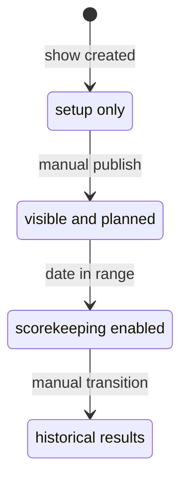
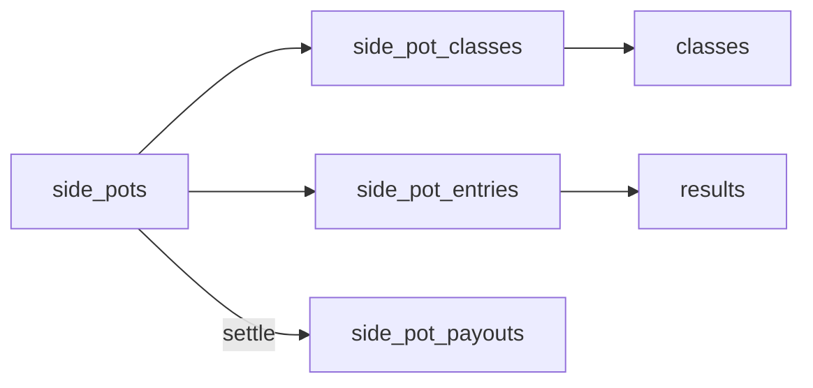

# Show Workflow

Shows move from setup to publication to scoring and results.

## Status Lifecycle

| Status | Meaning |
| --- | --- |
| `DRAFT` | Setup in progress; hidden from public/exhibitors |
| `PUBLISHED` | Visible and open for registration/planning |
| `ACTIVE` | Show is underway; scorekeepers can enter placings |
| `COMPLETED` | Show has ended |

Manual status changes are guarded in `backend/routers/shows.py` and surfaced through `ShowStatusControl.tsx`:

- `PUBLISHED` requires venue + at least one class.
- `ACTIVE` requires today's date to be inside the show's date range.
- `COMPLETED` is an explicit transition after results are final.

Codex note: when changing show visibility, scorekeeper access, or result entry behavior, check both the status guards in `backend/routers/shows.py` / `backend/routers/results.py` and the frontend controls that hide or disable actions by status.

## Show Manager Path

1. Show Manager self-registers.
2. Show Manager submits a request at `/show-requests/new`.
3. Admin reviews at `/admin/show-requests`.
4. On approval, a `DRAFT` show is created and the manager is assigned in `show_managers`.
5. Manager assigns Show Secretaries and Scorekeepers.
6. Secretary/manager completes setup, classes, entries, and back numbers.
7. Scorekeepers enter placings when the show is active.

## Direct Admin Or Secretary Path

1. Admin or Show Secretary creates a show directly.
2. Show is edited while in `DRAFT`.
3. Rings and divisions are configured at `/admin/shows/[id]/setup` (optional but recommended for multi-arena shows or when you want classes grouped for the schedule).
4. Classes, entries, staff, and back numbers are configured.
5. Show is published once it has a venue and at least one class.
6. Results are entered manually and published immediately.

## Rings And Divisions Setup

- Each show can declare its own list of rings (physical arenas) and divisions (class groupings such as Halter, Western Pleasure, Trail).
- The setup page at `/admin/shows/[id]/setup` exposes a picker seeded from `standard_rings` and `standard_divisions`. Standard divisions are association-aware: APHA and AQHA show types get curated discipline lists; other show types fall back to a generic set.
- Class records reference rings and divisions through nullable foreign keys; setup is optional for small shows that only need a flat class list.
- Rings and divisions cannot be deleted while any class still references them; reassign or delete those classes first (the API returns 409 with a human-readable detail and the UI disables the delete button accordingly).
- Demographic divisions (Open / Amateur / Youth / SPB) are still tracked per entry via `entries.apha_division`, not at the show-division level. Keep the picker discipline-only.

## Entries And Back Numbers

- `entries` represent a class-level exhibitor/horse registration.
- `show_entries` assign one show-level back number per exhibitor per show.
- Entry-level `back_number` exists for class context and compatibility with existing UI flows.
- A class with `status = "CLOSED"` rejects new entries at the backend (`backend/routers/entries.py::create_entry`); the EditClassCard status toggle is how secretaries close a class.
- Association-specific entry validation runs in `backend/rules`. AQHA currently blocks invalid entries when the app can verify the data: missing official AQHA class code, missing AQHA horse registration, missing AQHA exhibitor membership number, youth/select DOB failures, youth stallion entries, junior/senior horse-age mismatches, ranch/VRH minimum-age failures, and 2-year-old performance classes before July 1.

## Association Class Setup

- APHA and AQHA shows can bulk-add classes from official standard-class catalogs at `/admin/shows/[id]/classes`.
- APHA reference data lives in `apha_standard_classes`.
- AQHA reference data lives in `aqha_standard_classes` and is seeded from `database/seeds/aqha_standard_classes.csv`, which is extracted from the official 2026 AQHA Class Master Listing PDF.
- Imported classes create a `class_associations` row so later validation/export logic can read the association class code from one normalized location.

## AQHA Approval And Validation

- AQHA shows have `aqha_show_number`, `aqha_approval_status`, `aqha_approval_submitted_at`, and `aqha_approval_notes` fields on the show record.
- The AQHA dashboard card at `/admin/shows/[id]` summarizes approval metadata plus validation issue counts.
- Backend endpoint `GET /shows/{show_id}/aqha-validation` returns schedule and entry issues with `error` or `warning` severity.
- Errors block entry create/update; warnings are shown in validation summaries but do not block saving today.
- Current AQHA validation is limited to fields the app stores. Owner/lessee membership, AQHA amateur status, Level 1 eligibility, and per-judge show identities still need additional modeling.
- AQHA show-management workshop dates are stored on users as `aqha_management_workshop_completed_at`; at least one assigned show manager or show secretary should be current within 3 years of the show start date.

## Exhibitor Self-Service Flow

- Exhibitors can manage account identity data through user `me` endpoints.
- Exhibitors can maintain contact, emergency, and youth guardian fields through exhibitor profile endpoints.
- Exhibitors can maintain association membership numbers through exhibitor registration endpoints.
- Exhibitor membership-card documents can be tagged to a specific association (`show_type_id`) for multi-association shows.
- Exhibitors can manage horse relationships across owner-linked horses, created horses, and linked horses.

## Scorekeeper Flow

1. Scorekeeper opens `/scorekeeper`.
2. They see only assigned, non-draft shows.
3. On an active show, class cards link to the scorekeeper form.
4. The form rendered depends on the class's `score_type`:
   - `placement` (default, rail and halter classes) - secretary types placings directly; tie support via duplicate place numbers; gap warning prompts before saving non-contiguous placings.
   - `pattern` (showmanship, horsemanship, equitation, trail, reining, etc.) - secretary types each judge-aggregated score; the backend recomputes placings (highest score wins) on save and the UI shows derived placings live as scores are entered.
   - `time` (barrels, poles, stake race) - same as pattern but lowest time wins.
5. DQ entries are listed at the bottom and do not receive a place.
6. Audit rows are written for `placement` classes when a place changes; pattern/time classes do not audit derived placings (the score is the editorial value, not the placing).

## Class Scoring Type

Classes are tagged with a `score_type` in the class editor (`/admin/shows/[id]/classes`):

| Type | When to use | What gets entered | How placings are decided |
| --- | --- | --- | --- |
| `placement` | Rail classes, halter, color, lead line | Place number per entry | Manual entry (today's behavior) |
| `pattern` | Showmanship, horsemanship, equitation, trail, reining, western/ranch riding, longe line | Numerical judge score (~70 baseline) | Highest score wins; ties share a place |
| `time` | Barrel racing, pole bending, stake race | Time in seconds | Lowest time wins; ties share a place |

Newly created classes default to `placement`; APHA/AQHA bulk-imported classes also default to `placement` and need to be flipped per class today.

## Side Pots (Divisional Jackpots)

Side pots are optional money pools that span multiple classes within a show - analogous to division jackpots run alongside pattern-class divisions like Showmanship 13&U / 14-17 / 18-34 / 35-49 / 50+.

### Lifecycle

| Status | Meaning |
| --- | --- |
| `open` | Accepting opt-ins and edits |
| `closed` | Soft-closed; opt-ins frozen but not yet paid out (optional intermediate state) |
| `settled` | Payouts written; pot is locked from further edits |

Settling is one-way; reopening a pot is not currently supported.

### Configuration

- **`scoring_method`**: `sum_placings` (lowest sum wins, works for any class type) or `sum_scores` (highest sum wins, requires every bundled class to be `pattern` or `time`).
- **`eligibility_rule`**: `all_classes` requires a result in every bundled class to be ranked; `any_class` lets missing classes count as last place + 1.
- **`payout_schedule`**: JSONB map keyed by paid-entry count band, e.g. `{"1-3":[100], "4-7":[70,30], "8-15":[60,30,10], "16+":[40,25,15,12,8]}`. Defaults are seeded by the API; producers can override per pot.
- **Tie breaking**: `most 1sts -> most 2nds -> most 3rds ...`. If still tied, entries split the combined share evenly. Rounding remainder goes to first place.

### Operational Flow

1. Secretary creates a pot at `/admin/shows/[id]/side-pots`, picks classes (the picker hides classes that do not match the scoring method).
2. Secretary opts back numbers in by typing the back number, marks `paid` when cash is collected.
3. Standings page (`/admin/shows/[id]/side-pots/[potId]`) shows live ranking + projected payouts as the underlying class results land. Refresh button re-runs the computation.
4. Once results are final, secretary clicks **Settle**. The backend writes one `side_pot_payouts` row per eligible entry (place + cents) and locks the pot.
5. Frozen payouts table appears in the same screen for handoff to whoever cuts checks.

The total pool is `entry_fee_cents * paid count`; payout pool applies `payback_percent` to the total. Unpaid opt-ins still appear in standings (flagged "Unpaid") but contribute no money to the pool.
