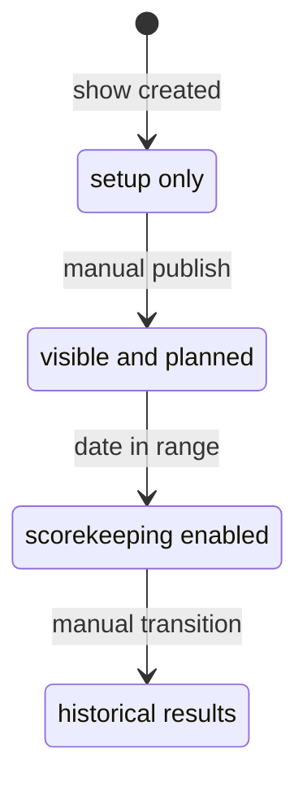
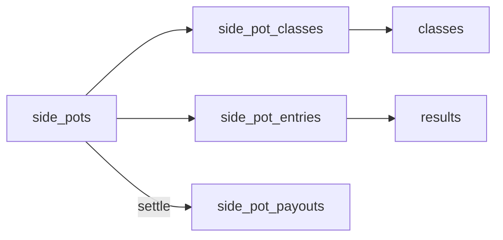

# Show Workflow

Shows move from setup to publication to scoring and results.

## Status Lifecycle

| Status | Meaning |
| --- | --- |
| `DRAFT` | Setup in progress; hidden from public/exhibitors |
| `PUBLISHED` | Visible and open for registration/planning |
| `ACTIVE` | Show is underway; scribes can enter placings |
| `COMPLETED` | Show has ended |

Manual status changes are guarded in `backend/routers/shows.py` and surfaced through `ShowStatusControl.tsx`:

- `PUBLISHED` requires venue + at least one class.
- `ACTIVE` requires today's date to be inside the show's date range.
- `COMPLETED` is an explicit transition after results are final.

Codex note: when changing show visibility, scribe access, or result entry behavior, check both the status guards in `backend/routers/shows.py` / `backend/routers/results.py` and the frontend controls that hide or disable actions by status.

## Show Setup Wizard

Show creation runs through an eight-step wizard. Each step is a separate route and is skippable — secretaries can come back later via the setup hub at `/admin/shows/[id]/setup`, which shows per-step completion derived from data presence (judges count, sanctioning count, lodging-fee codes, class-fee codes / `office_charge_cents`, class count, futurity count, and whether the published show bill is a bill yet). A completed step's badge reads **Edit**, not "Done": the row is still a link, so the badge names what clicking it does.

The hub and every step page read those counts from one helper, `setup/_lib/fetchStepCounts.ts`, so the stepper on a step page and the checklist on the hub cannot disagree about what is done.

Eligible to start the wizard: `ADMIN`, `SHOW_MANAGER`, `SHOW_SECRETARY`. Show Managers creating a show have an auto-inserted `show_managers` row; Step 1's staff roster is where any further assignment happens.

**Not every step lives under `/setup`, and not everything under `/setup` is a step.** Step 1 is `/admin/shows/[id]/edit`, Step 6 is `/admin/shows/[id]/classes` and Step 7 is `/admin/shows/[id]/futurities`, because all three are deep-linked from elsewhere and were screens before the wizard reached them. `/admin/shows/[id]/setup/paperwork` runs the other way — it is a redirect, not a step (see below). A step is a position in a flow, not a folder; `StepLayout` is what makes a route a step, and it is the same component in all eight.

| Step | Route | What it does |
| --- | --- | --- |
| 1. Basics & Staff | `/admin/shows/new`, then `/admin/shows/[id]/edit` | Name, show type, dates, venue — and **everyone who works the show**, via `ShowStaffPanel`: managers (`show_managers`), secretaries (`show_secretaries`), scribes (`show_scribes`), gate stewards (`show_gate_stewards`). Managers and secretaries are picked from `GET /users/by-role`; a secretary can also be inline-created via `POST /users/with-password` (Show Managers may only inline-create `SHOW_SECRETARY` accounts — extended check in `routers/people.py`). Scribes and gate stewards are assigned or invited by email token. Deciding who runs a show is part of setting it up, so there is no separate Show Staff screen; `/admin/shows/[id]/staff` redirects here. |
| 2. Judges | `/admin/shows/[id]/setup/judges` | Reuses `JudgesEditor` — **picks** judges from the `judges` registry (`GET /judges/`) and assigns them with `POST /shows/{id}/judges`. Name, contact details, and association cards are displayed read-only from the registry; show setup cannot edit them. A judge who isn't in the registry yet is added to it (`POST /judges/`) and assigned in one step. |
| 3. Sanctioning | `/admin/shows/[id]/setup/sanctioning` | Pick zero or more `sanctioned_associations` (NSBA, WSCA, ...) and set a `per_class_fee_cents` for each. Wraps `PUT /shows/{id}/sanctioning` which replaces the full set. The "+ Request new sanctioned club" link expands the request form on demand (`POST /sanctioned-association-requests`) — admin reviews via `POST /sanctioned-association-requests/{id}/review`. |
| 4. Lodging & Boarding | `/admin/shows/[id]/setup/lodging` | Three structured slots written into `show_fees` with codes `stall` / `shavings` / `camping`, plus a `shows.shavings_ban_outside` policy bool. Each slot also takes an optional **early rate** — a cheaper amount plus a "reserve by" date (`show_fees.early_amount_cents` / `early_deadline`, migration 092). The camping slot is camping *and* the electrical hook-up, with a choice of how it is charged: per night, per day, or one price for the whole show (`per_night` / `per_day` / `per_show`, migrations 108 and 111). A free-text notes field carries "electric included" or similar. Extra campsite tiers — dry camping, early arrival, late departure — are not slots here; they go on the full boarding fee schedule at `/admin/shows/[id]/fees/boarding`, which the step links to. |
| 5. Show Fees | `/admin/shows/[id]/setup/fees` | `office_charge_cents` + `office_charge_basis` (`per_back_number` vs `per_horse`) on the show row, plus two structured slots in `show_fees` with codes `standard_class` / `jackpot` — both `per_entry`, so both are published price-list text and neither bills (what an entry is charged comes from `classes.entry_fee_cents`, and a side pot's buy-in from the pot itself, over only the classes bundled into it). Each slot now says so on the screen, plus **Other fees** — any number of the show's own named charges, each priced per exhibitor, per horse, per judge per horse, or per judge per exhibitor (migration 112). Those are the only fee units besides the office charge that actually bill, via `billing.charge_lines`; they are matched by *unit* rather than by code, because a manager names them, and they are charged automatically to everyone who has entered a class rather than booked like a stall. The same editor (`components/ShowChargesEditor.tsx`) is what `/admin/shows/[id]/fees/entry` renders. Sanctioning per-class fees are editable here and link back to Step 3 for which clubs, and forward to Step 6's Sanctioned Classes for which classes each one approves — the amount alone does not say whether it charges anybody, so each club row also reports how many classes are marked approved. A **futurity slot used to sit here and does not any more** (migration 107): one amount cannot say that the same class costs $75, $100 or $150 depending on the entrant's category. The step links on to Step 7 instead, and offers to delete a leftover `futurity` fee row — a show carrying both bills its futurity entrants twice. |
| 6. Classes | `/admin/shows/[id]/classes` | Build the class schedule — the OPEN three-step class wizard documented below, or the per-association importers. Longest job in setting a show up, which is exactly why it is a step in the flow rather than an errand to remember from the dashboard. Route unchanged, so per-class deep links still work. A show carrying club sanctioning also gets a banner here linking to **Sanctioned Classes** (`/admin/shows/[id]/classes/sanctioning`, migration 113), where staff tick which classes each club approves — a club sanctions a list of classes, not the schedule, and its per-class fee is charged on those and nowhere else. Its own screen rather than a panel in the wizard, because the wizard is OPEN-only and an NSBA- or WSCA-sanctioned show is just as likely to be an AQHA or APHA show carrying the overlay. |
| 7. Futurities | `/admin/shows/[id]/futurities` | Optional; most shows run none. **+ Add futurity** captures the whole published entry form — deadline (to the minute), late fee, office fee by membership, the entry categories and what qualifies for each, an optional club membership for sale, which classes belong to the programme, the award / rules / refund notices, and the release entrants sign. After Classes on purpose: a futurity is defined by which classes belong to it, and there is nothing to pick from until the schedule exists. Route unchanged, so the dashboard tile still reaches it. |
| 8. Show Bill | `/admin/shows/[id]/setup/showbill` | Which show bill exhibitors see. **The show bill this app builds** is the default — drawn from the judges, classes, fees and policies the seven steps before it set, so it updates itself when any of them change. **Our own show bill, uploaded** publishes a PDF or image the show supplies instead (migration 127). Uploading and publishing are two separate presses: a manager comparing their club's PDF against the generated bill can put it on file and look at it without every exhibitor's Show Bill button changing underneath them. The radio for the uploaded bill is disabled until a file exists (`PUT /shows/{id}/showbill-source` 422s the same case anyway), and removing the file puts the show back on the generated bill in the same transaction. Last in the flow because the show bill is what every step before it adds up to. |

Sanctioning associations are distinct from breed `show_types` — see `docs/database.md`. The breed `show_type` is set once on the show row at creation and drives breed-specific rules; sanctioning is a per-show overlay that adds points eligibility (and an optional per-class fee) without changing the show's primary type.

That per-class fee is charged **only on the classes the club actually approves** (`class_sanctioning`, migration 113), designated in Step 6's Sanctioned Classes screen. Enrolling a club in Step 3 and pricing it in Step 5 charges nobody until that is done — which is deliberate, and both screens say so. A dual-sanctioned class carries both clubs' fees.

### The Show Bill: Generated Or Uploaded

The app has always drawn the show bill from the show's own records —
`/shows/[id]/showbill`, and the same document embedded on Show Details — and
that remains the default and the recommendation. A generated bill cannot fall
out of date with the schedule it describes: a secretary who adds a class or
moves a fee has already updated it.

Step 8 adds the other option (migration 127). The reason is not laziness on the
show's part. A club's show bill is usually a designed document — sponsor logos,
the club's own wording, the entry blank on the back, an award list this app has
no table for — laid out and sent to the printer well before anything is keyed in
here. Refusing the upload never made those shows use the generated bill; it made
them e-mail a PDF this app never saw.

Three rules keep the hazard visible rather than dismissing it:

- **The choice and the file are two separate facts.** `shows.showbill_source`
  may only read `uploaded` while a `SHOWBILL` row exists in `show_documents`.
  `PUT /shows/{id}/showbill-source` 422s the mismatch and
  `DELETE /shows/{id}/showbill-document` resets the column in the same
  transaction — "delete the file, then remember to change the setting" is not a
  sequence to hand somebody mid-setup. Readers still resolve rather than trust:
  `GET` returns `effective_source` beside `source` and every renderer uses the
  former, because the one thing a show bill must never be is blank.
- **An uploaded bill hides nothing.** Show Details prints the generated document
  under its own heading whichever bill the show chose. That document is drawn
  from the fee list `GET /shows/{id}/fees/public` charges from, so hiding it
  behind an uploaded PDF would leave an exhibitor with no way to check what they
  will actually be billed. A show chooses what the *button* shows; it does not
  get to make the live schedule unreachable.
- **There is no staleness check, and faking one would be worse than none.**
  Saying "this PDF predates the current schedule" needs the upload date compared
  against the last change to `classes`, `show_fees` and `show_judges`, and none
  of the three carries an `updated_at`. `UploadedShowbill` stamps the upload date
  on the page instead, says in as many words that classes and fees may have
  changed, and links out to the live schedule.

Roles: the same show-office tier as the rest of setup — `ADMIN`, or the
`SHOW_SECRETARY` / `SHOW_MANAGER` assigned to that show. Reading the bill and
downloading the file are **public**, like the generated bill and like
`/shows/[id]/schedule`: a show bill is the prize list a stranger reads to decide
whether to enter.

### Paperwork Requirements Are Not A Setup Step

Which health documents a show requires (`shows.requires_coggins` / `requires_health_certificate` + window / `requires_vaccination` + window + notes, migration 097) and the waivers exhibitors sign (`show_waivers`, migration 099) are set at **`/admin/shows/[id]/desk/paperwork`**, reached from a button on the registration desk. `/admin/shows/[id]/setup/paperwork` redirects there.

It was briefly a wizard step and that was the wrong place. Setup is answered once and closed; this is the standing order the desk reads every time somebody registers, and it is the registration side that discovers it is wrong — the checklist asking for a document this show does not want, or not asking for one it does. Putting the switch beside the checklist means the person who notices can fix it.

Coggins defaults on; CVI and vaccinations are opt-in, because they follow from state lines and venue rules rather than from the breed association. Waiver text is free-form — it comes from the venue's insurer or the fair board, and this app has no business supplying it.

## Class Setup Origins

The old per-show Standard Library matrix picker (`MatrixSetupClient`, `POST /shows/{show_id}/setup/apply`) was removed when the wizard shipped. Per-show divisions, sections, division-section memberships, and classes are now created via the Classes page — setup Step 6, `/admin/shows/[id]/classes` — either manually or via the Schedule Builder / Standard Library quick-start documented below. The `/standard-setup/catalog` endpoint and the `standard_classes` / `standard_division_sections` tables remain in place and are still used by the Classes-page importers.

## Show Status Lifecycle

1. Wizard creates the show in `DRAFT`.
2. Status moves to `PUBLISHED` once the show has a venue and at least one class (guarded in `backend/routers/shows.py`).
3. `PUBLISHED → ACTIVE` happens when today's date is in range.
4. `ACTIVE → COMPLETED` is an explicit transition after results are final.

## Rings, Divisions, and Sections Setup

- A **Ring** is a physical arena. Rings are managed inline on the Classes / Schedule Builder pages.
- A **Division** is a discipline (Halter, Western Pleasure, Trail, Barrels). Each division carries a `default_score_type` (`placement` / `pattern` / `time`) that newly-created classes inherit.
- A **Section** is an age or skill bracket (10 & Under, 11-13, Walk-Trot, Amateur). Sections live independently in `sections` but are scoped to one or more divisions via the `division_sections` join (migration 061).
- Class records require **both** `division_id` and `section_id` (migration 061) and the `(division_id, section_id)` pair must be a row in `division_sections` — enforced by a composite FK. The class create/edit forms gate the section dropdown on the chosen division and only show sections that belong to it. The Classes page (`/admin/shows/[id]/classes`) redirects until at least one ring and one division exist.
- Rings, divisions, and sections cannot be deleted while any class still references them (the API returns 409 and the UI disables the delete button accordingly). Removing a division from a section that still has classes pairing them also returns 409.
- Demographic splits (Open / Amateur / Youth / SPB) for APHA are still tracked per entry via `entries.apha_division`, not at the section or division level. Sections are about age/skill brackets at the class level, not entry-level eligibility.

## OPEN Class Setup Wizard

`ClassWizardClient` (`/admin/shows/[id]/classes`, OPEN shows) runs three steps — disciplines, divisions, classes — and drops into a hub overview once all three have data, so editing one section doesn't mean walking back through the other two. Its UI contract:

- **Every step ends in a save/finish bar** (`StepFooter`), stuck to the bottom of the viewport. The standard libraries and the class matrix are long enough to push a static footer out of sight, and a save button you have to scroll to find reads as a save button that doesn't exist. Steps 1 and 2 save pending picks; step 3 finishes (its classes are already saved).
- **Step 3 puts the picker first and folds the schedule underneath it.** Clicking a `(Division × Discipline)` cell creates the class immediately, so the matrix is what the secretary works in; the "Classes added (N)" disclosure below it opens the drag-to-reorder / delete list. The live count in its header and the ✓ on the cell are the feedback that a click landed.
- Step 3's finish button is disabled while creates are still draining, so nobody leaves mid-queue.

## Schedule Builder

The Schedule Builder at `/admin/shows/[id]/classes` lays out a show as a **divisions × sections** matrix:

- Rows are divisions (disciplines).
- Columns are sections (age/skill brackets), plus a "(no section)" column for unbracketed classes — picks in that column are stored under the per-show "Unassigned" section so the class still satisfies the required-both rule.
- Each checked cell materializes one numbered class and also registers the `(division, section)` pair in `division_sections` if it wasn't already a member — the matrix is effectively the secretary declaring "this section applies to this division".
- Class names auto-generate as `"{Section} {Division}"` (e.g. "10 & Under Showmanship") when a real section is paired, or just `"{Division}"` for the Unassigned column.
- `score_type` is taken from the division's `default_score_type` for every class the build creates (with a per-pick override available in the API for advanced use).
- New disciplines or brackets can be added inline from the builder (custom division add form includes a scoring radio; custom section add form is name-only).

## Standard Library Quick-Start

The "Add from Standard Library" action on `/admin/shows/[id]/classes` is the click-pick equivalent of the AQHA/APHA pickers for any show type:

- The picker loads valid standard `(division, section)` pairs from `GET /standard-setup/pairs`, backed by the `standard_division_sections` join table seeded in migrations 064-065. It no longer renders every possible cartesian product, so invalid combinations such as Walk-Trot Halter are filtered out before the secretary sees them.
- The secretary filters by discipline / bracket / search, checks the cells they want, sees a routing-summary panel, and commits.
- On commit, `POST /shows/{id}/classes/from-library` creates any missing per-show Division (with the discipline's `default_score_type`), Section, and `(division, section)` membership; then creates one class per pick named `"{Section} {Discipline}"` with the discipline's scoring type. The picker can assign all created classes to one selected ring, and the schedule is renumbered.
- Each pick already carries division name + score type from `standard_divisions`, so this endpoint skips the name-keyword classifier used by the AQHA/APHA bulk imports.
- Disciplines or brackets that don't appear in the standard library are added on the Setup page; they'll appear here the next time the picker opens.

## The Registration Desk

`/admin/shows/[id]/desk` is where the show office works on an exhibitor. Back numbers, class entries, side pot buy-ins, and paperwork check-in were three screens (`/entries`, `/back-numbers`, `/check-in`) and are one conversation at the counter — somebody walks up, gets a number, says what they are riding and on what, buys into the jackpot, and hands over their papers. Splitting that across three pages meant finding the same person three times, and no page could tell you what was still outstanding on the other two. All three routes now redirect here.

- **Two views, one screen.** *By exhibitor* is the desk flow: a searchable roster on the left with filter chips (no back number, paperwork to check, health flags, no classes yet), and the selected person's whole standing on the right. *By class* is the program listing — who is entered in what, grouped by show day, with owner/sire/dam. Clicking a name there jumps back to that person's panel.
- **Entries can be added from either view**, because filling a class is its own job — a secretary working down a short class calling for more riders is thinking about the class, not about each rider's account. `AddEntryForm` is one component with one side pinned: pass the exhibitor and it offers a class picker, pass the class and it offers an exhibitor picker. Writing it twice would have meant two copies of the SPB guard, the relationship-required rule, and the horse lookup. An expanded class shows the form behind a **+ Add an exhibitor to this class** toggle (one open at a time — with *Expand all* on a 21-class show a form per class is a wall of dropdowns), and it stays open after each save so a queue of riders goes in one after another. Closed classes offer a note instead of the form.
- **The pickers filter to what the backend would accept.** A horse can only be in a class once (`entries_class_horse_uniq`), and only `pattern` classes let one exhibitor ride several — so already-entered horses drop out of the horse list, and already-entered exhibitors drop out of the exhibitor list unless the class is `pattern`. The backend still enforces both; this is the friendlier half.
- **One money line per exhibitor, not two.** Billed, paid, and owing sit on the panel's summary row with a *Record a payment* link straight through to `/financials/exhibitors`. A second Account block lower down the panel restated the same three figures from the same `build_account` call — two places to read one number, and the reason to scroll for it was a link that belongs next to the figures anyway. The caveat it carried, that side pot buy-ins are not part of that balance, moved to the Side pots section where the buy-ins actually are.
- **No show-wide money figure at the top.** The header counts registration work — exhibitors, entries, missing back numbers, paperwork outstanding. What one exhibitor owes stays on their panel, since they may be paying it at this counter; "the show is owed $6,049" is a Financials question and is not part of registering anybody.
- **One read.** `GET /shows/{id}/desk` ([backend/routers/show_desk.py](../backend/routers/show_desk.py)) returns the roster, the class schedule, the side pots, and every exhibitor's entries, pot memberships, paperwork checks, and balance. Clicking down a roster must not fire five requests per exhibitor on venue wifi.
- **The desk computes nothing of its own.** Money comes from `_load_financials` → `billing.build_account`, so the running total read out at the desk is the same number the exhibitor sees on My Shows. Paperwork comes from `build_verification_checklist` in [backend/routers/show_office.py](../backend/routers/show_office.py), so "verified" / "changed since sign-off" / "nothing on file" has one definition. Adding a figure to this screen means calling the thing that already owns it.
- **Nothing on the screen mutates through a desk endpoint.** Every button posts to the endpoint that already owned that job — `POST .../classes/{id}/entries`, `PATCH .../back-numbers`, `POST .../side-pots/{id}/entries`, `POST .../verifications` — so association validation, back-number uniqueness, the closed-class rule, and the settled-pot lock all still apply. A save then re-reads `/desk`.
- **`POST /shows/{id}/desk/exhibitors` is the one exception**, and it only creates the roster row those endpoints assume. A back number lives on `show_entries` and a side pot entry points at it, so before this the desk could not give a walk-up a number or put them in a pot without first inventing a class entry for them. `registered_at` stays NULL — this is the shell row, not a sign-up, and the exhibitor still has to sign up before they can self-register for classes. Idempotent. `DELETE` is an undo for adding the wrong person and 409s once entries, pots, reservations, or payments exist.
- **Access is the show-office tier** — ADMIN, or the SHOW_SECRETARY / SHOW_MANAGER assigned to that show. `SCRIBE` and `GATE_STEWARD` are excluded, as on Financials: the desk carries every exhibitor's balance.
- An exhibitor's classes are listed in the order the show runs them, not by `class_number` — that column is text, so sorting on it puts class 10 ahead of class 3.

## Entries And Back Numbers

- `entries` represent a class-level exhibitor/horse registration.
- **`show_entries.back_number` is where a back number lives** — one per exhibitor per show, written by the back-number screen and protected by a unique constraint. `entries.back_number` is an older per-entry column that **nothing writes any more**; it survives only so existing rows and the entry create/update payloads keep working, and it is NULL on every entry created since assignment moved to `show_entries`.
- **The exhibitor may ask for a number, and gets it when it is free** (`show_entries.preferred_back_number`, migration 104). `PUT /shows/{id}/register/back-number` is on the class registration screen: enter a number, and if nothing else at that show holds it, it is issued on the spot. "Can I have 42 again?" is one of the commonest questions a show office fields before a show — it was answered by email and keyed in by hand. This grants rather than queues, because a number nobody else wants is not a decision anyone needs to make; a request that still leaves the exhibitor waiting on a secretary is the old workflow with an extra table. A taken number returns `409 BACK_NUMBER_TAKEN` naming it, so they pick another while they are still on the screen. Only while the show is `PUBLISHED`; once it is `ACTIVE` the numbers are printed and on backs.
- **`preferred_back_number` is what was asked for; `back_number` is what was issued.** They agree in the ordinary case and diverge when the office renumbers, which is the whole reason they are two columns — the desk shows "asked for 42" under the field so staff see it before the exhibitor raises it at the counter. Clearing the request drops the wish and never the number already issued.
- **`POST /shows/{id}/back-numbers/auto-assign` honours requests**, claiming those numbers first and filling everyone else from the lowest number still free. Numbering straight through 1..N would undo every request in one click, and the office would find out at the desk from the exhibitor. It also reserves numbers held by roster rows outside the run, and nulls the target set before refilling it — Postgres checks `UNIQUE (show_id, back_number)` per statement, so reassigning in place can raise on a halfway state where two rows have swapped.
- **Never render `Entry.back_number` directly.** Resolve it — prefer the show-level number, fall back to the legacy column — via `back_numbers_for_show()` / `resolve_back_number()` in [backend/backnumbers.py](../backend/backnumbers.py). Reading the entry column straight through fails silently: no error, just a column of dashes where the numbers should be. That bug shipped on the public class page, the scribe form, the admin entry list, and the gate screen at once, because each read path had made the same assumption independently. `GET /shows/{id}/classes/{classId}/entries/` and the gate endpoints now resolve it server-side, so their consumers get the real number without doing anything.
- The public class page must not overlay back numbers from `/shows/{id}/back-numbers/` — that endpoint is staff-only (`_assert_show_access`) and returns 422 to the unauthenticated spectator pages. It is for the admin back-number screen.
- A class with `status = "CLOSED"` rejects new entries at the backend (`backend/routers/entries.py::create_entry`); the EditClassCard status toggle is how secretaries close a class.
- Association-specific entry validation runs in `backend/rules`. AQHA currently blocks invalid entries when the app can verify the data: missing official AQHA class code, missing AQHA horse registration, missing AQHA exhibitor membership number, youth/select DOB failures, youth stallion entries, junior/senior horse-age mismatches, ranch/VRH minimum-age failures, and 2-year-old performance classes before July 1.

## Paperwork Check-In

What a show secretary physically picks up and reads at the counter. The office records each inspection in the **Paperwork** section of each exhibitor's panel on [the registration desk](#the-registration-desk), plus *Paperwork to check* and *Unsigned releases* roster filters for working the sweep front to back. Backed by [backend/routers/show_office.py](../backend/routers/show_office.py), [backend/routers/show_waivers.py](../backend/routers/show_waivers.py), `show_verifications` (migrations 090, 098), and `show_waivers` (migration 099).

Four sign-offs, from the things staff hold in their hands:

| Check | Held against | Signed off per |
| --- | --- | --- |
| Horse age | The foaling date printed on the registration papers | Horse |
| Horse registration | Each registration number on the papers | Horse × association |
| Rider membership | Each membership card | Exhibitor × association |
| Health document | The Coggins, CVI, or vaccination record itself — markings and description against the horse | Horse × document type |

Trainers' cards are **not** checked here. Migration 098 added a `trainer_membership` kind and 100 reversed it: a professional's card really is what makes an amateur class an amateur class, but the trainer is not at the counter, has no entry and no back number, and their card is the association's business rather than this show's. The check sat permanently unverified and inflated every outstanding count.

Plus two things that are not sign-offs: **waiver signatures** (either typed by the exhibitor at sign-up or recorded from a paper blank at the desk) and the **emergency contact** on the exhibitor's profile.

The contact is editable here. Reporting it missing and leaving staff to ask the exhibitor to go and edit their own account — at a counter, with a queue — was the whole cost of not having a write path: `PATCH /exhibitors/{id}` is ADMIN-or-self, so a secretary could not do it for them. `PATCH /shows/{id}/exhibitors/{exhibitor_id}/emergency-contact` is roster-scoped, the same rule as staff creating a horse, and writes the **profile** rather than a per-show copy — who to telephone about someone is not a fact about one weekend. Both halves or neither, because a name with no number still reads as missing.

- **The roster is derived, not configured.** Everyone with a `show_entries` row (sign-up, or the shell row a secretary creates when hand-adding an entry) plus everyone with a class entry. Horses come from the show's entries, so a horse only needs papers checked once it is actually competing.
- **Sign-offs snapshot the value they were held against.** `verified_value` records what was on file at the time, so an exhibitor editing the number afterwards flips the check to `stale` rather than leaving it green. Statuses are `verified`, `stale`, `unverified`, and `not_on_file` (nothing on the profile to check against — the record has to be filled in first).
- **The value is never sent by the client.** `POST /shows/{id}/verifications` takes only the subject (`kind` plus the ids); the backend reads the current value off the record itself. A caller able to name the value it "verified" could attest to a number nobody has on file.
- **Re-signing replaces, it does not stack.** Posting the same subject twice updates the one row — that is how a stale check is cleared once staff have seen the new paper. `DELETE /shows/{id}/verifications/{id}` undoes a sign-off recorded against the wrong row.
- **Scope is one show.** A verification is this show's attestation that its own office saw the document. The next show runs its own sweep — see [docs/database.md](database.md) for why.
- **Nothing here gates entry — and nothing anywhere else does either.** Health paperwork used to be the one hard stop and no longer is (see [Health Records — A Flag, Not A Gate](#health-records--a-flag-not-a-gate)); an office mid-sweep must still be able to run its show. Checking is limited to ADMIN / SHOW_SECRETARY / SHOW_MANAGER with access to that show, and the subject must be on that show's roster (403 otherwise).
- **The health line carries two facts, not one.** A derived `status` from the documents on file, and an attested `inspection`. The derived half is excluded from `outstanding` — a lapsed Coggins is the exhibitor's job, not a sign-off the desk owes — and the attested half is counted. See [Health Records — A Flag, Not A Gate](#health-records--a-flag-not-a-gate).
- **A health sign-off works with nothing on file.** `horse_health_document` is keyed on `(horse_id, document_type)`, not on an uploaded row, because an exhibitor handing over a paper the app has never seen is the ordinary case. `verified_value` snapshots the standing **derived from the documents on file** (`valid:2027-05-03`, or `missing:none`), so a document arriving later flips the check to stale.
- **Inspecting clears the flag when staff record the date.** The sign-off takes `attested_expiry` — the expiry printed on the paper in their hand. When it covers the show, the horse reads `valid` and drops off the chase list; nothing else does, because the office having *looked* at a document says nothing about whether it has expired. Leave it blank for an illegible or lapsed paper and the inspection is still recorded with the horse still flagged. A cleared-by-attestation line is marked so nobody mistakes it for an upload: the app is not holding that document, and the next show will ask again.
- **Waiver signatures are the one value the backend does not derive.** There is nothing to read a signature off, so `signed_name` is accepted from the client — and staff typing a name off a paper blank is the point. `on_paper` is still set by the endpoint rather than the caller, so the two routes stay honest about which one a row came through. Editing a waiver's text leaves existing signatures alone; deleting the waiver takes them with it.

### Reading the document at the desk

An exhibitor who uploaded a perfectly good Coggins and left the printout at home used to be in the same position as one who had nothing. Staff could download the file, but downloading a stranger's veterinary paperwork onto the office laptop to squint at it is not the same as looking at it.

Every health row and the registration-papers block now carry a **View** button. Opening one splits the horse card into two columns — checks on the left, the scan on the right — so the checkbox and the document are on screen together. PDFs render in an `<iframe>`, images in an ``, and anything else offers a download rather than a broken box. One document is open at a time across the whole panel; there is a queue behind the desk.

Served by `GET /horses/{id}/documents/{doc}/download?inline=true` through the Next route `/api/horses/[id]/documents/[docId]/view` — same bytes and same access rules as the download route, only the `Content-Disposition` differs. Nothing is written to disk.

### Creating a horse for an exhibitor

Someone arrives at the desk with a horse that was never added to their profile. `POST /shows/{id}/exhibitors/{exhibitor_id}/horses` lets show staff create it for them, offered inline in the Paperwork section of their desk panel — and the new horse drops straight into the class picker above it, which is why they were adding it.

- Limited to exhibitors **on that show's roster** — staff get this reach because the person is standing in front of them at *their* show, not as a general licence to write to strangers' profiles.
- The exhibitor ends up owning the horse and it is linked via `exhibitor_horses`, so it appears in their own horse list and in the Add Entry picker immediately.
- `created_by_exhibitor_id` stays NULL (they did not add it) and `created_by_user_id` records the staff member who did.
- The request body carries no owner-selection fields, and `build_horse_with_registrations()` in [backend/routers/people.py](../backend/routers/people.py) drops the inherited `owner_exhibitor_id`, so no body shape can point the horse at somebody else. That helper and `assert_registrations_available()` are shared with the exhibitor's own add-a-horse wizard, so both paths file registrations in the same transaction as the horse.

## Association Class Setup

- APHA and AQHA shows can bulk-add classes from official standard-class catalogs at `/admin/shows/[id]/classes`.
- All show types can bulk-add classes from the **Standard Library** picker (cartesian product of `standard_divisions` × `standard_sections` for the show type) — no typing, no parsing, just check the cells.
- APHA reference data lives in the shared class-code catalog (`association_standard_classes`), loaded by an admin at `/admin/standard-classes` from APHA's published Approved Class Codes PDF.
- AQHA reference data lives in `aqha_standard_classes` and is seeded from `database/seeds/aqha_standard_classes.csv`, which is extracted from the official 2026 AQHA Class Master Listing PDF.
- Imported classes create a `class_associations` row so later validation/export logic can read the association class code from one normalized location.

## AQHA Approval And Validation

- AQHA shows have `aqha_show_number`, `aqha_approval_status`, `aqha_approval_submitted_at`, and `aqha_approval_notes` fields on the show record.
- The AQHA dashboard card at `/admin/shows/[id]` summarizes approval metadata plus validation issue counts.
- Backend endpoint `GET /shows/{show_id}/aqha-validation` returns schedule and entry issues with `error` or `warning` severity.
- Errors block entry create/update; warnings are shown in validation summaries but do not block saving today.
- Current AQHA validation is limited to fields the app stores. Owner/lessee membership, AQHA amateur status, Level 1 eligibility, and per-judge show identities still need additional modeling.
- Horse and exhibitor AQHA registration checks match on `associations` (`reg.association_id`), not on the show's `show_type_id` — registration rows have only carried `association_id` since migration 080. The rules layer has no DB access, so callers resolve the id with `get_aqha_association_id()` in `backend/routers/shows.py` and pass it as `context["aqha_association_id"]`. Any new code path that calls `validate_entry` for an AQHA show must supply that key; without it the registration checks are skipped rather than failing. Note that `class_associations` is the exception — it really does key on `show_type_id`.
- AQHA show-management workshop dates are stored on users as `aqha_management_workshop_completed_at`; at least one assigned show manager or show secretary should be current within 3 years of the show start date.

## Exhibitor Self-Service Flow

- Exhibitors can manage account identity data through user `me` endpoints.
- Exhibitors can maintain contact, emergency, and youth guardian fields through exhibitor profile endpoints.
- Exhibitors can maintain association membership numbers through exhibitor registration endpoints.
- Exhibitor membership-card documents can be tagged to a specific association (`show_type_id`) for multi-association shows.
- Exhibitors can manage horse relationships across owner-linked horses, created horses, and linked horses.

### Horse Access and Ownership Transfer

Adding a horse **somebody else owns** takes that owner's approval, and handing a horse over takes the recipient's acceptance. Both run through `horse_access_requests` (migration 087) and [backend/routers/horse_access.py](../backend/routers/horse_access.py).

- `POST /exhibitors/{id}/linked-horses` still links outright when the horse has **no** owner on the platform (`horses.owner_exhibitor_id IS NULL`) — there is nobody to ask. When it does have an owner, it returns `409 OWNER_APPROVAL_REQUIRED` carrying the owner's name, and the profile screen turns that into an "Ask {owner} for approval" button.
- **Creating the record is not a way around that.** `POST /exhibitors/{id}/created-horses` in ride mode files a horse against somebody else. When the owner named is already on the platform (an exhibitor row with a user account), the caller does not get the horse on their profile outright: `created_by_exhibitor_id` is left NULL and a pending `link` request is opened in the same transaction. The response is a `CreatedHorseResult` — the horse plus `pending_owner_approval`, `approver_name`, and `approval_url` — and the wizard shows the same `ApprovalLinkCallout` the link flow does. When the owner is a brand-new standalone record with no account, nothing changes: there is nobody who could approve, so the caller is attached as before.
- `POST /horse-access-requests` with `kind: 'link'` asks the owner; with `kind: 'transfer'` (owner only, `to_exhibitor_id` required) offers the horse to another **registered user** — transfer targets must have an account, since accepting requires signing in.
- The approver decides either way, and **both routes require them to be signed in as themselves**:
  - from the link at `/horse-requests/[token]` (`POST /horse-access-requests/by-token/{token}/respond`), which 401s with `SIGN_IN_REQUIRED` for an anonymous caller and 403s with `NOT_YOUR_REQUEST` for anyone who is not the approver;
  - or in-app from the "Waiting on you" panel on the My Horses tab (`POST /horse-access-requests/{id}/respond`). Both call the same `_apply_decision`.
- **The link identifies the request; the session authorizes the answer.** It is handed to the *requester* for copy/paste so an undelivered email never strands a horse — which is exactly why holding it cannot be the permission: otherwise the requester follows their own link and approves their own request to take somebody else's horse. Consequence: a `link` request against an owner with no user account is refused at creation (400) rather than opened and left unanswerable, and the show office adds the horse at the desk instead.
- Approving a `link` writes the `exhibitor_horses` row. Approving a `transfer` moves `horses.owner_exhibitor_id` and puts the horse on the recipient's profile; the former owner keeps whatever profile access they already had, so a sale doesn't erase the horse from the seller's record mid-show.
- **Email is best-effort.** [backend/mailer.py](../backend/mailer.py) sends over stdlib SMTP when `SMTP_HOST` is configured and returns `None` (logged, non-fatal) when it isn't. The create response always includes `approval_url`, and the UI always shows it for copy and paste — an undelivered email must never be the reason a horse can't change hands. `horse_access_requests.email_sent` records which happened.
- Requests expire after 30 days, are single-use, and can be cancelled by the requester. Aging to `expired` happens lazily, the next time anyone reads the request.

## Visitors Without An Account

Someone browsing shows before they have signed up sees a different `/shows/[id]`: the event details, and the two things they can actually do — **Register for this show** and **Contact show staff**. The class schedule is deliberately absent, because a person deciding whether to enter is not helped by a wall of class numbers.

- **This gates the browsing path only.** `/shows/[id]/live`, `/schedule`, `/results` and the class pages stay open to everyone — those are the at-the-rail screens people reach by QR code mid-show without signing in, and starred classes persist per-device precisely because those readers are signed out. Since the show page no longer links to the schedule for visitors, the funnel works without closing the rail.
- **Register carries the destination.** The button goes to `/register?next=/shows/{id}/signup`, and login/register push to that path after authenticating instead of dropping the visitor on the home page. `next` is sanitized by `safeNextPath()` in [frontend/lib/safe-next.ts](../frontend/lib/safe-next.ts) — same-origin absolute paths only, rejecting `//host` and `/\host`, because the value arrives in a URL a stranger can compose. The parameter is carried across the login ↔ register cross-links too, so choosing "create an account" mid-flow does not lose it.
- When the show is not `PUBLISHED` the register tile is replaced by plain "Registration is closed" copy pointing at the contact form, rather than a disabled button nobody can interpret.

### Contacting A Show

`/shows/[id]/contact` is open to anyone, account or not. Messages land in the show's inbox at `/admin/shows/[id]/messages`, which is also a tile on the show dashboard carrying an unread count.

- **Stored, not emailed.** `mailer.py` is best-effort and does nothing without SMTP configured, so a forward-only contact form would accept a message, tell the sender it was sent, and lose it — the one failure a contact form must not have. Staff reply from their own mail client via a `mailto:` link on each message.
- `POST /shows/{id}/contact/` needs the internal API key but **no session** — that is the point. It is **rate limited to 5/minute** per IP, because it is the one endpoint a stranger can write to. A show that is not `PUBLISHED` / `ACTIVE` / `COMPLETED` returns 404, so a DRAFT nobody can see cannot be used as an anonymous drop box; "no such show" and "not published" give the same answer so probing ids reveals nothing.
- Reading and triaging (`GET`/`PATCH .../contact/messages`) is staff-only through `_assert_show_access`, so one show's secretary cannot read another show's mail. Status is `new` → `read` → `archived`, and reversible in both directions.
- **Everything the sender types is self-reported and unverified.** Never treat `sender_email` as an identity — the feature exists for people who have no account.
- **A signed-in sender is stamped, not gated** (migration 103). When the route handler forwards a session, the backend writes `sender_user_id` / `sender_exhibitor_id` from it — never from the body, since a caller able to name the exhibitor they were sending "as" could attach their question to someone else's back number. The inbox then badges the message *Back #42* when they hold one at this show, *Entered here* when they are on the roster without a number yet, and *Has an account* when they are signed in but not entered. No badge is the ordinary case, not a suspicious one.
- **Exhibitors have a way in now.** The form used to be linked only from the signed-out show view, so signing in took the contact form away. It is a tile on the exhibitor show hub, a button on every My Shows card (past shows included — "you charged me for four stalls" arrives after the weekend), and a link from Show Details, the show bill, and the per-show bill page.

## Exhibitor Self-Registration

Exhibitors register themselves for a show that is `PUBLISHED`, in **three steps, in order**, all three on `/shows/[id]/register`:

1. **Your profile** — contact details, date of birth, an emergency contact, and one horse. The office used to reach a stall chart before it had somebody's telephone number, and nobody goes back afterwards to fill that in.
2. **Stalls, shavings & camping** — creates the `show_entries` row and captures what the show office needs to run the grounds: stalls, bags of shavings, camping nights.
3. **Classes & back number** — enter one class at a time, on the show office's own entry form.

Each step is locked until the one above it is done, and **every lock is a rule the backend already enforces**:

- `PUT /shows/{id}/register/signup` returns `409 PROFILE_INCOMPLETE` with the missing items named, so step 2 cannot be completed over a short profile.
- `POST /shows/{id}/register/` returns `409 SHOW_SIGNUP_REQUIRED` when the caller is not on the roster, so step 3 cannot be completed over an unfinished step 2.

The screen locks the section rather than doing the refusing, so nobody fills in a form that is going to be turned away. The ordering is the point twice over: the office wants the person's details before it holds a stall for them, and stall counts before it has a ring full of horses.

### Step One: The Profile

`backend/exhibitor_profile.py` holds the checklist, and **what blocks versus what only prompts is deliberate** — the same reasoning as health paperwork, which flags rather than refuses.

| Item | Blocks? | Why |
| --- | --- | --- |
| Name, date of birth, phone, mailing address, emergency contact | Yes | Facts only the exhibitor holds, typed in a minute, and a show office with none of them has nothing to work with. The date of birth is on the list because the youth divisions are decided by it (YP-075) and a missing one is found out at the gate. |
| At least one horse | Yes | You enter classes on a horse from your profile. |
| Association memberships | **No** | A membership number is a claim the desk verifies against a card (`show_verifications`), and one can be bought at the counter. Prompted prominently, never refused over. The row is **omitted entirely** when the show has no breed or club affiliation — an item that can never be ticked is one people learn to scroll past. |

Step two asks three things about each horse that have no business on a form about the person:

- **Are its papers what this show runs under?** `backend/horse_eligibility.py` compares the horse's `horse_registrations` against the show's own associations and warns about the gap. Never a gate — refusing the entry would not register the horse, a number can be typed in from the phone in somebody's hand, and whether the papers describe *this* animal is a question only the desk can answer. Rendered as one line however many bodies are short: a dual-sanctioned show produces a flag per association, and three boxes saying nearly the same thing about the same horse is how people learn to scroll past the panel.
- **How is this exhibitor entitled to show it?** Usually not a question at all: `horse_eligibility.effective_relationship` reads **Self** off `horses.owner_exhibitor_id`, which covers almost every entry ever made, and the step states it rather than offering a picker. The picker appears only for a horse somebody else owns, where no record anywhere says whether that owner is your mother, your aunt or your neighbour. That answer goes to `PUT /shows/{id}/register/horses/{horse_id}/relationship` and is copied onto every entry. The entry form used to ask this per class, from a list of twenty-five relationships.
- **Will its health paperwork carry it through the show?** The same derivation the office reads, shown to the exhibitor with time to act on it.

`GET /shows/{id}/register/profile-status` returns the checklist on its own; it also rides on `GET /register/preview` and `GET /register/signup`, so a screen never has to ask twice. The personal fields are edited **in place** by `ProfileStep`, posting to the same `PATCH /api/exhibitors/{id}` the profile screen uses — one writer. Horses and memberships are links, because adding a horse runs the document-extraction wizard and rebuilding it here would be a second version to keep in step.

`/shows/[id]/signup` enforces step one too, for anyone arriving by that URL directly.

### Cancelling A Registration

An exhibitor may call off their own registration **up to a fortnight before the show**. Inside that window the show office does it, from the desk.

- `DELETE /shows/{id}/register/signup` — the exhibitor's own door. Returns `409 CANCELLATION_WINDOW_CLOSED`, carrying the deadline and the days remaining, once the show is within `CANCELLATION_NOTICE_DAYS` (14) of starting. The screen shows the office's contact link instead of a disabled button — a greyed-out control with a tooltip is how somebody ends up ringing round to find out whether they are still entered.
- `POST /shows/{id}/desk/exhibitors/{exhibitor_id}/cancel` — the office's. No window: someone whose truck breaks down on the Friday still has to come off the stall chart. Distinct from `DELETE /desk/exhibitors/{id}`, which is the undo for adding the wrong person and refuses the moment anything hangs off the row.

Both run `cancellations.cancel_registration`, so they cannot disagree about what a cancellation leaves behind:

- **Goes:** class entries, stall/shavings/camping reservations, futurity enrollments, side pot buy-ins. All four are things the show would otherwise still be holding for somebody who is not coming, and all four are priced.
- **Stays:** the `show_entries` row, its back number, and every `show_payments` row on it. Deleting the row would cascade the payments away — the same reason a refund is a negative payment row rather than an edit to the original. What is left is a bill of nothing against whatever was paid, which reads as a **credit** on the office's own screen and is exactly the prompt to refund it.
- **Refused** once a placing or a settled-pot payout exists (`RESULTS_RECORDED` / `SIDE_POT_SETTLED`). At that point the exhibitor did not cancel, they competed.

On the roster is `registered_at IS NOT NULL AND cancelled_at IS NULL` — `cancellations.is_on_roster`, written once because every reader that asked only about `registered_at` would go on showing a cancelled exhibitor as entered. **Signing up again is the way back in**: the same `PUT /signup` on the same row, so a back number and any payment history survive it.

### Show Sign-Up

- `GET /shows/{id}/register/signup` returns the show, the caller's exhibitor profile, the reservable fee options, and their current sign-up (`null` until completed). Each fee option carries `rate_cents` — what *this* exhibitor pays per unit — alongside the standard `amount_cents`; `rate_cents` is the only number the screen multiplies by a quantity.
- `PUT /shows/{id}/register/signup` accepts `{ reservations: [{ show_fee_id, quantity }], arrival_date?, departure_date?, notes? }`. Idempotent — the same call handles the first sign-up and every edit after it while the show is `PUBLISHED`. The body is the complete booking, so a removed option disappears rather than lingering at its old quantity; lines that survive are updated **in place** so their `reserved_at` (and with it their early rate) is not re-dated.
- What can be reserved comes from the show's own `show_fees` catalog, filtered by unit: `per_stall`, `per_bag`, `per_night`, `per_day`, `per_show` (`RESERVABLE_FEE_UNITS` in [backend/billing.py](../backend/billing.py)). Prices are the secretary's numbers — there is no second place to configure them, and a show that adds its own per-stall fee is offered automatically. A show that has published no such fees can still be signed up for.
- **Camping is one line item, priced three ways.** `per_night`, `per_day` and `per_show` are how a venue charges for the same spot — a nightly rate, a daily rate, or one charge for the whole show (migrations 108 and 111) — so the picker groups them under a single "Camping & hook-ups" heading and the noun sits against the number being typed: `nights`, `days` or `spots`. They were two headings, which left a whole-show camping spot filed under "For the whole show" and no "Camping" section at all on the shows that sell it that way. The noun-by-the-box is what now guards the hazard the split was there for: booking two *nights* of a $60-for-the-weekend hook-up and being charged $120 — and it is the only guard against the quieter day/night mistake, which is off by one rather than obviously doubled.
- **Early rates.** A fee may carry a discounted `early_amount_cents` available through `early_deadline` (migration 092). The rate is fixed by `show_entry_reservations.reserved_at` — the day that line was booked — not by today, so a booking never reprices itself when the deadline passes. The sign-up screen says which of the three states each fee is in: still open, held from an earlier booking, or expired.
- `shows.shavings_ban_outside` surfaces as a callout on the sign-up screen, since that policy is precisely what makes the shavings count matter. **Stated both ways, always** — a ban in amber, and outside shavings being allowed in green, repeated on the Shavings group next to the quantity box. Only rendering the ban left the permissive case saying nothing at all, and silence is not an answer to "do I need to load six bags into the trailer?" — the exhibitor is packing either way, and the question just moves to a phone call to the show office. Note that the column is `NOT NULL DEFAULT FALSE`, so a show whose secretary never opened the lodging step will state that outside shavings are allowed; if that turns out to be wrong in practice the honest fix is a tri-state, not silence. The policy is also on `/shows/[id]/details` and the show bill. It stays off the **signed-out** show view (`VisitorShowView`) — that page is for picking a show, not packing for one.

### Class Registration

**One screen for the whole registration.** `/shows/[id]/register` carries all five steps, as collapsible boxes (`RegistrationSection`) under a stepper (`RegistrationStepper`) and over the running bill, with the cancel control below it:

| Step | Holds | Backed by |
| --- | --- | --- |
| 1. Your details | The `details` half of the checklist, the personal-details form, the membership link | `GET /shows/{id}/register/preview` → `profile`, `PATCH /exhibitors/{id}` |
| 2. Your horses | Each horse with its registration warnings, its health warnings, its relationship-to-owner picker, and **Remove** — refused while the horse is entered in a class here, which the row says instead of offering the button | `preview` → `horses`, `PUT .../register/horses/{id}/relationship`, `DELETE /exhibitors/{id}/created-horses/{hid}` or `./linked-horses/{hid}` |
| 3. Stalls, shavings & camping | `ReservationFields` — the fee groups, the stabling request, arrival/departure dates, notes to the office | `GET/PUT /shows/{id}/register/signup` |
| 4. Classes & back number | Back-number request, entered-class table with inline-confirm removal, the one-class-at-a-time entry form (**a class picker and a horse picker, and nothing else**, with championship classes left off and counted), and the horses whose health records are outstanding | `GET/POST /shows/{id}/register`, `PUT .../register/back-number` |
| 5. Futurities | Horse, category, membership and **Enter futurity** — only at a show that runs one | `GET/POST /shows/{id}/register/futurities` |

Steps 3 and 4 were separate screens with a redirect between them, because they are separate backend calls. That is not a distinction an exhibitor should have to care about — somebody entering a show is doing one job, and bouncing them between screens to finish it is how people end up signed up with no classes. They fold because all of it open at once is a very long page on a phone; collapsed, each header's summary line is the only thing saying where you are, so it carries what is still missing from the details, the horses without papers, the reserved quantities with their total, the class count with the back number, and the futurity deadline.

The screen **opens on whichever step still needs doing**, so coming back does not mean starting again. **Each step's own save is its Next** where there is something to save — a Next that did not save would advance past boxes nobody had written down — and the classes step carries a *Finish later from My Shows* link beside Back, because classes are the one step somebody legitimately leaves half done and comes back to when the Saturday schedule is out.

**The locks are visible rules, not the enforcement.** The backend refuses on the same two conditions (`PROFILE_INCOMPLETE`, `SHOW_SIGNUP_REQUIRED`), and each locked header says which section to fill in first — "you can't do this yet" without a destination is the kind of message people read as a fault. `/shows/[id]/signup` remains as its own route (the status banner's stall link and the My Shows card point at it, and it is where releases are signed) and renders the same `ReservationFields` and the same `ProfileStep`, so the two cannot disagree about a price, a quantity, or whether a profile is finished.

**The futurity step is the decision, not the programme.** The card carries the deadline, the categories with their per-class rates, the office fee and any late fee — the prices attached to the buttons beside them — and links to the Futurities section of the show bill for the awards, the rules, the category definitions and the refund policy. Reprinting all of that here pushed the four controls somebody came to the screen to use below several screens of text they had already read. Entering adds a line to the bill below, from `billing.futurity_lines`, so a $150-per-class futurity against $0 class rows never reads as a double charge.

**A horse can come back off the profile from here.** The way onto step 2 is a link to the add-a-horse wizard and the way off it was nothing at all, so somebody who added the wrong horse — or added one twice — had to leave registration, find the profile screen, and pick between two similarly-named rows. **Remove** is inline-confirmed and calls whichever of the two existing endpoints applies: a horse this exhibitor created is removed by clearing the creator, one somebody else owns by dropping the rider link. Neither deletes the horse. It is **refused outright while the horse is entered in a class at a show still to come** — the row says so and links to the classes step rather than showing a button that 409s — because removal leaves the entries behind, pointing at a horse its rider can no longer reach and still being billed for. The guard is on the endpoint, so the profile screen gets it too.

**A championship class is not on offer, and the picker says how many it left out.** A Grand & Reserve Champion class calls back the top two from each qualifying class once those have been judged, so there is nothing to enter — `classes.entered_by_qualification` (migration 129) marks it, `AddClassEntry` drops it from the dropdown, and `POST /shows/{id}/register` refuses it with `CLASS_BY_QUALIFICATION` for any caller that goes round the screen. A line under the picker counts them and explains, because a class that is simply absent, read next to a printed show bill that lists it, looks like the app has lost one. The public schedule marks the same classes for the same reason. The **desk still enters them**: the office is at the gate when the judge calls the horses back, and the app holds no relationship between a championship and the classes feeding it.

**Shavings are required where the show says they are.** A show that bans outside shavings has already stated the requirement — it does not also have to type a number into the fee — so a bedding line at such a show carries a floor of one bag for anybody who reserves a stall, raised further by an explicit `show_fees.min_quantity`. The box starts at the floor and will not go under it, the line beneath says where the number came from, and `PUT /shows/{id}/register/signup` refuses the whole booking otherwise. Day-haul entries with no stall are untouched. See `backend/reservations.py`.

**The class half is the desk's entry form with the exhibitor pinned to themselves.** `AddClassEntry` in `frontend/app/shows/[id]/register/` mirrors `admin/shows/[id]/desk/AddEntryForm`: what you are entered in as a table, and below it one class picker, one horse picker, and **Enter class**. It replaced a list of every class in the show with a horse select on each row and a single Submit at the bottom — a shape that hid the four classes someone had chosen under the thirty-six they had not, and reported the first clash only after the whole batch was sent.

- The class dropdown carries the desk's filtering, for the desk's reasons: a class already entered drops off unless it is a `pattern` class with a horse still spare, and a horse already in the picked class drops out of the horse list. The backend enforces both regardless — see **Two Horses, One Pattern Class** in `IMPROVEMENTS.md`.
- Two deliberate differences from the desk form, both because the reader is different: classes are grouped by show day (staff are handed a class number; an exhibitor is picking a Saturday), and removing an entry confirms inline rather than going straight through.
- Money comes from `billing.build_bill` in the preview payload and is rendered by the shared `ShowBillBreakdown`, so the register screen, the My Shows card, the per-show bill page and the office's account screen cannot quote different totals. Nothing is summed in the browser.
- Browsing lives at `/shows/[id]/schedule`, linked from the screen. A picker that was also the program was serving two readers badly.

- Backend endpoints (`backend/routers/show_registration.py`):
  - `GET /shows/{id}/register/preview` returns `signup` (null until sign-up is done), the show, the caller's exhibitor profile, open classes with `entry_fee_cents`, the horses on the exhibitor's profile (owned + created + linked, each with `is_solid_paint_bred` and derived `health`), any existing entries (what the pickers filter against), and `bill` from `build_bill`. Entries feeding the bill are **not** filtered to open classes — a class that closed after the entry went in is still owed for.
  - `POST /shows/{id}/register/` accepts `{ entries: [{ class_id, horse_id, apha_division?, relationship_to_owner? }] }`. The exhibitor is resolved from the authenticated user — body never carries `exhibitor_id`. The list shape stays because the endpoint has always taken one; the screen posts a single entry per press, so a failure is one class in front of someone who just clicked rather than a whole batch rejected as a unit.
  - `PUT /shows/{id}/register/back-number` accepts `{ preferred_back_number }` (1–9999, or `null` to drop the request) and grants it when free — see **Entries And Back Numbers** above. Requires a completed sign-up, same `409 SHOW_SIGNUP_REQUIRED` as entering classes.
- Status gate: only `PUBLISHED` shows accept self-registration. Once a show flips to `ACTIVE`, `COMPLETED`, or back to `DRAFT`, the endpoint returns 403 and the show secretary must add late entries through the admin entries flow.
- The `show_entries` row comes from sign-up, not from class registration. Class registration no longer creates one silently — see the 409 above.
- Association validation (`backend/rules`) runs identically to the secretary entry create path. Association rules skip non-`ENTERED` entries via `DefaultRules.entry_is_active()`, which treats an unset status as ENTERED — validation runs before the entry is flushed, and `Entry.status`'s column default is not applied until flush. Code that builds an unsaved `Entry` for validation should still set `status="ENTERED"` explicitly. AQHA errors block at submit time. Health paperwork does not — the preview endpoint returns each horse's `health` so the picker can mark what is outstanding, and the entry still goes through.

### Health Records — A Flag, Not A Gate

**Health paperwork does not stop an entry.** An exhibitor registers whatever horses they intend to bring; a horse whose Coggins is missing, undated, or lapsed goes in like any other and turns up on the show's health flags for the office to chase.

This used to be a hard block on both entry paths. It was the wrong tool: refusing the entry never made a single horse compliant, it moved the discovery to the desk with the trailer already parked, and it pushed staff through an override that recorded a *bypass* where what the office actually wanted was a *to-do*. The paperwork still has to be right before the horse ships in — that is now stated, chased, and checked at the desk rather than enforced at the moment of registration.

### What a show requires

Coggins is universal. A Certificate of Veterinary Inspection follows from crossing a state line, and which vaccinations count comes from the venue rather than the breed association — so those two are **opt-in per show** (migration 097, set at `/admin/shows/[id]/desk/paperwork`). Deriving a flat "no CVI on file" flag would light up every in-state horse at every show, and staff would learn to ignore the whole panel; the policy has to exist before the derivation is worth having.

| Document | Default | How long it stays good |
| --- | --- | --- |
| Coggins (EIA) | Required | Whatever expiry the document itself carries. No fallback window — how long a negative test is good for is a state rule (twelve months in most, six in some) and the app does not know which state the horse is standing in. |
| Health certificate (CVI) | Off | `shows.health_certificate_valid_days` from `issue_date`, default 30 — a CVI is written as "issued within 30 days", not "expires on". A printed expiry still wins. |
| Vaccination records | Off | `shows.vaccination_valid_days` from `issue_date`, default 365. `vaccination_notes` says which shots, in the office's own words, and is shown to the exhibitor. |

`health_status()` in [backend/routers/horse_documents.py](../backend/routers/horse_documents.py) is the single implementation, shared by the exhibitor's registration screen, the show office's flags, and the desk checklist — same documents, same requirements, same deadline, so they cannot disagree about a horse. `coggins_status()` remains as the Coggins-shaped door onto it. Four states:

| Status | Meaning |
| --- | --- |
| `valid` | At least one Coggins is still good on the day being checked |
| `missing` | No Coggins uploaded |
| `undated` | A Coggins is on file but has no expiration date recorded |
| `expired` | Every Coggins on file has lapsed by that day |

An **undated Coggins does not clear the horse.** With no date there is nothing to verify. `undated` is reported ahead of `expired` when both are present, because it names the fixable data problem rather than sending the exhibitor after a test they may not need.

**Judged against the show's last day, not today.** `health_status(expiries, as_of)` takes the day the paperwork has to be good for. Everything show-scoped passes `show.end_date` (`paperwork_deadline()`, defined once in `horse_documents.py`), because a Coggins that lapses the week before the show is exactly the case staff need to chase — evaluating against today would call it valid right up until it was too late. The last day rather than the first: a document expiring on the Saturday of a Friday-to-Sunday show does not cover the horse for the time it is on the grounds. The horse card on `/profile` has no show in hand and so still evaluates against today.

**Where the flag surfaces.**

- `GET /shows/{id}/health-flags` (staff, show-scoped) — every entered horse whose paperwork will not carry it through the show, worst first (`missing` → `undated` → `expired`), with the exhibitors to call, their back numbers, and how many classes the horse is in. A horse shared between two exhibitors is one flag with both names on it. The desk answers the same question per person instead: a **Health flags** roster filter finds who to call, and the flag itself sits on their panel next to the phone number's owner.
- The desk checklist (`GET /shows/{id}/verifications/checklist`, and the desk payload) carries a `health` list per horse, one entry per document the show requires. Each carries the derived `status` **and** an `inspection`. The derived half is excluded from `outstanding`; the inspection is counted.
- The exhibitor's registration screen lists the same horses under "needs health records updated before the show", tells them the office has the same list, and links to the upload form. The horse picker marks them `⚠ records due` but leaves them selectable.

**Nothing is stored.** Flags are computed on read, which is what makes them self-clearing: the exhibitor uploads a current Coggins and the flag is gone the next time anyone looks. There is no row to remember to close.

### The flag and the sign-off are different questions

An earlier version of this document argued there was no point signing off a health document, on the grounds that it is either current — in which case the file says so — or lapsed, in which case signing changes nothing. That collapses two questions.

The file answers **is the date still good**. Only a person at the counter answers **does this paper describe this horse** — the markings and description against the animal in the trailer, on a document that is genuine and physically present. They can disagree in both directions, and the desk has to tell them apart: a current Coggins nobody has looked at and a lapsed one the office is holding are not the same situation.

So `horse_health_document` (migration 098) records the second. It is keyed on the horse and the document type rather than on a `horse_documents` row, because the paper is frequently not in the app at all; `missing:none` is a perfectly good thing to have attested to, and it goes stale the moment a document arrives.

**Historical.** `coggins_override_audit` (migration 082) and `GET /shows/{id}/coggins-overrides` remain, read-only. Nothing writes them — an override only means something while there is a block to override — but shows run under the old rule keep their audit trail. `CogginsOverridePanel` still renders those rows, labelled as historical, and is empty for any show since.

Staff can read the paperwork itself at any point — at the desk through the side-by-side viewer described above, and elsewhere through a **Papers** toggle on the entries list. Both render `HorseDocuments` with `readOnly`, backed by the view/manage split in [docs/auth.md](auth.md#horse-documents-read-and-write-split).

**Upstream of the flag.** Undated Coggins records come from the upload form asking exhibitors to hand-type a date off a scan they just attached. Document extraction pre-fills that date from the document itself, and offers a one-click derived expiry when a Coggins prints only a test date — see [docs/document-extraction.md](document-extraction.md). It never writes the date on its own: the uploader confirms, and `document_extractions` records whether they accepted the reading or corrected it.
- Fees are surfaced to the exhibitor in three layers; the app does not collect payment.
  - **Per-class entry fee** (`classes.entry_fee_cents`, migration 054, default 0). Set on the class editor or via the bulk "Set fee…" action on the schedule list.
  - **NSBA sanction fee** (auto-computed at preview/POST time). Any class whose primary `show_type_code` is `NSBA` or whose `class_associations` include an `NSBA` row carries an additional `max($3, 6% × entry_fee)` charge per entry, matching the official [NSBA sanction-fees rule](https://www.nsba.com/images/documents/Show-Approval-Documents/Sanction-Fees.pdf). The preview endpoint returns `is_nsba_approved` and `nsba_sanction_cents` per class; the form shows the rollup as a separate line item.
  - **Office charge** (`shows.office_charge_cents`, migration 055, default 0), applied on `shows.office_charge_basis`: `per_back_number` charges the exhibitor once however many horses they bring, `per_horse` multiplies by distinct horses entered. Set on the show edit page. Typically covers drug testing and administrative overhead (NSBA World Show uses $75).
  - **Stalls, shavings and camping** from show sign-up — `show_entry_reservations.quantity ×` the fee's rate, which is `early_amount_cents` when the line was booked on or before `early_deadline` and `amount_cents` otherwise (`fee_rate_cents()`). The bill line reports both, plus `is_early_rate`, so My Shows can show what reserving early saved.
  - All four are computed by `build_bill()` in [backend/billing.py](../backend/billing.py), shared by the registration screen, the sign-up screen, and the My Shows bill, so the three cannot quote different totals.
- Exhibitors with no horses on their profile see an empty-state nudging them to add a horse first.
- **Two horses in one pattern class.** A pattern class is judged run by run, so showmanship on two horses is two runs, two scores, and two entry fees — and the backend has always allowed it (`score_type == 'pattern'` is the one case that escapes the once-per-exhibitor 409). On the one-class-at-a-time form this is simply a class that stays on offer after it has been entered, marked `· another horse`, and drops off the moment the last spare horse goes in. Everything else leaves the list on first entry. Totals are per **entry** rather than per class, so the second run carries its own entry fee and NSBA sanction fee. `entries_class_horse_uniq` still stops the same horse going in twice, which is why a horse already in the picked class is not in the horse list; if that empties the list the box is disabled and says so rather than sitting open with nothing in it.
- **Removing a class**: while the show is still `PUBLISHED`, exhibitors can take themselves back out of any class they entered (`DELETE /shows/{id}/register/entries/{entry_id}`). Every entered class is a row in the **Your classes** table above the entry form, each with a labelled **Remove** button and inline confirm — removing a class picked by mistake is as ordinary an action as adding one, so it is not hidden inside a badge. Classes already entered are also the ones missing from the picker, which the form says out loud rather than leaving someone to wonder where their class went. Removal is blocked if a result has already been recorded for the entry (defensive 409 — this only fires if a class was scored then the show was reverted to `PUBLISHED`). Once the show flips to `ACTIVE`, the secretary owns edits through the admin entries flow.

## My Shows and the Bill

`GET /my-shows/` ([backend/routers/my_shows.py](../backend/routers/my_shows.py)) returns every show the calling exhibitor signed up for **or** has an entry in, each with an itemized bill from `build_bill()` and a result summary. One endpoint backs three surfaces so they cannot drift:

| Surface | Route | Reads |
| --- | --- | --- |
| My Shows | `/my-shows` | The bill per show. No roll-up across shows — see below |
| My Show Entries | `/dashboard` | Classes and placings (via `/dashboard/exhibitor/{id}`), with buttons back to the show page and the full class schedule |
| Show History | `/profile?tab=history` | Past shows, each linking back to the show, its results, and its schedule |

**"Due at this show" is per show, and lives on the show.** My Shows used to carry a roll-up across every upcoming show at the top of the page. Nobody is ever asked for that number: the office collects per show, against a back number, and "you owe $940 across four weekends" cannot be handed to anyone at a desk. The figure moved to `/shows/[id]/details`, next to the dates and venue it is owed for, with the itemised version one click below at `/shows/[id]/my-bill`. Both render the shared `DueAtShow` over `loadMyShowBill()`, so the headline a reader arrives with is the headline they land on. Each My Shows card still totals its own show through `ShowBillBreakdown`.

The app never collects payment — the bill is what the show office will collect, reported back. What the office actually collected is recorded on the other side of the same money, in Financials below.

## Financials

`/admin/shows/[id]/financials` is the show office's view of the money: what has been billed, what has been recorded as collected, and who still owes. Backed by `GET /shows/{id}/financials` ([backend/routers/show_financials.py](../backend/routers/show_financials.py)).

The landing page is a **summary**, with two buttons to the working screens — **Exhibitors** and **Reports**:

| Block | Shows |
| --- | --- |
| Exhibitors / Reports buttons | The two working screens. Exhibitors carries an "N owing" badge |
| Money | Billed, collected, outstanding, and how many accounts are settled |
| Side pots | Buy-ins, payout pool, and the show's cut — reported apart from the accounts |

Registration counts and the revenue-by-category breakdown are **not** on this page. Both are reports (`registrations`, `revenue-summary`) where they can also be printed and exported, and carrying a second copy on the summary meant two places to keep telling the same story.

Every figure comes from `build_bill()` per account, then `summarize_accounts()`. Nothing is re-derived in SQL, so the total quoted here and the bill the exhibitor reads on My Shows are the same computation.

**The figures keep themselves current.** Both Financials screens refresh on tab focus and on a 30-second interval while visible. Recording a payment already refreshes the page it was recorded on, and navigating between the two screens already refetches — this covers the case those do not: a totals screen left open at the desk while a second staff member takes money elsewhere. The Exhibitors page holds off while an account row is expanded, so the list cannot reorder under someone mid-entry.

### Exhibitors — accounts and payment entry

`/admin/shows/[id]/financials/exhibitors` is the working screen: every account with its itemized bill, payment history, and the record-a-payment form, filtered on Owing / Settled / All and searchable by name or back number. It reads the same `GET /shows/{id}/financials` payload as the summary, through a shared loader.

Split from the summary because the two answer different questions. The summary answers "how did the show do" — a set of totals read at a glance. This answers "who do I chase, and here is the check they just handed me" — a list that is scrolled and typed into. Keeping the list under the totals meant scrolling past every exhibitor at the show to reach anything below it.

Staff expand an account and record what they took: amount, method (`cash` / `check` / `card` / `transfer` / `other`), an optional reference like a check number, the day it was received, and a note. **This records a payment; it does not process one** — no card is handled and no processor is called.

- The `show_entries` row is created if it does not exist. A secretary can be handed a check before back numbers are assigned, and refusing the payment until the roster catches up would push the record back onto paper.
- **A refund is a negative amount**, entered via "Refund instead" on the same form. It stays on the account as a negative line rather than editing away the original payment, so the day still reconciles against what actually moved.
- **Remove** is for a row typed in error, not for giving money back. It is an inline confirmation, per the project's delete convention.
- Outstanding counts only what is owed. Overpayments are reported separately as credit and are never netted off the arrears figure — one exhibitor paying twice does not reduce what anyone else owes.

### Reports

`/admin/shows/[id]/financials/reports` lists what the registry in [backend/financial_reports.py](../backend/financial_reports.py) can produce: revenue summary, outstanding balances, registrations, payments received, stalls/shavings/camping sold, and side pot money. Each renders through one generic table with CSV export and print.

A report is a slug, a title, and a builder returning columns and rows — so adding one is a function in `_REPORTS` and nothing else. Reports are built from the payload the overview already assembled and never query, so a report cannot quote a different number than the screen it was opened from.

Because payments land on an *account* rather than on individual charges, collections cannot be split by revenue category. The revenue summary says so rather than inventing an allocation.

Access is the show-office tier — ADMIN, or the SHOW_SECRETARY / SHOW_MANAGER assigned to that show. `SCRIBE` and `GATE_STEWARD` are excluded; see "Who May See The Money" in [auth.md](auth.md).

## Scribe Flow

1. Scribe opens `/scribe`.
2. They see only assigned, non-draft shows.
3. On an active show, class cards link to the scribe form.
4. The form rendered depends on the class's `score_type`:
   - `placement` (default, rail and halter classes) - scribe taps a place per horse; tie support via duplicate place numbers.
   - `pattern` (showmanship, horsemanship, equitation, trail, reining, etc.) - scribe enters each judge-aggregated score; the backend recomputes placings (highest score wins) and the UI shows derived placings live.
   - `time` (barrels, poles, stake race) - same as pattern but lowest time wins.
5. **Entry autosaves.** There is no Save button — changes commit on a short settle, with an "All changes saved" indicator. A failed save stays on screen with the values intact.
6. **Results are a draft until posted.** Everything entered is visible to show staff only. Nothing appears on the public `/live` and `/results` screens until the scribe presses **Post Results to Live**. Non-contiguous placings prompt a gap warning at that point — not while typing, where gaps are normal.
7. After posting, the class reads "Live — edits post immediately": corrections go straight to the public screens and are recorded in the audit history.
8. DQ entries are listed at the bottom and do not receive a place.
9. Audit rows are written for `placement` classes when a place changes **on a posted class**. Draft edits are not audited (there is no published value to have changed), and pattern/time classes do not audit derived placings (the score is the editorial value, not the placing).

Entry is finger-first for a tablet in the ring: rows are tap-selectable, a pad docks at the bottom, and the OS keyboard is suppressed. Placement classes get a 1..N place grid, pattern classes get half-point steppers that start from the base score of 70, and timed classes get a digit keypad.

## Class Scoring Type

Classes are tagged with a `score_type` in the class editor (`/admin/shows/[id]/classes`):

| Type | When to use | What gets entered | How placings are decided |
| --- | --- | --- | --- |
| `placement` | Rail classes, halter, color, lead line | Place number per entry | Manual entry (today's behavior) |
| `pattern` | Showmanship, horsemanship, equitation, trail, reining, western/ranch riding, longe line | Numerical judge score (~70 baseline) | Highest score wins; ties share a place |
| `time` | Barrel racing, pole bending, stake race | Time in seconds | Lowest time wins; ties share a place |

Single classes created through `CreateClassForm` or the Schedule Builder inherit `score_type` from the selected division's `default_score_type`. APHA/AQHA bulk-imported classes still default to `placement` and need to be flipped per class today.

## Side Pots (Divisional Jackpots)

Side pots are optional money pools that span multiple classes within a show - analogous to division jackpots run alongside pattern-class divisions like Showmanship 13&U / 14-17 / 18-34 / 35-49 / 50+.

### Lifecycle

| Status | Meaning |
| --- | --- |
| `open` | Accepting entries and edits |
| `closed` | Soft-closed; entries frozen but not yet paid out (optional intermediate state) |
| `settled` | Payouts written; pot is locked from further edits |

Settling is one-way; reopening a pot is not currently supported.

### Configuration

- **`scoring_method`**: `sum_placings` (lowest sum wins, works for any class type) or `sum_scores` (highest sum wins, requires every bundled class to be `pattern` or `time`).
- **`eligibility_rule`**: `all_classes` requires a result in every bundled class to be ranked; `any_class` lets missing classes count as last place + 1.
- **`payout_schedule`**: JSONB map keyed by paid-entry count band, e.g. `{"1-3":[100], "4-7":[70,30], "8-15":[60,30,10], "16+":[40,25,15,12,8]}`. Defaults are seeded by the API; producers can override per pot.
- **Tie breaking**: `most 1sts -> most 2nds -> most 3rds ...`. If still tied, entries split the combined share evenly. Rounding remainder goes to first place.

### Operational Flow

1. Secretary creates a pot at `/admin/shows/[id]/side-pots`, picks classes (the picker hides classes that do not match the scoring method). Class selection is editable afterwards on the pot's **Settings** screen.
2. On **Side Pot Entries** (`/admin/shows/[id]/side-pots/[potId]/entries`) the secretary picks an exhibitor from the show's roster (`GET .../side-pots/{potId}/roster`, sent as `show_entry_id`). One entry covers every bundled class, and whoever is already in is filtered out of the picker. There is no paid tick: buy-ins settle with the exhibitor's bill at the end of the show, so `paid` defaults to true and everyone in the pot funds the pool.
3. **Standings** (`/admin/shows/[id]/side-pots/[potId]/standings`) shows live ranking + projected payouts as the underlying class results land. Refresh button re-runs the computation.
4. Once results are final, secretary clicks **Settle** on that same Standings screen — it freezes exactly the table above the button. The backend writes one `side_pot_payouts` row per eligible entry (place + cents) and locks the pot.
5. The frozen payouts table then appears below the ranking for handoff to whoever cuts checks.

The total pool is `entry_fee_cents * paid count`; payout pool applies `payback_percent` to the total. Since `paid` now defaults to true, that is every entry in the pot. The column, the "Unpaid" flag in standings, and `PATCH .../entries/{id}` all remain for pots created while the desk ticked buy-ins off one at a time — an unpaid row is ranked but funds nothing.

## Futurities

A **futurity** is a named programme inside a show with its own classes, its own
tiered entry fee, an entry deadline, and Hi-Point awards. It is reached both as
**setup Step 7** and from the **Futurities** tile on the show dashboard —
`/admin/shows/[id]/futurities` either way — and is a hub over four working
screens: Settings, Entries, Hi-Point divisions, and Standings, the same split
the side pot hub uses.

An earlier version of this document argued it was deliberately *not* a wizard
step, on the grounds that setup is answered once and closed while a futurity
takes entries and is worked alongside the desk. Half of that holds. Defining the
programme — its deadline, its categories, its classes, the words on its entry
form — is setup, and is done while the show is being built; taking entries and
reading standings is desk work that happens later. Classes are exactly the same
shape and are Step 6. So the programme is a step and the entries are not, which
is why the route did not move: the step is a signpost in the flow, not a
relocation.

| Screen | What it does |
| --- | --- |
| Settings | The whole entry form. Name, deadline (date, time and printed zone label), late fee, member / non-member office fee, the entry categories and what qualifies for each, an optional club membership for sale, which of the show's classes belong to the futurity, whether the horse's foaling date / sire / dam are required, the award / rules / refund notices, and the release. |
| Entries | Enroll a horse, pick its category, record a membership bought and who is showing if not the owner. Shows what each entrant is charged, how many futurity classes their horse is actually in, and which horses are missing the details the form asks for. |
| Hi-Point | Award brackets, what the champion and reserve receive, and which classes count toward each — either *always counts*, or *best of a named group*. |
| Standings | Computed on read from the placings on file. Nothing is materialized; a futurity has no settle step, because the awards are saddles and buckles rather than a money pool. |

### The words on the entry form

Migration 107 modelled what a futurity charges. Migration 109 added what it
*says*: `entry_deadline_time` + `entry_deadline_timezone` (display precision —
the biller still reads the date), `award_notice`, `rules_notice`,
`entry_instructions`, `refund_policy`, and `requires_horse_pedigree`. All free
text, because the words belong to the club running the futurity. Everything set
here is printed on the generated show bill and on the exhibitor's entry screen,
which is the point: a paper form that stated the rules and an app that quietly
took the money would not be the same transaction.

Two things on the form are neither money nor prose:

- **The optional club membership** (`futurity_membership_options`) is sold by the
  futurity at the moment of enrollment and charged once. It is **not** the same
  question as `futurity_entries.is_member`, which decides which office fee
  applies: that follows a card the entrant already holds. Somebody joining on the
  day pays the non-member office fee *and* the membership, which is what the
  paper form charges them.
- **Who is showing the horse** (`futurity_entries.shown_by_name`) — "exhibitor if
  different than owner". Free text, because the person showing a two-year-old is
  often a trainer or a youth with no account here. Named `shown_by_name` rather
  than `exhibitor_name` because every payload carrying it also carries the
  account holder's name.

`requires_horse_pedigree` (default true) is asked for and enforced **only on the
exhibitor's own door**: they own the horse and can add its foaling date, sire and
dam in a minute. Staff enrolling at the counter are never blocked — the shortfall
is reported on the entries screen as `missing_horse_details` instead, because
refusing an entry at the desk does not produce the sire's name.

### The release

The release on a futurity entry form is a `show_waivers` row with `futurity_id`
set (migration 109), not a column on the futurity. Scoping an existing waiver
reuses everything that already works: typed signatures at sign-up, paper blanks
recorded at the desk, guardians signing for youth entrants, and the outstanding
counts on My Shows and the desk checklist.

What `futurity_id` narrows is *who is asked*. Only exhibitors with an enrollment
in that futurity are counted or chased — `GET /shows/{id}/waivers` returns it to
everybody with `applies_to_me` false, since somebody deciding whether to enter is
entitled to read what they would be agreeing to. Signing is deliberately not
gated on being enrolled: signing then entering is the order the paper form runs
in.

It is written on the futurity's Settings screen, alongside the rest of its entry
form, and appears read-only in the desk's paperwork list marked with the futurity
it belongs to.

Exhibitors enter through `/shows/[id]/register`, which shows the show's
futurities below the classes and stalls sections. Enrolling requires a completed
show sign-up (`409 SHOW_SIGNUP_REQUIRED`) and is open while the show is
`PUBLISHED`, exactly as class self-registration is.

### What an enrollment costs

    tier rate x futurity classes entered
        + office fee
        + late fee x classes
        + the club membership bought with the entry, if any

computed once, in `billing.futurity_charge_cents`. Two consequences are worth
knowing before touching any of it:

- **A futurity class carries `entry_fee_cents = 0`.** The tier supplies the
  per-class price. A priced futurity class is charged twice — once in the bill's
  class lines and once in its futurity lines. The futurity screens warn about
  it; nothing corrects it, because the fix belongs on the class.
- **Lateness is decided by `entered_at`,** the day the enrollment was taken, and
  never by today. This is the same rule reservations follow through
  `fee_rate_cents`.

Hi-Point scoring reuses the side pot vocabulary — `sum_placings` (lowest total
wins) or `sum_scores` (highest total wins) — because the app has no points
table. `best_of_group` is what expresses "all three pleasure classes may be
entered, but only the one scoring highest counts": classes sharing a
`group_name` inside a division contribute exactly one result between them. An
entrant missing a counting class is listed unplaced rather than dropped, since
"who still needs a class" is what the office asks of that screen.
