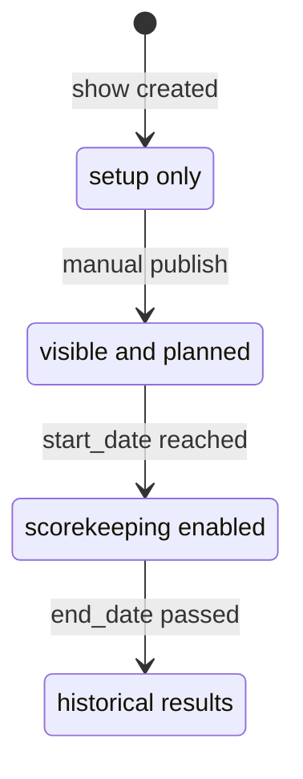

# Show Workflow

Shows move from setup to publication to scoring and results.

## Status Lifecycle

| Status | Meaning |
| --- | --- |
| `DRAFT` | Setup in progress; hidden from public/exhibitors |
| `PUBLISHED` | Visible and open for registration/planning |
| `ACTIVE` | Show is underway; scorekeepers can enter placings |
| `COMPLETED` | Show has ended |

Backend status automation:

- `PUBLISHED` to `ACTIVE` when today is on or after `start_date`.
- `ACTIVE` to `COMPLETED` when today is after `end_date`.

Manual status changes are guarded in `backend/routers/shows.py` and surfaced through `ShowStatusControl.tsx`.

Codex note: when changing show visibility, scorekeeper access, or result entry behavior, check both the status guards in `backend/routers/shows.py` / `backend/routers/results.py` and the frontend controls that hide or disable actions by status.

## Show Manager Path

1. Show Manager self-registers.
2. Show Manager submits a request at `/show-requests/new`.
3. Admin reviews at `/admin/show-requests`.
4. On approval, a `DRAFT` show is created and the manager is assigned in `show_managers`.
5. Manager assigns Show Secretaries and Scorekeepers.
6. Secretary/manager completes setup, classes, entries, and back numbers.
7. Scorekeepers enter placings when the show is active.

## Direct Admin Or Secretary Path

1. Admin or Show Secretary creates a show directly.
2. Show is edited while in `DRAFT`.
3. Classes, entries, staff, and back numbers are configured.
4. Show is published once it has a venue and at least one class.
5. Results are entered manually and published immediately.

## Entries And Back Numbers

- `entries` represent a class-level exhibitor/horse registration.
- `show_entries` assign one show-level back number per exhibitor per show.
- Entry-level `back_number` exists for class context and compatibility with existing UI flows.
- A class with `status = "CLOSED"` rejects new entries at the backend (`backend/routers/entries.py::create_entry`); the EditClassCard status toggle is how secretaries close a class.

## Exhibitor Self-Service Flow

- Exhibitors can manage profile identity data through user `me` endpoints.
- Exhibitors can maintain association membership numbers through exhibitor registration endpoints.
- Exhibitors can manage exhibitor-level documents (membership card, amateur card, youth card, medical, identification, other).
- Exhibitors can manage horse relationships across owner-linked horses, created horses, and linked horses.

## Scorekeeper Flow

1. Scorekeeper opens `/scorekeeper`.
2. They see only assigned, non-draft shows.
3. On an active show, class cards link to the scorekeeper form.
4. The scorekeeper form saves manual placings; DQ entries do not receive a place.
5. Result changes write audit history.
