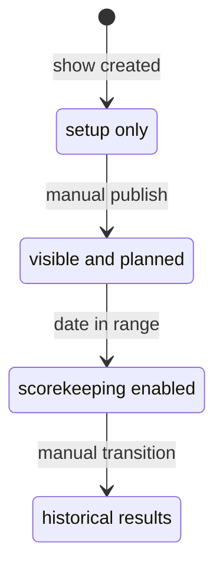
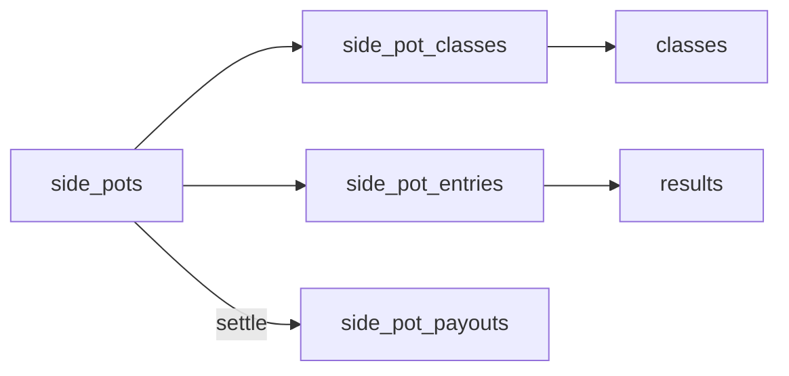

# Show Workflow

Shows move from setup to publication to scoring and results.

## Status Lifecycle

| Status | Meaning |
| --- | --- |
| `DRAFT` | Setup in progress; hidden from public/exhibitors |
| `PUBLISHED` | Visible and open for registration/planning |
| `ACTIVE` | Show is underway; scorekeepers can enter placings |
| `COMPLETED` | Show has ended |

Manual status changes are guarded in `backend/routers/shows.py` and surfaced through `ShowStatusControl.tsx`:

- `PUBLISHED` requires venue + at least one class.
- `ACTIVE` requires today's date to be inside the show's date range.
- `COMPLETED` is an explicit transition after results are final.

Codex note: when changing show visibility, scorekeeper access, or result entry behavior, check both the status guards in `backend/routers/shows.py` / `backend/routers/results.py` and the frontend controls that hide or disable actions by status.

## Show Setup Wizard

Show creation runs through a five-step wizard. Each step is a separate route and is skippable — secretaries can come back later via the setup hub at `/admin/shows/[id]/setup`, which shows per-step completion derived from data presence (judges count, sanctioning count, lodging-fee codes, class-fee codes / `office_charge_cents`).

Eligible to start the wizard: `ADMIN`, `SHOW_MANAGER`, `SHOW_SECRETARY`. Show Managers creating a show have an auto-inserted `show_managers` row; the wizard's Step 1 secretary assignment writes to `show_secretaries`.

| Step | Route | What it does |
| --- | --- | --- |
| 1. Basics | `/admin/shows/new` | Name, show type, dates, venue, Show Secretary. Secretary can be picked from `GET /users/by-role?role=SHOW_SECRETARY` or inline-created via `POST /users/with-password`. Show Managers may only inline-create `SHOW_SECRETARY` accounts (extended check in `routers/people.py`). |
| 2. Judges | `/admin/shows/[id]/setup/judges` | Reuses `JudgesEditor` — list / add / edit `show_judges` rows. |
| 3. Sanctioning | `/admin/shows/[id]/setup/sanctioning` | Pick zero or more `sanctioned_associations` (NSBA, WSCA, ...) and set a `per_class_fee_cents` for each. Wraps `PUT /shows/{id}/sanctioning` which replaces the full set. Users can also submit `POST /sanctioned-association-requests` if they need a new sanctioning body added — admin reviews via `POST /sanctioned-association-requests/{id}/review`. |
| 4. Lodging & Boarding | `/admin/shows/[id]/setup/lodging` | Three structured slots written into `show_fees` with codes `stall` / `shavings` / `camping`, plus a `shows.shavings_ban_outside` policy bool. Camping uses a free-text notes field to capture "includes electric hookup" or similar. |
| 5. Show Fees | `/admin/shows/[id]/setup/fees` | `office_charge_cents` + `office_charge_basis` (`per_back_number` vs `per_horse`) on the show row, plus three structured slots in `show_fees` with codes `standard_class` / `jackpot` / `futurity`. Sanctioning per-class fees are read-only here and link back to Step 3. |

Sanctioning associations are distinct from breed `show_types` — see `docs/database.md`. The breed `show_type` is set once on the show row at creation and drives breed-specific rules; sanctioning is a per-show overlay that adds points eligibility (and an optional per-class fee) without changing the show's primary type.

The old per-show Standard Library matrix picker (`MatrixSetupClient`, `POST /shows/{show_id}/setup/apply`) was removed when the wizard shipped. Per-show divisions, sections, division-section memberships, and classes are now created via the Classes page (`/admin/shows/[id]/classes`) — either manually or via the Schedule Builder / Standard Library quick-start documented below. The `/standard-setup/catalog` endpoint and the `standard_classes` / `standard_division_sections` tables remain in place and are still used by the Classes-page importers.

## Show Status Lifecycle

1. Wizard creates the show in `DRAFT`.
2. Status moves to `PUBLISHED` once the show has a venue and at least one class (guarded in `backend/routers/shows.py`).
3. `PUBLISHED → ACTIVE` happens when today's date is in range.
4. `ACTIVE → COMPLETED` is an explicit transition after results are final.

## Rings, Divisions, and Sections Setup

- A **Ring** is a physical arena. Rings are managed inline on the Classes / Schedule Builder pages.
- A **Division** is a discipline (Halter, Western Pleasure, Trail, Barrels). Each division carries a `default_score_type` (`placement` / `pattern` / `time`) that newly-created classes inherit.
- A **Section** is an age or skill bracket (10 & Under, 11-13, Walk-Trot, Amateur). Sections live independently in `sections` but are scoped to one or more divisions via the `division_sections` join (migration 061).
- Class records require **both** `division_id` and `section_id` (migration 061) and the `(division_id, section_id)` pair must be a row in `division_sections` — enforced by a composite FK. The class create/edit forms gate the section dropdown on the chosen division and only show sections that belong to it. The Classes page (`/admin/shows/[id]/classes`) redirects until at least one ring and one division exist.
- Rings, divisions, and sections cannot be deleted while any class still references them (the API returns 409 and the UI disables the delete button accordingly). Removing a division from a section that still has classes pairing them also returns 409.
- Demographic splits (Open / Amateur / Youth / SPB) for APHA are still tracked per entry via `entries.apha_division`, not at the section or division level. Sections are about age/skill brackets at the class level, not entry-level eligibility.

## Schedule Builder

The Schedule Builder at `/admin/shows/[id]/classes` lays out a show as a **divisions × sections** matrix:

- Rows are divisions (disciplines).
- Columns are sections (age/skill brackets), plus a "(no section)" column for unbracketed classes — picks in that column are stored under the per-show "Unassigned" section so the class still satisfies the required-both rule.
- Each checked cell materializes one numbered class and also registers the `(division, section)` pair in `division_sections` if it wasn't already a member — the matrix is effectively the secretary declaring "this section applies to this division".
- Class names auto-generate as `"{Section} {Division}"` (e.g. "10 & Under Showmanship") when a real section is paired, or just `"{Division}"` for the Unassigned column.
- `score_type` is taken from the division's `default_score_type` for every class the build creates (with a per-pick override available in the API for advanced use).
- New disciplines or brackets can be added inline from the builder (custom division add form includes a scoring radio; custom section add form is name-only).

## Standard Library Quick-Start

The "Add from Standard Library" action on `/admin/shows/[id]/classes` is the click-pick equivalent of the AQHA/APHA pickers for any show type:

- The picker loads valid standard `(division, section)` pairs from `GET /standard-setup/pairs`, backed by the `standard_division_sections` join table seeded in migrations 064-065. It no longer renders every possible cartesian product, so invalid combinations such as Walk-Trot Halter are filtered out before the secretary sees them.
- The secretary filters by discipline / bracket / search, checks the cells they want, sees a routing-summary panel, and commits.
- On commit, `POST /shows/{id}/classes/from-library` creates any missing per-show Division (with the discipline's `default_score_type`), Section, and `(division, section)` membership; then creates one class per pick named `"{Section} {Discipline}"` with the discipline's scoring type. The picker can assign all created classes to one selected ring, and the schedule is renumbered.
- Each pick already carries division name + score type from `standard_divisions`, so this endpoint skips the name-keyword classifier used by the AQHA/APHA bulk imports.
- Disciplines or brackets that don't appear in the standard library are added on the Setup page; they'll appear here the next time the picker opens.

## Entries And Back Numbers

- `entries` represent a class-level exhibitor/horse registration.
- `show_entries` assign one show-level back number per exhibitor per show.
- Entry-level `back_number` exists for class context and compatibility with existing UI flows.
- A class with `status = "CLOSED"` rejects new entries at the backend (`backend/routers/entries.py::create_entry`); the EditClassCard status toggle is how secretaries close a class.
- Association-specific entry validation runs in `backend/rules`. AQHA currently blocks invalid entries when the app can verify the data: missing official AQHA class code, missing AQHA horse registration, missing AQHA exhibitor membership number, youth/select DOB failures, youth stallion entries, junior/senior horse-age mismatches, ranch/VRH minimum-age failures, and 2-year-old performance classes before July 1.

## Association Class Setup

- APHA and AQHA shows can bulk-add classes from official standard-class catalogs at `/admin/shows/[id]/classes`.
- All show types can bulk-add classes from the **Standard Library** picker (cartesian product of `standard_divisions` × `standard_sections` for the show type) — no typing, no parsing, just check the cells.
- APHA reference data lives in `apha_standard_classes`.
- AQHA reference data lives in `aqha_standard_classes` and is seeded from `database/seeds/aqha_standard_classes.csv`, which is extracted from the official 2026 AQHA Class Master Listing PDF.
- Imported classes create a `class_associations` row so later validation/export logic can read the association class code from one normalized location.

## AQHA Approval And Validation

- AQHA shows have `aqha_show_number`, `aqha_approval_status`, `aqha_approval_submitted_at`, and `aqha_approval_notes` fields on the show record.
- The AQHA dashboard card at `/admin/shows/[id]` summarizes approval metadata plus validation issue counts.
- Backend endpoint `GET /shows/{show_id}/aqha-validation` returns schedule and entry issues with `error` or `warning` severity.
- Errors block entry create/update; warnings are shown in validation summaries but do not block saving today.
- Current AQHA validation is limited to fields the app stores. Owner/lessee membership, AQHA amateur status, Level 1 eligibility, and per-judge show identities still need additional modeling.
- Horse and exhibitor AQHA registration checks match on `associations` (`reg.association_id`), not on the show's `show_type_id` — registration rows have only carried `association_id` since migration 080. The rules layer has no DB access, so callers resolve the id with `get_aqha_association_id()` in `backend/routers/shows.py` and pass it as `context["aqha_association_id"]`. Any new code path that calls `validate_entry` for an AQHA show must supply that key; without it the registration checks are skipped rather than failing. Note that `class_associations` is the exception — it really does key on `show_type_id`.
- AQHA show-management workshop dates are stored on users as `aqha_management_workshop_completed_at`; at least one assigned show manager or show secretary should be current within 3 years of the show start date.

## Exhibitor Self-Service Flow

- Exhibitors can manage account identity data through user `me` endpoints.
- Exhibitors can maintain contact, emergency, and youth guardian fields through exhibitor profile endpoints.
- Exhibitors can maintain association membership numbers through exhibitor registration endpoints.
- Exhibitor membership-card documents can be tagged to a specific association (`show_type_id`) for multi-association shows.
- Exhibitors can manage horse relationships across owner-linked horses, created horses, and linked horses.

## Exhibitor Self-Registration

Exhibitors can register themselves for a show that is `PUBLISHED`. The flow lives at `/shows/[id]/register`, surfaced as a CTA on the show detail page for any logged-in `EXHIBITOR` while the show is `PUBLISHED`.

- Backend endpoints (`backend/routers/show_registration.py`):
  - `GET /shows/{id}/register/preview` returns the show, the caller's exhibitor profile, OPEN classes with `entry_fee_cents`, the horses on the exhibitor's profile (owned + created + linked), and any existing entries (used to pre-disable already-entered horses).
  - `POST /shows/{id}/register/` accepts `{ entries: [{ class_id, horse_id, apha_division?, relationship_to_owner? }] }`. The exhibitor is resolved from the authenticated user — body never carries `exhibitor_id`.
- Status gate: only `PUBLISHED` shows accept self-registration. Once a show flips to `ACTIVE`, `COMPLETED`, or back to `DRAFT`, the endpoint returns 403 and the show secretary must add late entries through the admin entries flow.
- A `show_entries` row is auto-created on first registration (back number stays NULL — the secretary still assigns it).
- Coggins and association validation (`backend/rules`) run identically to the secretary entry create path. Association rules skip non-`ENTERED` entries via `DefaultRules.entry_is_active()`, which treats an unset status as ENTERED — validation runs before the entry is flushed, and `Entry.status`'s column default is not applied until flush. Code that builds an unsaved `Entry` for validation should still set `status="ENTERED"` explicitly. The preview endpoint includes each horse's Coggins readiness so the self-registration picker can grey out blocked horses before submit. AQHA errors still block at submit time, and a Coggins problem returns `422 COGGINS_EXPIRED`.

### Coggins Gate

A horse may be entered only when it has a Coggins carrying an **expiration date that has not passed**. `coggins_status()` in [backend/routers/horse_documents.py](../backend/routers/horse_documents.py) is the single implementation — the secretary entry path, exhibitor self-registration, and the registration preview all call it, so the screen can never say a horse is clear while the endpoint rejects it. It returns four states:

| Status | Meaning |
| --- | --- |
| `valid` | At least one Coggins expires today or later |
| `missing` | No Coggins uploaded |
| `undated` | A Coggins is on file but has no expiration date recorded |
| `expired` | Every Coggins on file has lapsed |

An **undated Coggins does not clear the horse.** With no date there is nothing to verify, and it previously counted as valid forever — one undated row silently disabled the gate for that horse permanently. `undated` is reported ahead of `expired` when both are present, because it names the fixable data problem rather than sending the exhibitor after a test they may not need. All four states share the `COGGINS_EXPIRED` error code (the entry form and registration screen branch on it); the message carries the distinction.

**Show-staff override.** `POST .../entries?skip_coggins_check=true` skips the gate entirely. This is the deliberate escape hatch for a secretary or manager who has physically inspected the exhibitor's paper Coggins — it keeps a thin or lapsed *record* from blocking a horse whose *documentation* is actually good. The endpoint is limited to ADMIN / SHOW_SECRETARY / SHOW_MANAGER with access to the show, so exhibitors cannot reach it, and **self-registration has no equivalent** — an exhibitor cannot wave through their own horse. Every effective override writes a `coggins_override_audit` row (migration 082) in the **same transaction** as the entry — an entry that bypassed the gate can never exist without the row explaining why. Passing the flag for a horse that already holds a valid Coggins overrides nothing and records nothing, so the table counts real bypasses rather than flag usage. Read them at `GET /shows/{id}/coggins-overrides`, surfaced as a collapsible panel on the admin entries page that stays hidden when a show has none.

Staff can read the paperwork before deciding: the Coggins warning on `CreateEntryForm` expands the horse's health documents inline, and every row on the entries list carries a **Papers** toggle. Both render `HorseDocuments` with `readOnly`, backed by the view/manage split in [docs/auth.md](auth.md#horse-documents-read-and-write-split). Before this, staff could override the gate but not view the document behind it.
- Fees are surfaced to the exhibitor in three layers; the app does not collect payment.
  - **Per-class entry fee** (`classes.entry_fee_cents`, migration 054, default 0). Set on the class editor or via the bulk "Set fee…" action on the schedule list.
  - **NSBA sanction fee** (auto-computed at preview/POST time). Any class whose primary `show_type_code` is `NSBA` or whose `class_associations` include an `NSBA` row carries an additional `max($3, 6% × entry_fee)` charge per entry, matching the official [NSBA sanction-fees rule](https://www.nsba.com/images/documents/Show-Approval-Documents/Sanction-Fees.pdf). The preview endpoint returns `is_nsba_approved` and `nsba_sanction_cents` per class; the form shows the rollup as a separate line item.
  - **Office charge per horse** (`shows.office_charge_cents`, migration 055, default 0). One-time charge per distinct horse on the registration, set on the show edit page (Office charge per horse field). Typically covers drug testing and administrative overhead (NSBA World Show uses $75).
- Exhibitors with no horses on their profile see an empty-state nudging them to add a horse first.
- **Withdraw**: while the show is still `PUBLISHED`, exhibitors can withdraw any of their own entries inline (`DELETE /shows/{id}/register/entries/{entry_id}`). The registration screen renders each existing entry as a chip with an inline confirm; the dashboard ShowCard surfaces a "Manage registration" link to the same screen. Withdraw is blocked if a result has already been recorded for the entry (defensive 409 — this only fires if a class was scored then the show was reverted to `PUBLISHED`). Once the show flips to `ACTIVE`, the secretary owns edits through the admin entries flow.

## Scorekeeper Flow

1. Scorekeeper opens `/scorekeeper`.
2. They see only assigned, non-draft shows.
3. On an active show, class cards link to the scorekeeper form.
4. The form rendered depends on the class's `score_type`:
   - `placement` (default, rail and halter classes) - secretary types placings directly; tie support via duplicate place numbers; gap warning prompts before saving non-contiguous placings.
   - `pattern` (showmanship, horsemanship, equitation, trail, reining, etc.) - secretary types each judge-aggregated score; the backend recomputes placings (highest score wins) on save and the UI shows derived placings live as scores are entered.
   - `time` (barrels, poles, stake race) - same as pattern but lowest time wins.
5. DQ entries are listed at the bottom and do not receive a place.
6. Audit rows are written for `placement` classes when a place changes; pattern/time classes do not audit derived placings (the score is the editorial value, not the placing).

## Class Scoring Type

Classes are tagged with a `score_type` in the class editor (`/admin/shows/[id]/classes`):

| Type | When to use | What gets entered | How placings are decided |
| --- | --- | --- | --- |
| `placement` | Rail classes, halter, color, lead line | Place number per entry | Manual entry (today's behavior) |
| `pattern` | Showmanship, horsemanship, equitation, trail, reining, western/ranch riding, longe line | Numerical judge score (~70 baseline) | Highest score wins; ties share a place |
| `time` | Barrel racing, pole bending, stake race | Time in seconds | Lowest time wins; ties share a place |

Single classes created through `CreateClassForm` or the Schedule Builder inherit `score_type` from the selected division's `default_score_type`. APHA/AQHA bulk-imported classes still default to `placement` and need to be flipped per class today.

## Side Pots (Divisional Jackpots)

Side pots are optional money pools that span multiple classes within a show - analogous to division jackpots run alongside pattern-class divisions like Showmanship 13&U / 14-17 / 18-34 / 35-49 / 50+.

### Lifecycle

| Status | Meaning |
| --- | --- |
| `open` | Accepting opt-ins and edits |
| `closed` | Soft-closed; opt-ins frozen but not yet paid out (optional intermediate state) |
| `settled` | Payouts written; pot is locked from further edits |

Settling is one-way; reopening a pot is not currently supported.

### Configuration

- **`scoring_method`**: `sum_placings` (lowest sum wins, works for any class type) or `sum_scores` (highest sum wins, requires every bundled class to be `pattern` or `time`).
- **`eligibility_rule`**: `all_classes` requires a result in every bundled class to be ranked; `any_class` lets missing classes count as last place + 1.
- **`payout_schedule`**: JSONB map keyed by paid-entry count band, e.g. `{"1-3":[100], "4-7":[70,30], "8-15":[60,30,10], "16+":[40,25,15,12,8]}`. Defaults are seeded by the API; producers can override per pot.
- **Tie breaking**: `most 1sts -> most 2nds -> most 3rds ...`. If still tied, entries split the combined share evenly. Rounding remainder goes to first place.

### Operational Flow

1. Secretary creates a pot at `/admin/shows/[id]/side-pots`, picks classes (the picker hides classes that do not match the scoring method).
2. Secretary opts back numbers in by typing the back number, marks `paid` when cash is collected.
3. Standings page (`/admin/shows/[id]/side-pots/[potId]`) shows live ranking + projected payouts as the underlying class results land. Refresh button re-runs the computation.
4. Once results are final, secretary clicks **Settle**. The backend writes one `side_pot_payouts` row per eligible entry (place + cents) and locks the pot.
5. Frozen payouts table appears in the same screen for handoff to whoever cuts checks.

The total pool is `entry_fee_cents * paid count`; payout pool applies `payback_percent` to the total. Unpaid opt-ins still appear in standings (flagged "Unpaid") but contribute no money to the pool.
